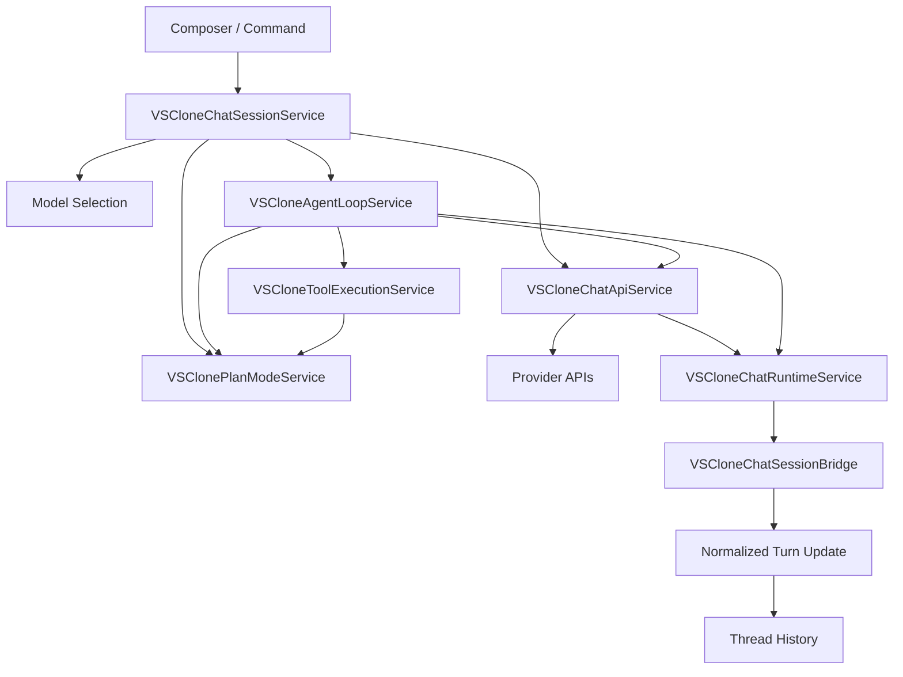
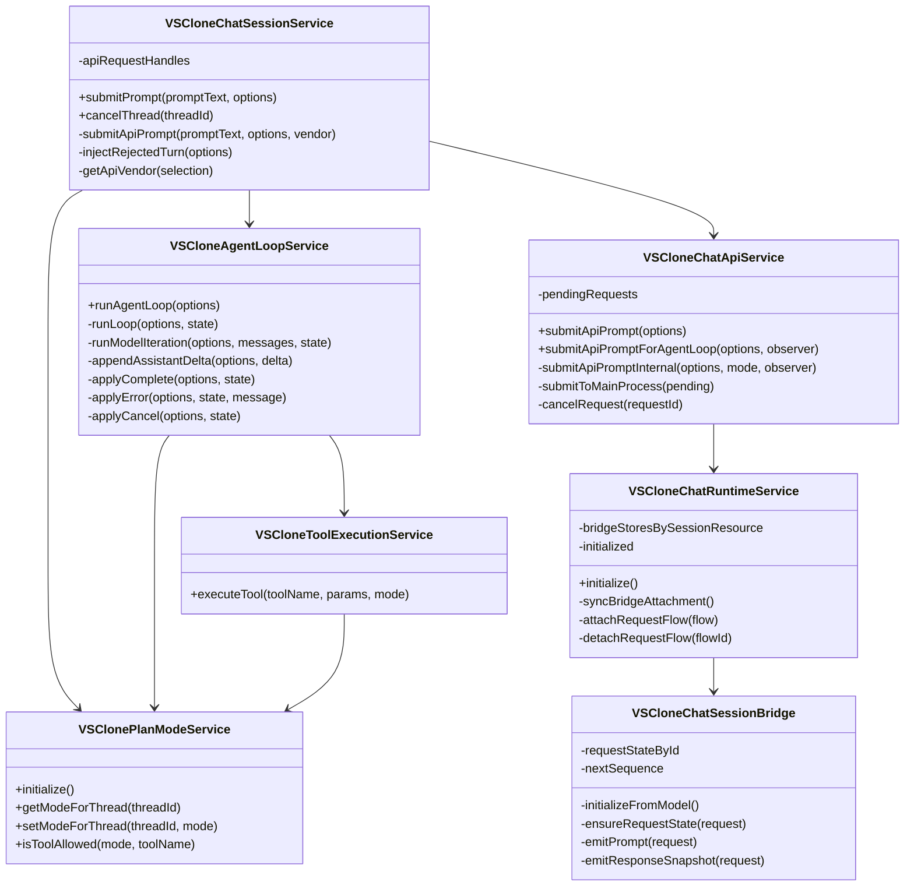

# Module 2: Chat Execution

Shared cross-module architecture, storage details, and top-level design rationale live in [the backend architecture document](../backend-unified-spec.md). This module document isolates the `Chat Execution` design so request orchestration, live execution tracking, and turn-update normalization remain focused and easy to review.

## 1. Features

What it can do:

- accept prompt submission from the composer or commands
- resolve the active thread and selected model before send
- call the configured provider through the direct provider path
- manage cancellation and in-flight request handles
- observe provider stream events
- normalize prompt, delta, completion, error, and cancel events into turn updates
- support agent-loop execution as an extension of the same request lifecycle

What it does not do:

- it does not own durable storage directly
- it does not define provider catalog policy
- it does not choose a model from UI state alone
- it does not render UI

## 2. Internal Architecture

Chat Execution is one top-level module because the system has one supported send path. Internally, it uses a small set of cooperating classes so transport, session control, agent execution, and live event handling stay understandable and testable:

- a session service that accepts send requests and resolves the selected model
- a plan-mode service that resolves and persists the effective read-only vs act mode for the thread
- an API service that performs transport-level provider execution
- an agent-loop service for multi-step execution
- a tool-execution service that enforces mode-specific workspace tool access
- a runtime service and session bridge that convert live provider events into normalized updates

This design keeps the public architecture simple without collapsing all execution behavior into one oversized class.

Why this is defensible to a senior architect:

- one module owns the full lifecycle from send to normalized update
- internal seams remain available for unit and integration testing
- request transport remains separate from thread-state ownership
- read-only planning is enforced by execution services instead of relying on model obedience
- execution can evolve without destabilizing storage semantics

## 3. Data Abstraction

Primary abstractions:

- `ExecutionRequest`
- `ExecutionHandle`
- `RuntimeRequestState`
- `NormalizedTurnUpdate`
- `ExecutionModeSnapshot`

Abstraction function:

- an execution request represents one logical user send
- an execution handle represents control over the in-flight request
- runtime request state represents transient progress while the request is active
- a normalized turn update represents the durable semantic output that Thread History can safely persist
- an execution-mode snapshot represents the thread's effective `plan` or `act` mode captured at submit time

Representation invariant:

- every execution request is bound to exactly one thread
- every normalized turn update refers to one existing thread identifier and turn identifier
- every tool execution within a turn uses the same snapshotted execution mode that prompt assembly used
- stream events are reduced in sequence order for a given request
- terminal states are exclusive: completed, failed, or cancelled

The key architectural idea is that this module is allowed to be transient internally as long as it emits durable turn updates promptly into Thread History.

## 4. Stable Storage Mechanism

This module does not own an independent durable store. Its stable storage mechanism is indirect:

- request start, stream checkpoints, and terminal events are emitted into Thread History
- Thread History persists those updates in SQLite

Why this is acceptable:

- execution state is only valuable insofar as it changes the recoverable conversation
- a second execution-specific database would introduce another source of truth
- the system can recover to the last committed thread state even if the application crashes mid-stream

## 5. Storage Schemas

This module does not own tables of its own. It writes durable effects into Thread History through the following tables:

- `threads`
  - used to keep active model, timestamps, and summary state current
- `turns`
  - used to persist prompt text, streamed assistant output, status, error information, and per-turn execution mode
- `thread_modes`
  - used to persist the current Plan/Act mode for each thread so the composer restores it on reopen

Module-local transient state is not persisted separately.

## 6. External API

The external API is an internal execution service contract.

Operations exposed by Chat Execution:

- `submitPrompt(promptText, options)`
  - resolves thread and model, starts execution, and returns a submission result
- `cancelThread(threadId)`
  - cancels the active request for the given thread
- `getModeForThread(threadId)`
  - resolves the current persisted Plan/Act mode for a thread or unsaved composer
- `setModeForThread(threadId, mode)`
  - persists the Plan/Act mode for a thread or the unsaved composer
- `isToolAllowed(mode, toolName)`
  - determines whether a workspace tool is allowed for the snapshotted turn mode
- `submitApiPrompt(options)`
  - dispatches a direct provider request
- `submitApiPromptForAgentLoop(options, observer)`
  - dispatches a provider request for agent-mode execution
- `runAgentLoop(options)`
  - executes a multi-step agent loop while still producing normalized updates
- `initialize()`
  - starts live request tracking so active streams can be tracked even before the view opens

## 7. Class, Method, and Field Declarations

Externally visible classes:

- `VSCloneChatSessionService`
  - methods: `submitPrompt`, `cancelThread`
  - fields: none exposed publicly beyond service registration

- `VSClonePlanModeService`
  - methods: `initialize`, `getModeForThread`, `setModeForThread`, `isToolAllowed`
  - fields: none exposed publicly beyond service registration

- `VSCloneChatApiService`
  - methods: `submitApiPrompt`, `submitApiPromptForAgentLoop`
  - fields: none exposed publicly beyond service registration

- `VSCloneAgentLoopService`
  - methods: `runAgentLoop`
  - fields: none exposed publicly beyond service registration

- `VSCloneToolExecutionService`
  - methods: `executeTool`
  - fields: none exposed publicly beyond service registration

- `VSCloneChatRuntimeService`
  - methods: `initialize`
  - fields: none exposed publicly beyond service registration

Private-to-module classes:

- `VSCloneChatSessionBridge`
  - methods: `initializeFromModel`, `ensureRequestState`, `emitPrompt`, `emitResponseSnapshot`
  - fields: `requestStateById`, `nextSequence`

Private methods across the module:

- `submitApiPromptInternal`
- `syncBridgeAttachment`
- `attachRequestFlow`
- `detachRequestFlow`
- `runLoop`
- `runModelIteration`
- `appendAssistantDelta`
- `applyComplete`
- `applyError`
- `applyCancel`
- `createToolUsageReprompt`
- `injectRejectedTurn`
- `getApiVendor`

Private fields across the module:

- `apiRequestHandles`
- `pendingRequests`
- `bridgeStoresBySessionResource`
- `requestStateById`
- `initialized`

## 8. Mermaid Class Diagram

