# Chat Execution

Shared architecture and storage context live in [the backend architecture document](../backend-unified-spec.md). This document isolates the implemented `Chat Execution` path: prompt submission, agent-loop orchestration, tool execution, prompt context gathering, and provider transport.

## 1. Features

What it can do:

- accept prompt submission from the VSClone composer
- resolve the active thread id, selected model, and current Plan/Act mode
- snapshot the execution mode at submit time
- gather workspace/editor context and assemble a system prompt
- run a multi-step agent loop that can call workspace tools
- stream provider output into history
- sanitize invalid tool transcripts before using them
- enforce Plan Mode at runtime for edit/create tools
- cancel in-flight work by thread

What it does not do:

- it does not own durable storage directly
- it does not define the model catalog
- it does not render the UI
- it does not persist OAuth tokens

## 2. Internal Architecture

The current composer send path always flows through the agent loop:

1. `VSCloneChatSessionService.submitPrompt(...)`
2. `VSCloneThreadModelSelectionService` resolves the model
3. `VSClonePlanModeService` snapshots the current mode
4. `VSCloneContextGatheringService` gathers active file/open files/workspace tree/diagnostics
5. `VSClonePromptAssemblyService` builds the system prompt
6. `VSCloneAgentLoopService.runAgentLoop(...)` drives the turn
7. `VSCloneChatApiService` bridges to the Electron main process for model streaming
8. `VSCloneToolExecutionService` executes any parsed tool calls
9. `IVSCloneChatHistoryService.applyTurnUpdate(...)` persists the canonical transcript

## 3. Data Abstraction

Primary abstractions:

- `IVSCloneChatSubmitOptions`
- `IVSCloneAgentLoopOptions`
- `IVSCloneApiSubmitOptions`
- `IVSCloneChatTurnUpdate`
- `VSCloneChatMode`

Abstraction function:

- a submit request represents one logical composer send
- agent-loop options represent one tool-capable execution turn
- API submit options represent one provider request with all model/provider metadata already resolved
- chat turn updates are the durable boundary between transient runtime work and persisted history
- chat mode represents the execution policy (`act` vs `plan`) captured for that turn

Representation invariants enforced by the code:

- each request is bound to exactly one `threadId` and `turnId`
- provider transport runs only after a concrete `vendor` and `modelId` are resolved
- the snapshotted turn mode is reused across prompt assembly, tool gating, and transcript updates
- the agent loop stops on completion, error, cancel, or the hard iteration cap
- only one tool call is executed at a time

## 4. Stable Storage Mechanism

This module does not own a separate store. Its durable effects are emitted into history as `IVSCloneChatTurnUpdate` events with phases:

- `prompt`
- `stream`
- `complete`
- `error`
- `cancel`

Those updates are reduced by Thread History and persisted through the unified snapshot store.

## 5. Storage Schemas

The execution module writes fields into the existing turn schema rather than creating new tables or keys:

- `executionMode`
- `modelIdentifier`
- `providerId`
- `promptText`
- `responseMarkdown`
- `responsePlainText`
- `startedAt`
- `completedAt`
- `status`
- `errorCode`

Additional execution behavior reflected in the transcript:

- agent traces are emitted as `<agent_trace ...>` XML markers
- tool results are appended as `<tool_result ...>` XML blocks
- rejected sends write a failed turn with `errorCode='request_rejected'`

## 6. External API

Implemented workbench service contracts:

- `VSCloneChatSessionService`
  - `submitPrompt(promptText, options?)`
  - `cancelThread(threadId)`

- `VSClonePlanModeService`
  - `initialize()`
  - `getModeForThread(threadId?)`
  - `setModeForThread(threadId, mode)`
  - `isToolAllowed(mode, toolName)`

- `VSCloneChatApiService`
  - `submitApiPrompt(options)`
  - `submitApiPromptForAgentLoop(options, observer)`

- `VSCloneAgentLoopService`
  - `runAgentLoop(options)`

- `VSCloneToolExecutionService`
  - `executeTool(toolName, params, mode?)`

## 7. Class, Method, and Field Declarations

Implemented classes:

- `VSCloneChatSessionService`
  - methods: `submitPrompt`, `cancelThread`
  - private helpers: `submitApiPrompt`, `ensureThreadSelectionBinding`, `injectRejectedTurn`, `getApiVendor`, `rejectMissingApiSelection`
  - private field: `apiRequestHandles`

- `VSCloneAgentLoopService`
  - methods: `runAgentLoop`
  - private helpers: `runLoop`, `runModelIteration`, `appendAssistantDelta`, `replaceCurrentIterationTranscript`, `applyComplete`, `applyError`, `applyCancel`, `emitAgentTrace`
  - policy constants: `maxAgentIterations=25`, `maxToolUsageReprompts=2`

- `VSCloneChatApiService`
  - methods: `submitApiPrompt`, `submitApiPromptForAgentLoop`
  - private helpers: `submitApiPromptInternal`, `registerChannelListeners`, `submitToMainProcess`, `cancelRequest`, `handleDeltaEvent`, `handleCompleteEvent`, `handleErrorEvent`, `handleAbortedEvent`, `applyErrorUpdate`, `finishRequest`
  - private fields: `channel`, `pendingRequests`

- `VSCloneToolExecutionService`
  - methods: `executeTool`
  - private helpers implement `read_file`, `list_directory`, `search_files`, `edit_file`, `create_file`

- `VSCloneContextGatheringService`
  - method: `gatherContext`

- `VSClonePromptAssemblyService`
  - method: `assembleSystemMessage`

- `VSCloneChatApiChannel`
  - methods: `call`, `listen`
  - private helpers: `submitRequest`, `abortRequest`, `streamRequest`, `consumeStream`, `processBufferedSseText`, `processSseLine`
  - private fields: emitters for `onDelta`, `onComplete`, `onError`, `onAborted`, plus `runningRequests`

Support helpers used by this module:

- `sanitizeAgentModelOutput(...)`
- `parseToolCalls(...)`
- `formatToolResult(...)`
- `getVendorAdapter(...)`

## 8. Class Diagram

