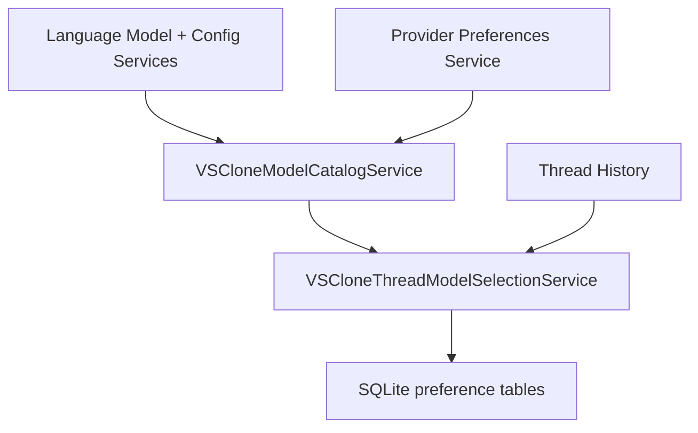
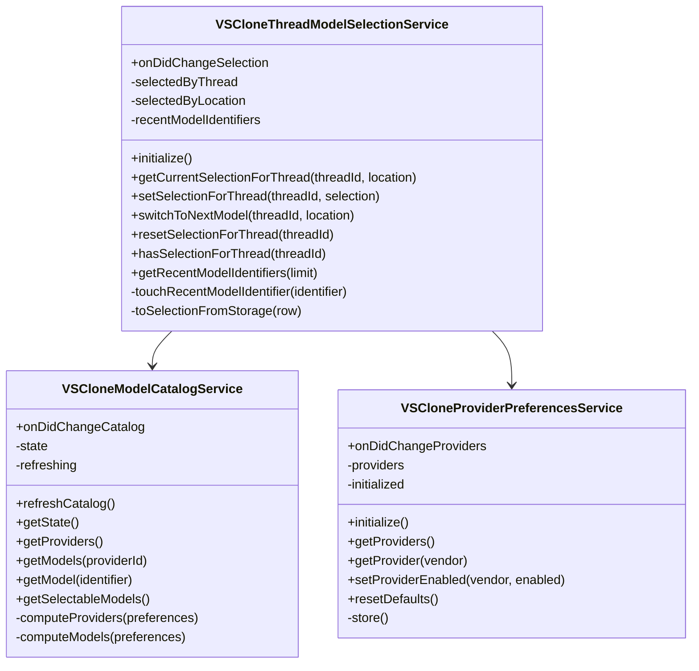

# Module 3: Model Selection

Shared cross-module architecture, storage details, and top-level design rationale live in [the backend architecture document](../backend-unified-spec.md). This module document isolates the `Model Selection` design so the catalog and policy behavior can evolve without burying those details inside the architecture overview.

## 1. Features

What it can do:

- build the selectable provider/model catalog
- track per-thread selected models
- track per-location default models
- track recent models
- track provider enablement
- validate whether a model is selectable for the current context
- expose selection decisions to Chat Execution

What it does not do:

- it does not execute requests
- it does not store provider secrets
- it does not persist full conversation history
- it does not render the picker widget itself

## 2. Internal Architecture

Model Selection should remain internally split between two concerns:

- catalog discovery and validation
- thread-specific selection policy and preference persistence

That separation matters because provider availability can change frequently, while thread selection state should remain stable unless the user changes it or the saved choice becomes invalid.

Why this is defensible to a senior architect:

- catalog refreshes do not need to mutate thread history
- selection policy can stay deterministic over canonical thread state
- provider enablement and recents remain policy data, not UI-local state
- fallback behavior stays centralized instead of spreading across picker code and send code

## 3. Data Abstraction

Primary abstractions:

- `ModelCatalogState`
- `ModelSelection`
- `SelectionPreferences`

Abstraction function:

- catalog state represents the currently available providers and models
- model selection represents the chosen model for one thread or location
- selection preferences represent persistent fallback and recent-choice policy

Representation invariant:

- a selected model identifier must refer to a model known to the catalog unless it is explicitly marked unavailable
- recent model identifiers are unique and ordered newest-first
- location defaults contain at most one default per location
- provider enablement contains at most one record per vendor

## 4. Stable Storage Mechanism

Stable storage for this module is the shared SQLite database used by Thread History.

Durability policy:

- per-thread selection persists in `thread_selection`
- per-location defaults persist in `location_defaults`
- recent models persist in `recent_models`
- provider enablement persists in `provider_preferences`

This keeps history restore and model restore on the same durability contract.

## 5. Storage Schemas

This module owns or reads the following tables:

`thread_selection`

- primary key and foreign key: `thread_id -> threads.thread_id`
- key fields: `location`, `model_identifier`, `vendor`, `model_id`, `model_name`, `reasoning_effort`, `selected_at`
- purpose: selected model bound to a specific thread

`location_defaults`

- primary key: `location`
- key fields: `model_identifier`
- purpose: fallback defaults by surface or location

`recent_models`

- primary key: `position`
- key fields: `model_identifier`
- purpose: bounded recent-model list

`provider_preferences`

- primary key: `vendor`
- key fields: `enabled`
- purpose: persisted provider enablement policy

## 6. External API

The external API is an internal service contract used by the picker and Chat Execution.

Operations exposed by Model Selection:

- `initialize()`
  - loads provider preferences, defaults, recents, and any needed selection state
- `getCurrentSelectionForThread(threadId, location)`
  - returns the effective model for the thread
- `setSelectionForThread(threadId, selection)`
  - persists the selected model for a thread
- `switchToNextModel(threadId, location)`
  - rotates to the next valid model
- `resetSelectionForThread(threadId)`
  - clears explicit selection and falls back to defaults
- `hasSelectionForThread(threadId)`
  - reports whether the thread has an explicit saved selection
- `getRecentModelIdentifiers(limit)`
  - returns recent model identifiers
- `refreshCatalog()`
  - rebuilds provider/model catalog state
- `getProviders()`
  - returns provider descriptors
- `getModels(providerId)`
  - returns models for one provider or for the full catalog

## 7. Class, Method, and Field Declarations

Externally visible classes:

- `VSCloneThreadModelSelectionService`
  - methods: `initialize`, `getCurrentSelectionForThread`, `setSelectionForThread`, `switchToNextModel`, `resetSelectionForThread`, `hasSelectionForThread`, `getRecentModelIdentifiers`
  - fields: `onDidChangeSelection`

- `VSCloneModelCatalogService`
  - methods: `refreshCatalog`, `getState`, `getProviders`, `getModels`, `getModel`, `getSelectableModels`
  - fields: `onDidChangeCatalog`

- `VSCloneProviderPreferencesService`
  - methods: `initialize`, `getProviders`, `getProvider`, `setProviderEnabled`, `resetDefaults`
  - fields: `onDidChangeProviders`

Private-to-module classes and helpers:

- selection-policy helpers inside `VSCloneThreadModelSelectionService`
  - methods: `touchRecentModelIdentifier`, `toSelectionFromStorage`
  - fields: `selectedByThread`, `selectedByLocation`, `recentModelIdentifiers`

- catalog-computation helpers inside `VSCloneModelCatalogService`
  - methods: `computeProviders`, `computeModels`
  - fields: `state`, `refreshing`

- provider-preference persistence helpers inside `VSCloneProviderPreferencesService`
  - methods: `store`
  - fields: `providers`, `initialized`

Externally visible fields:

- `onDidChangeSelection`
- `onDidChangeCatalog`
- `onDidChangeProviders`

Private fields:

- `selectedByThread`
- `selectedByLocation`
- `recentModelIdentifiers`
- `state`
- `refreshing`
- `providers`
- `initialized`

## 8. Mermaid Class Diagram

