# Model Selection

Shared architecture lives in [the backend architecture document](../backend-unified-spec.md). This document focuses on the implemented `Model Selection` subsystem: provider enablement preferences, explicit model catalog construction, per-thread selections, location defaults, and fallback policy.

## 1. Features

What it can do:

- persist provider enablement preferences
- build an explicit provider/model catalog from source-controlled definitions
- mark models selectable only when the provider is signed in and enabled
- persist per-thread selections
- persist per-location defaults
- persist recent model identifiers
- reconcile stale selections when catalog/auth state changes
- provide a policy-managed fallback for `editorInline`

What it does not do:

- it does not fetch a remote model list from providers
- it does not execute requests
- it does not store OAuth secrets
- it does not render the picker widget itself

## 2. Internal Architecture

The implemented selection stack is:

1. `VSCloneProviderPreferencesService`
   - profile-scoped enable/disable flags
2. `VSCloneModelCatalogService`
   - explicit catalog + auth readiness
3. `VSCloneThreadModelSelectionService`
   - per-thread selection policy, location defaults, recents, and fallback reconciliation

The durable selection state itself lives inside the unified chat snapshot owned by `VSCloneUnifiedChatBackendService`. That means thread restore, send-time resolution, and picker restore all read from the same persisted state.

## 3. Data Abstraction

Primary abstractions:

- `IVSCloneProviderPreferenceState`
- `IVSCloneModelCatalogState`
- `IVSCloneModelSelection`
- `IVSCloneUnifiedChatSelectionState`

Abstraction function:

- provider preferences represent which vendors are eligible for selection
- catalog state represents the current selectable/non-selectable model list
- a model selection represents one persisted decision for a thread or location
- the unified selection state groups thread bindings, location defaults, and recents so reconciliation is atomic

Representation invariants enforced by the implementation:

- `selectedByThread` and `selectedByLocation` store normalized selections without UI-only data
- recent identifiers are unique and newest-first
- a selection is considered valid only if the catalog still knows the model and `isSelectable=true`
- `editorInline` may replace stored location state with the current fallback chain automatically

## 4. Stable Storage Mechanism

This module uses two durable locations:

- profile storage key `vsclone.providerPreferences.v1`
  - enabled flags for `openai`, `anthropic`, and `google`
- unified chat snapshot
  - `selectedByThread`
  - `selectedByLocation`
  - `recentModelIdentifiers`

There are no dedicated `thread_selection`, `location_defaults`, or `recent_models` tables in the implementation.

## 5. Storage Schemas

### Provider preferences payload

Stored at `vsclone.providerPreferences.v1`:

- `version: 1`
- `providers: { [vendor]: { enabled: boolean } }`

Default runtime values:

- `openai: enabled`
- `anthropic: enabled`
- `google: disabled`

### Unified selection state

Persisted inside the chat history snapshot:

- `selectedByThread: Record<string, IVSCloneModelSelection>`
- `selectedByLocation: Partial<Record<'chat' | 'editorInline' | 'notebook' | 'terminal', IVSCloneModelSelection>>`
- `recentModelIdentifiers: string[]`

### Catalog characteristics

`VSCloneModelCatalogService` does not persist catalog snapshots. It recomputes them from:

- source-controlled model definitions
- provider enabled flags
- `VSCloneOAuthService.state.providers[vendor].isReady`

## 6. External API

Implemented service operations:

- `VSCloneProviderPreferencesService`
  - `initialize()`
  - `getProviders()`
  - `getProvider(vendor)`
  - `setProviderEnabled(vendor, enabled)`
  - `resetDefaults()`

- `VSCloneModelCatalogService`
  - `refreshCatalog()`
  - `getState()`
  - `getProviders()`
  - `getModels(providerId?)`
  - `getModel(identifier)`
  - `getSelectableModels()`

- `VSCloneThreadModelSelectionService`
  - `initialize()`
  - `getCurrentSelectionForThread(threadId, location)`
  - `setSelectionForThread(threadId, selection)`
  - `switchToNextModel(threadId, location)`
  - `resetSelectionForThread(threadId)`
  - `hasSelectionForThread(threadId)`
  - `getRecentModelIdentifiers(limit?)`

## 7. Class, Method, and Field Declarations

Implemented classes:

- `VSCloneProviderPreferencesService`
  - methods: `initialize`, `getProviders`, `getProvider`, `setProviderEnabled`, `resetDefaults`
  - private fields: `initialized`, `providers`

- `VSCloneModelCatalogService`
  - methods: `refreshCatalog`, `getState`, `getProviders`, `getModels`, `getModel`, `getSelectableModels`
  - private helpers: `computeProviders`, `computeModels`
  - private fields: `state`, `refreshing`, `failNextRefreshForTest`

- `VSCloneThreadModelSelectionService`
  - methods: `initialize`, `getCurrentSelectionForThread`, `setSelectionForThread`, `switchToNextModel`, `resetSelectionForThread`, `hasSelectionForThread`, `getRecentModelIdentifiers`
  - private helpers: `reconcileSelections`, `toSelection`, `normalizeReasoningEffort`, `getPreferredReasoningEffortForLocation`, `isSelectableModelIdentifier`, `shouldReplaceLocationSelection`, `getPreferredFallbackModel`, `getFallbackSelection`
  - private field: `initialized`

Important implemented policy:

- the `editorInline` fallback chain prefers:
  - `openai/gpt-5.3-codex-spark` with `lite`
  - `openai/gpt-5-nano` with `none`
  - `google/gemini-3.1-flash-lite-preview` with `minimal`
  - `anthropic/claude-haiku-4-5-20251001`
- catalog refresh is driven by auth/provider-state changes, not remote model discovery

## 8. Class Diagram

