# OAuth / Auth

Shared architecture and storage context live in [the backend architecture document](../backend-unified-spec.md). This document focuses on the implemented `OAuth / Auth` subsystem: provider sign-in/sign-out, token restore and refresh, secret-storage persistence, provider-specific API header construction, and the Electron main-process loopback/token-exchange channel.

## 1. Features

What it can do:

- restore persisted provider token sets from secret storage on startup
- expose an immutable per-provider auth snapshot with readiness and status
- run PKCE-based sign-in flows for `openai`, `anthropic`, and `google`
- prefer localhost loopback callback capture and fall back to manual paste when needed
- proxy token exchange and refresh requests through the Electron main process
- refresh near-expiry access tokens and coalesce concurrent refreshes per vendor
- build provider-specific API headers for chat and completion requests
- clear stored secrets and reset provider state on sign-out

What it does not do:

- it does not choose models or provider enablement policy
- it does not execute chat or completion requests itself
- it does not persist state in workspace/profile SQL-style tables
- it does not expose a standalone HTTP service beyond temporary localhost callback listeners

## 2. Internal Architecture

The implemented OAuth/Auth path is:

1. `VSCloneOAuthService`
   - source of truth for auth state, sign-in, sign-out, restore, refresh, and API header construction
2. `defaultOAuthProviderConfig`
   - static provider registry for authorize/token URLs, scopes, redirect strategy, and API endpoint metadata
3. `ISecretStorageService`
   - durable storage for serialized per-vendor token sets
4. `VSCloneOAuthLoopbackChannel`
   - Electron main-process channel that opens the external browser, manages loopback callback listeners, and proxies token exchange POSTs
5. downstream consumers
   - `VSCloneModelCatalogService` reads readiness
   - `VSCloneChatApiService` reads vendor headers for chat requests
   - `VSCloneCompletionApiService` reads vendor headers for completion requests

## 3. Data Abstraction

Primary abstractions:

- `VSCloneOAuthStatus`
- `IVSCloneOAuthProviderState`
- `IVSCloneOAuthState`
- `IVSCloneOAuthTokenSet`
- `IVSCloneOAuthProviderConfig`

Abstraction function:

- OAuth status represents one vendor's lifecycle (`signed_out`, `signing_in`, `signed_in`, `refreshing`, `error`)
- provider state represents the immutable UI/runtime snapshot for one vendor
- the full OAuth state represents the current auth snapshot across all supported vendors
- a token set represents the durable secret payload needed to authenticate API requests
- provider config represents the source-controlled contract for OAuth endpoints, scopes, redirect strategy, and API base URL

Representation invariants enforced by the implementation:

- the state snapshot always contains entries for `openai`, `anthropic`, and `google`
- `isReady=true` only when status is `signed_in` and the current token is still valid
- at most one token set is cached per vendor
- refresh work is coalesced so concurrent requests for the same vendor do not issue multiple refresh POSTs
- loopback callback completion requires both `code` and `state`, and the returned state must match the sign-in request
- provider metadata extraction is best-effort and must not block successful sign-in

## 4. Stable Storage Mechanism

This module uses application secret storage rather than the unified chat snapshot store.

Persisted state:

- key helper in code: `oauthSecretKey(vendor)`
- concrete keys in code: `vsclone.oauth.tokens.openai`, `vsclone.oauth.tokens.anthropic`, `vsclone.oauth.tokens.google`
- host-backed secret-storage entries: `secret://vsclone.oauth.tokens.<vendor>`
- scope: application secret storage via `ISecretStorageService`

Transient-only state:

- in-memory `_tokenSets` cache
- in-memory `_refreshPromises` for refresh coalescing
- in-memory loopback sessions inside `VSCloneOAuthLoopbackChannel`
- immutable `_state` snapshot published to consumers

This module does not add SQL tables or workspace/profile JSON keys.

## 5. Storage Schemas

### Secret payload

Stored as JSON in secret storage:

- `vendor: 'openai' | 'anthropic' | 'google'`
- `accessToken: string`
- `refreshToken?: string`
- `idToken?: string`
- `expiresAt?: number`
- `scopes: string[]`
- `providerMetadata: Record<string, string>`

### Derived provider state

Computed at runtime, not stored directly:

- `displayName`
- `status`
- `userDisplayName`
- `errorMessage`
- `isReady`

### Static provider config registry

Source-controlled, not persisted:

- `authUrl`
- `tokenUrl`
- `scopes`
- `redirectStrategy`
- `redirectUriTemplate`
- `preferredPort`
- `extraAuthorizeParams`
- `extraTokenParams`
- `quotaProject?`
- `apiEndpoint`

## 6. External API

Implemented workbench service contract:

- `IVSCloneOAuthService`
  - `initialize()`
  - `signIn(vendor)`
  - `signOut(vendor)`
  - `getAccessToken(vendor)`
  - `getTokenSet(vendor)`
  - `getApiHeaders(vendor)`
  - `isSignedIn(vendor)`
  - `state`
  - `onDidChangeState`

Main-process IPC contract:

- channel: `vsclone-oauth`
- commands:
  - `startLoopback`
  - `waitForLoopback`
  - `stopLoopback`
  - `tokenExchange`
  - `openExternal`

Important consumers of this module:

- `VSCloneModelCatalogService`
- `VSCloneChatApiService`
- `VSCloneCompletionApiService`

## 7. Class, Method, and Field Declarations

Implemented classes and supporting declarations:

- `VSCloneOAuthService`
  - methods: `initialize`, `signIn`, `signOut`, `getAccessToken`, `getTokenSet`, `getApiHeaders`, `isSignedIn`
  - private helpers: `_acquireManualAuthorizationCode`, `_acquireLoopbackAuthorizationCode`, `_promptForAuthorizationCode`, `_stopLoopbackSession`, `_getLoopbackChannel`, `_buildInitialState`, `_setProviderStatus`, `_isTokenValid`, `_recomputeDerivedState`, `_ensureRefreshed`, `_doRefresh`, `_extractUserDisplayNameFromTokenSet`
  - private fields: `_state`, `_tokenSets`, `_refreshPromises`, `_initialized`, `loopbackChannel`

- `VSCloneOAuthLoopbackChannel`
  - methods: `call`, `listen`
  - private helpers: `tokenExchange`, `startLoopback`, `waitForLoopback`, `stopLoopback`, `listenServer`, `getBoundPort`, `closeServer`, `handleLoopbackRequest`
  - private field: `sessions`

- `defaultOAuthProviderConfig`
  - source-of-truth registry for all supported OAuth providers

- `oauthSecretKey(vendor)`
  - helper for stable secret-storage key construction

Implemented runtime policy:

- loopback sign-in is preferred when the Electron channel is available
- manual paste remains the fallback when loopback capture fails or is unavailable
- token refresh starts when the access token is within `60s` of expiry
- loopback callback wait timeout is `180000ms`
- Anthropic API headers always include `anthropic-version` and `anthropic-beta`
- Google API headers include `x-goog-user-project` when local config resolves a quota project

## 8. Class Diagram

