# Plan Mode

Shared architecture and storage context live in [the backend architecture document](../backend-unified-spec.md). This document focuses on the implemented `Plan Mode` subsystem: persisted thread mode, transient unsaved composer mode, submit-time mode snapshots, prompt-level read-only instructions, and runtime tool gating.

## 1. Features

What it can do:

- track unsaved composer mode separately from persisted thread mode
- persist per-thread `act` vs `plan` state through the unified backend snapshot
- restore thread mode after reload or thread reopen
- expose an explicit mode change API and event surface for UI/runtime consumers
- snapshot mode once per send so prompt assembly, tool execution, and turn metadata stay aligned
- hide mutating tools from the model prompt during plan turns
- reject mutating tool calls at runtime if a plan-mode turn still tries to invoke them

What it does not do:

- it does not own the chat-history store directly
- it does not execute tool bodies itself
- it does not choose providers or models
- it does not create a separate storage key or SQL table

## 2. Internal Architecture

The implemented Plan Mode path is:

1. `VSClonePlanModeService`
   - public API for reading/updating mode plus transient unsaved composer state
2. `VSCloneUnifiedChatBackendService`
   - durable owner of persisted `modeByThread`
3. `VSCloneChatSessionService.submitPrompt(...)`
   - snapshots the current mode once per submission and binds it to the resolved thread id
4. `VSClonePromptAssemblyService`
   - emits read-only instructions and filtered tool definitions for plan turns
5. `VSCLONE_TOOL_DEFINITIONS`
   - source of truth for per-tool `planModeAllowed`
6. `VSCloneToolExecutionService`
   - final runtime gate that rejects disallowed tools in plan mode

## 3. Data Abstraction

Primary abstractions:

- `VSCloneChatMode`
- `IVSCloneUnifiedChatPlanModeState`
- transient `composerMode` inside `VSClonePlanModeService`
- `planModeAllowed` on each tool definition

Abstraction function:

- `VSCloneChatMode` represents the execution policy for one thread or one submitted turn
- `modeByThread` represents the durable restore state for saved threads
- `composerMode` represents the unsaved Plan/Act selection before a concrete thread id exists
- `planModeAllowed` represents whether a tool is legal during a read-only planning turn

Representation invariants enforced by the implementation:

- mode values are limited to `'act'` or `'plan'`
- missing thread entries default to `'act'`
- unsaved composer mode never overwrites persisted thread state until a real thread id is bound
- the snapshotted submission mode is reused across prompt assembly, tool gating, and turn execution metadata
- unknown tools are denied by the runtime policy check

## 4. Stable Storage Mechanism

This module reuses the unified snapshot store rather than introducing a Plan Mode-specific store.

Persisted state:

- `VSClonePlanModeService.setModeForThread(...)`
  - writes through `VSCloneUnifiedChatBackendService.replacePlanModeState(...)`
- `VSCloneUnifiedChatBackendService`
  - persists the resulting snapshot through `VSCloneChatHistoryStore`
- `VSCloneChatHistoryStore`
  - stores `modeByThread` inside `vsclone.chatHistory.v2.index`

Transient-only state:

- `composerMode`
  - used only when no thread id exists yet

Related downstream persistence:

- Chat Execution writes the snapshotted mode into each turn's `executionMode`
- that per-turn field is a consumer of Plan Mode, not the restore-state store owned here

## 5. Storage Schemas

This module does not add a new storage key. It contributes fields to the existing unified snapshot:

- key: `vsclone.chatHistory.v2.index`
- field: `modeByThread: Record<string, 'act' | 'plan'>`

Important storage behavior:

- only saved threads appear in `modeByThread`
- an absent thread entry means the effective mode is `act`
- unsaved composer mode is intentionally not persisted

Related turn field written by Chat Execution:

- `executionMode`

## 6. External API

Implemented workbench service contract:

- `VSClonePlanModeService`
  - `initialize()`
  - `getModeForThread(threadId?)`
  - `setModeForThread(threadId, mode)`
  - `isToolAllowed(mode, toolName)`
  - `onDidChangeMode`

Implemented consumers of that contract:

- `VSCloneChatSessionService.submitPrompt(promptText, options?)`
- `VSClonePromptAssemblyService.assembleSystemMessage(context, vendor, mode)`
- `VSCloneToolExecutionService.executeTool(toolName, params, mode?)`

## 7. Class, Method, and Field Declarations

Implemented classes and supporting declarations:

- `VSClonePlanModeService`
  - methods: `initialize`, `getModeForThread`, `setModeForThread`, `isToolAllowed`
  - private fields: `composerMode`, `initialized`, `initializing`

- `VSCloneUnifiedChatBackendService`
  - methods: `getPlanModeState`, `replacePlanModeState`

- `VSCloneChatHistoryModel`
  - methods: `getPlanModeState`, `replacePlanModeState`
  - private field: `modeByThread`

- `VSClonePromptAssemblyService`
  - method: `assembleSystemMessage`

- `VSCloneToolExecutionService`
  - method: `executeTool`

- `VSCLONE_TOOL_DEFINITIONS`
  - per-tool fields: `name`, `description`, `planModeAllowed`, `parameters`

Implemented runtime policy:

- plan turns may use `read_file`, `list_directory`, `search_files`, and `attempt_completion`
- plan turns may not use `edit_file` or `create_file`
- prompt filtering and runtime gating intentionally duplicate the restriction so prompt drift cannot silently allow mutations

## 8. Class Diagram

