# Tab Completion

Shared backend architecture lives in [the backend architecture document](../backend-unified-spec.md). This document focuses on the implemented `Tab Completion` backend: the editor-facing inline completion provider, bounded context gathering, completion prompt shaping, provider transport, retry policy, and post-processing.

## 1. Features

What it can do:

- register an inline completions provider for editor models
- extract bounded prefix/suffix context around the cursor
- choose a prediction mode (`single-line` vs `multi-line`)
- debounce requests adaptively based on local typing context
- reuse cached suggestions when the current prefix extends a prior prefix
- gather small cross-file context snippets for multi-line continuations
- resolve the `editorInline` model selection through the shared selection backend
- send dedicated completion requests through a separate main-process transport
- retry on inline fallback models when a provider request fails
- post-process raw provider output into exact insertion text

What it does not do:

- it does not persist completion results across restart
- it does not reuse the full chat context-gathering pipeline on every keystroke
- it does not route through the chat history transport
- it does not own OAuth token storage

## 2. Internal Architecture

The implemented request path is:

1. `VSCloneAutocompleteService`
   - debounce, prediction mode, cache, replace range, and cancellation
2. `VSCloneCompletionContextService`
   - optional open-tab snippets for multi-line suggestions
3. `VSCloneCompletionBackendService`
   - selection resolution, timeout, retry, and normalization
4. `VSCloneCompletionPromptService`
   - prompt envelope construction
5. `VSCloneCompletionApiService`
   - auth headers + IPC
6. `VSCloneCompletionChannel`
   - main-process fetch + SSE accumulation
7. `vscloneCompletionApiAdapters`
   - vendor-specific body construction and SSE parsing

## 3. Data Abstraction

Primary abstractions:

- `IVSCloneCompletionRequest`
- `IVSCloneCompletionPromptEnvelope`
- `IVSCloneCompletionResponse`
- `IVSCloneCompletionCrossFileContext`
- cached completion entries inside `VSCloneAutocompleteService`

Abstraction function:

- a completion request represents one bounded editor snapshot
- a prompt envelope represents the normalized transport contract for provider calls
- a completion response represents raw provider text plus normalized insert text
- cross-file snippets represent small, serializable related-file context blocks

Representation invariants enforced by the implementation:

- `prefix` and `suffix` come from one text model snapshot and cursor position
- only multi-line requests gather cross-file snippets
- completion requests are cancelled when a newer keystroke supersedes them
- the backend returns at most one normalized insert string per request
- stale provider responses are ignored after timeout/cancellation

## 4. Stable Storage Mechanism

This module does not add a durable completion store.

Persisted inputs reused from elsewhere:

- configuration
  - `vsclone.autocomplete.enabled`
  - `vsclone.autocomplete.debounceMs`
- model-selection state
  - `selectedByLocation['editorInline']`
  - provider readiness/enablement derived through the selection backend

Transient-only state:

- per-document LRU cache
- active request trackers
- debounce timestamps

## 5. Storage Schemas

No new storage keys or SQL tables are added by the completion module.

Relevant persistent contracts consumed indirectly:

- `vsclone.autocomplete.enabled`
- `vsclone.autocomplete.debounceMs`
- unified selection snapshot entries for `editorInline`

Important implementation limits:

- completion backend timeout: `8000ms`
- cache entry limit per document: `20`
- cache entry max age: `30000ms`
- max concurrent requests per document: `2`

## 6. External API

Implemented service contracts:

- `IVSCloneCompletionBackend.complete(request, token): Promise<string | undefined>`
- `VSCloneCompletionContextService.gatherContext(currentUri, currentLanguageId, maxSnippets, maxCharsPerSnippet)`
- `VSCloneCompletionPromptService.buildPromptEnvelope(request, selection)`
- `VSCloneCompletionApiService.complete(envelope, selection, token)`

Main-process IPC contract:

- channel: `vsclone-completion`
- commands:
  - `submit`
  - `abort`

## 7. Class, Method, and Field Declarations

Implemented classes:

- `VSCloneAutocompleteService`
  - methods: `provideInlineCompletions`, `handleItemDidShow`, `disposeInlineCompletions`
  - private helpers: `debounce`, `extractCompletionContext`, `getPredictionMode`, `getReplaceRange`, `getCachedCompletion`, `addToCache`, `beginBackendRequest`, `endBackendRequest`
  - private fields: `cacheByResource`, `latestRequestTimestampByResource`, `activeRequestsByResource`, `shownCompletionLists`

- `VSCloneCompletionContextService`
  - method: `gatherContext`
  - private helpers: `scoreCandidate`, `extractSnippet`

- `VSCloneCompletionBackendService`
  - method: `complete`
  - private helpers: `resolveCompletionSelection`, `completeWithSelection`, `getRetrySelectionsAfterFailure`, `toRetrySelection`, `normalizeBackendResult`
  - private field: `requestTimeoutMs`

- `VSCloneCompletionPromptService`
  - method: `buildPromptEnvelope`
  - private helpers: `getStopTokens`, `getMaxOutputTokens`, `trimPrefixForBudget`, `trimSuffixForBudget`, `trimCrossFileContextForBudget`, `buildVendorPrompt`

- `VSCloneCompletionApiService`
  - method: `complete`
  - private helper: `submitToMainProcess`

- `VSCloneCompletionChannel`
  - methods: `call`, `listen`
  - private helpers: `submitRequest`, `abortRequest`, `runRequest`, `consumeSseText`, `processBufferedSseText`, `processSseLine`
  - private field: `runningRequests`

- adapter helpers in `vscloneCompletionApiAdapters.ts`
  - `buildRequest`
  - `parseText`
  - `getEndpointMode`

Implemented runtime policy:

- the backend retries only through the inline fallback chain, not an arbitrary model list
- cross-file context is used only for multi-line predictions
- provider fetches are performed in the main process so cancellation can abort the underlying network request immediately

## 8. Class Diagram

