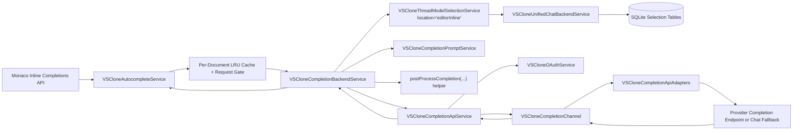
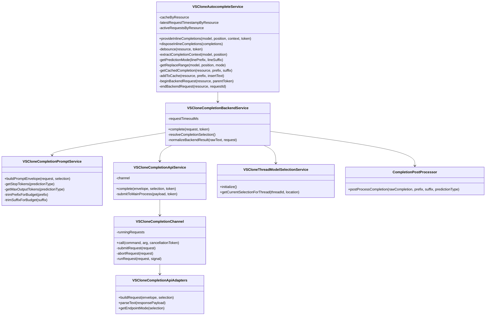

# Module 4: Tab Completion

Shared cross-module backend architecture, storage conventions, and design rationale live in [the backend architecture document](../backend-unified-spec.md). This module document isolates the `Tab Completion` backend so the low-latency request path, model-policy reuse, and completion transport details stay focused and implementation-ready.

This module also draws directly on [the existing autocomplete research](../../src/vs/workbench/contrib/vsclone/AUTOCOMPLETE_RESEARCH.md) and the current VSClone scaffolding under `src/vs/workbench/contrib/vsclone`.

## 1. Features

What it can do:

- accept bounded prefix/suffix context from `VSCloneAutocompleteService`
- resolve an effective completion model for the `editorInline` location by reusing the existing model-selection backend
- assemble a vendor-ready fill-in-the-middle style completion prompt from the current document snapshot
- submit a low-latency completion request through a dedicated completion transport path
- normalize raw provider output into plain source text through deterministic post-processing
- honor cancellation, timeout, and per-document concurrency limits
- support future retrieval of nearby same-language snippets without changing the editor-facing provider contract

What it does not do:

- it does not render ghost text or own editor keybindings
- it does not persist completion payloads or acceptance history in MVP
- it does not reuse the heavier chat context-gathering path on every keystroke
- it does not mutate chat history state
- it does not store provider secrets or tokens

## 2. Internal Architecture

The backend boundary starts at `IVSCloneCompletionBackend.complete(...)` and ends when one normalized completion string is returned to `VSCloneAutocompleteService`.

The implementation should stay split into four concerns:

- editor-facing request shaping in `VSCloneAutocompleteService`
- model resolution plus prompt orchestration in `VSCloneCompletionBackendService`
- pure prompt formatting and output normalization in common helpers
- network transport and vendor protocol handling in a dedicated completion API service and main-process channel

This split is important because tab completion has very different constraints from chat:

- the editor provider must keep debounce, replacement-range logic, and prefix-extension cache close to editor events
- the backend service must stay deterministic and unaware of UI rendering concerns
- prompt assembly and post-processing should remain pure so they are cheap to unit test
- transport should mirror the existing chat IPC pattern so token handling, abort propagation, and provider-specific parsing stay out of the renderer hot path

## 3. Data Abstraction

Primary abstractions:

- `IVSCloneCompletionRequest`
- `IVSCloneModelSelection`
- `VSCloneCompletionPromptEnvelope`
- `VSCloneCompletionResponse`
- `IVSCloneCachedCompletion`

Abstraction function:

- a completion request represents one bounded editor snapshot at one cursor position
- a model selection represents the provider/model policy that should answer for `editorInline`
- a prompt envelope represents a vendor-neutral completion job derived from that snapshot
- a completion response represents raw provider text before post-processing plus normalized insert text after post-processing
- a cached completion represents a previously returned backend result that can be reused when the current prefix extends the cached prefix

Representation invariant:

- `prefix` and `suffix` are extracted from the same text model snapshot and cursor position
- the request `predictionType` matches the replace-range semantics chosen by `VSCloneAutocompleteService`
- the effective completion model must be selectable according to `VSCloneModelCatalogService`
- only one normalized insert text is returned per request in MVP
- cached entries are only reusable when the current normalized prefix extends the cached prefix and the entry is younger than the cache TTL
- late provider responses are ignored after cancellation or timeout

Two research-driven decisions matter here:

- the request abstraction stays centered on prefix/suffix because that is the highest-signal context for fill-in-the-middle completion and is already present in the current service
- the module intentionally does not reuse `IVSCloneContextGatheringService.gatherContext()` because that path collects workspace tree and diagnostics, which is appropriate for chat but too expensive for per-keystroke completion

## 4. Stable Storage Mechanism

This module should not own a dedicated durable completion store in MVP.

Stable persisted inputs come from existing storage contracts:

- VS Code configuration:
  - `vsclone.autocomplete.enabled`
  - `vsclone.autocomplete.debounceMs`
- unified model-selection backend state:
  - `selectedByLocation['editorInline']`
  - provider enablement and fallback state

Transient runtime state stays in memory only:

- per-document completion cache
- active request maps
- prompt envelopes in flight

Why this is the correct durability boundary:

- stale inline completions lose value quickly across edits, file changes, and restarts
- persisting raw completion text increases privacy risk without improving restore semantics
- the only state that should survive restart is policy state, not prediction output

## 5. Storage Schemas

This module should not add new SQLite tables in MVP.

It reads existing backend state indirectly through `VSCloneThreadModelSelectionService` and `VSCloneUnifiedChatBackendService`:

`location_defaults`

- primary key: `location`
- relevant row: `location = 'editorInline'`
- purpose: default completion model when no thread-scoped selection exists

`provider_preferences`

- primary key: `vendor`
- relevant field: `enabled`
- purpose: prevent completion routing through disabled providers

`recent_models`

- primary key: `position`
- relevant use: optional future ranking and fallback preference, not required for initial completion dispatch

No completion cache table should be added unless later latency profiling shows that restart-surviving cache entries materially improve time-to-first-suggestion.

## 6. External API

This project does not use a REST API here. The external API is an internal workbench service contract.

Required editor-facing contract:

- `IVSCloneCompletionBackend.complete(request, token): Promise<string | undefined>`
  - resolves model policy
  - assembles a prompt envelope
  - dispatches the provider request
  - returns raw completion text for post-processing or `undefined`

Recommended internal service contracts:

- `IVSCloneCompletionPromptService.buildPromptEnvelope(request, selection)`
  - converts bounded editor context into a vendor-neutral prompt envelope
- `IVSCloneCompletionApiService.complete(envelope, selection, token)`
  - resolves auth headers and submits a completion request through IPC
- `VSCloneCompletionApiAdapters.buildRequest(envelope, selection)`
  - maps the neutral envelope to a vendor-specific request body
- `VSCloneCompletionApiAdapters.parseResponse(payload)`
  - extracts completion text from the provider response shape

The API should stay intentionally narrow. The editor provider already owns debounce and cache; the backend should not introduce a second public API for those concerns.

## 7. Class, Method, and Field Declarations

Existing classes that remain part of this module boundary:

- `VSCloneAutocompleteService` (`browser/vscloneAutocompleteService.ts`)
  - methods: `provideInlineCompletions`, `disposeInlineCompletions`
  - private methods that should remain editor-local: `debounce`, `extractCompletionContext`, `getPredictionMode`, `getReplaceRange`, `getCachedCompletion`, `addToCache`, `beginBackendRequest`, `endBackendRequest`
  - private fields that should remain editor-local: `cacheByResource`, `latestRequestTimestampByResource`, `activeRequestsByResource`

- `postProcessCompletion` helper (`common/vscloneCompletionPostProcessor.ts`)
  - method: `postProcessCompletion`
  - responsibility: deterministic cleanup only, with no transport or selection logic

- `VSCloneThreadModelSelectionService` (`common/backend/vscloneThreadModelSelectionService.ts`)
  - methods used by this module: `initialize`, `getCurrentSelectionForThread`
  - responsibility here: resolve the effective `editorInline` model policy

Proposed new classes:

- `VSCloneCompletionBackendService` (`browser/vscloneCompletionBackendService.ts`)
  - implements `IVSCloneCompletionBackend`
  - methods: `complete`, `resolveCompletionSelection`, `normalizeBackendResult`
  - private fields: `requestTimeoutMs`

- `VSCloneCompletionPromptService` (`common/vscloneCompletionPromptService.ts`)
  - methods: `buildPromptEnvelope`, `getStopTokens`, `getMaxOutputTokens`, `buildVendorPrompt`
  - private helpers: `trimPrefixForBudget`, `trimSuffixForBudget`

- `VSCloneCompletionApiService` (`browser/vscloneCompletionApiService.ts`)
  - methods: `complete`
  - private methods: `submitToMainProcess`
  - private fields: `channel`

- `VSCloneCompletionApiAdapters` (`common/vscloneCompletionApiAdapters.ts`)
  - methods: `buildRequest`, `parseText`, `getEndpointMode`

- `VSCloneCompletionChannel` (`electron-main/vscloneCompletionChannel.ts`)
  - methods: `call`, `submitRequest`, `abortRequest`, `runRequest`
  - private fields: `runningRequests`

- `VSCloneCompletionApiIpc` (`common/vscloneCompletionApiIpc.ts`)
  - exports: channel name, command names, request and response DTOs

Implementation constraints that should stay explicit:

- keep `VSCloneAutocompleteService` as the only place that knows about debounce, replace ranges, and prefix-extension cache reuse
- replace `VSCloneMockCompletionBackend` with `VSCloneCompletionBackendService`, but do not change the `IVSCloneCompletionBackend` surface unless a concrete blocker appears
- reuse `editorInline` location defaults through the selection service instead of adding a completion-only provider/model setting first
- do not route completion requests through `VSCloneChatApiService` because chat transport is transcript-oriented and completion transport is single-result oriented
- do not call `VSCloneContextGatheringService.gatherContext()` from the autocomplete hot path
- add a hard timeout in the completion backend or completion channel because late inline suggestions are worse than dropped suggestions
- treat provider-native FIM support as an optimization, not a requirement

## 8. Mermaid Class Diagram

