# Thread History

Shared architecture and cross-module rationale live in [the backend architecture document](../backend-unified-spec.md). This module document focuses on the implemented `Thread History` subsystem: the durable chat snapshot, the reducer that turns runtime events into persisted state, and the storage contract used by the rest of VSClone.

## 1. Features

What it can do:

- own the canonical persisted chat snapshot
- store and query thread summaries
- store and query ordered turns per thread
- archive, delete, and clear threads
- persist per-thread model selection together with the thread snapshot
- persist thread Plan/Act mode in the same durable snapshot
- enforce retention limits and max-turn trimming
- redact simple secret-like text before persistence when configured

What it does not do:

- it does not talk directly to providers
- it does not render the UI
- it does not decide fallback model policy
- it does not execute tools

## 2. Internal Architecture

The implemented history stack has four layers:

1. `VSCloneChatHistoryService`
   - compatibility facade used by existing UI/services
2. `VSCloneUnifiedChatBackendService`
   - single durable owner of the snapshot
3. `VSCloneChatHistoryModel`
   - in-memory canonical state
4. `VSCloneChatHistoryStore` + `VSCloneChatHistorySerializer`
   - storage and schema validation

Turn updates are reduced through `reduceThreadTurns(...)` in `vscloneChatHistoryStateMachine.ts`. That pure reducer is the correctness boundary for thread status, preview text, turn ordering, and terminal-state handling.

## 3. Data Abstraction

The core durable abstraction is `IVSCloneChatHistorySnapshot`.

Abstraction function:

- `threads` represents the restorable summary list used by the history rail
- `turnsByThreadId` represents the ordered transcript for each thread
- `selectedByThread` and `selectedByLocation` represent persisted model-selection state
- `modeByThread` represents persisted Plan/Act mode
- `recentModelIdentifiers` represents model-selection recency policy

Representation invariants enforced by the implementation:

- each turn belongs to exactly one thread
- turns are stored in increasing `sequence` order, with `startedAt` breaking ties
- `turnCount` equals the number of retained turns for that thread
- `lastTurnPreview` is derived from the latest retained turn
- archived threads report status `archived`
- only schema version `2` payloads are accepted by the serializer

## 4. Stable Storage Mechanism

This module uses VS Code host storage, not a VSClone-owned SQL schema. `VSCloneChatHistoryStore` writes JSON payloads under these keys:

- `vsclone.chatHistory.v2.index`
- `vsclone.chatHistory.v2.thread.<url-encoded-thread-id>`

Persistence scope is controlled by `vsclone.chatHistory.persistScope`:

- `workspace`
- `profile`

Important implementation details:

- streamed updates are persisted with a `300ms` delay
- prompt completion/error/cancel/archive/delete operations persist immediately
- retention is enforced on initialize and after each turn update
- malformed thread payloads are skipped with a warning
- a malformed index payload aborts history initialization

## 5. Storage Schemas

### Index payload

Stored at `vsclone.chatHistory.v2.index`:

- `schemaVersion: 2`
- `workspaceId`
- `updatedAt`
- `threads: IVSCloneChatHistoryThread[]`
- `modeByThread: Record<string, 'act' | 'plan'>`
- `selectedByLocation`
- `recentModelIdentifiers`

### Per-thread payload

Stored at `vsclone.chatHistory.v2.thread.<encoded-thread-id>`:

- `schemaVersion: 2`
- `threadId`
- `sessionResource`
- `turns: IVSCloneChatHistoryTurn[]`
- `selection?: IVSCloneModelSelection`

### Key thread fields

- `IVSCloneChatHistoryThread`
  - `threadId`
  - `sessionResource`
  - `title`
  - `activeModelIdentifier`
  - `createdAt`
  - `updatedAt`
  - `status`
  - `archived`
  - `turnCount`
  - `lastTurnPreview`

- `IVSCloneChatHistoryTurn`
  - `turnId`
  - `threadId`
  - `sequence`
  - `executionMode`
  - `modelIdentifier`
  - `providerId`
  - `promptText`
  - `responseMarkdown`
  - `responsePlainText`
  - `startedAt`
  - `completedAt`
  - `status`
  - `errorCode`
  - `lastEventAt`

## 6. External API

Implemented service operations:

- `initialize()`
- `getThreads(query?)`
- `getTurns(threadId)`
- `applyTurnUpdate(update)`
- `archiveThread(threadId, archived)`
- `deleteThread(threadId)`
- `clearAll(scope)`

Unified-backend-only operations used by other modules:

- `getSelectionState()`
- `replaceSelectionState(state)`
- `getPlanModeState()`
- `replacePlanModeState(state)`

## 7. Class, Method, and Field Declarations

Implemented classes:

- `VSCloneChatHistoryService`
  - methods: `initialize`, `getThreads`, `getTurns`, `applyTurnUpdate`, `archiveThread`, `deleteThread`, `clearAll`
  - role: thin facade over the unified backend

- `VSCloneUnifiedChatBackendService`
  - methods: `initialize`, `getThreads`, `getTurns`, `applyTurnUpdate`, `archiveThread`, `deleteThread`, `clearAll`, `getSelectionState`, `replaceSelectionState`, `getPlanModeState`, `replacePlanModeState`
  - private fields: `model`, `store`, `persistDelayer`, `initialized`, `disabled`, `initializing`

- `VSCloneChatHistoryModel`
  - methods: `initialize`, `toSnapshot`, `getThread`, `getThreadState`, `getTurns`, `getThreads`, `setThreadState`, `archiveThread`, `deleteThread`, `clear`, `applyRetention`, `getSelectionState`, `replaceSelectionState`, `getPlanModeState`, `replacePlanModeState`
  - private fields: `threads`, `turnsByThreadId`, `threadIdsBySessionResource`, `searchTextByThreadId`, `modeByThread`, `selectedByThread`, `selectedByLocation`, `recentModelIdentifiers`

- `VSCloneChatHistoryStore`
  - methods: `load`, `save`, `clear`
  - private helpers: `loadFromStorage`, `restoreSnapshot`, `getManagedStorageKeys`, `getManagedThreadKeys`, `getThreadStorageKey`

- `VSCloneChatHistorySerializer`
  - methods: `serializeIndex`, `serializeThread`, `deserializeIndex`, `deserializeThread`

- `reduceThreadTurns(...)`
  - responsibility: deterministic turn/thread reduction

## 8. Class Diagram

