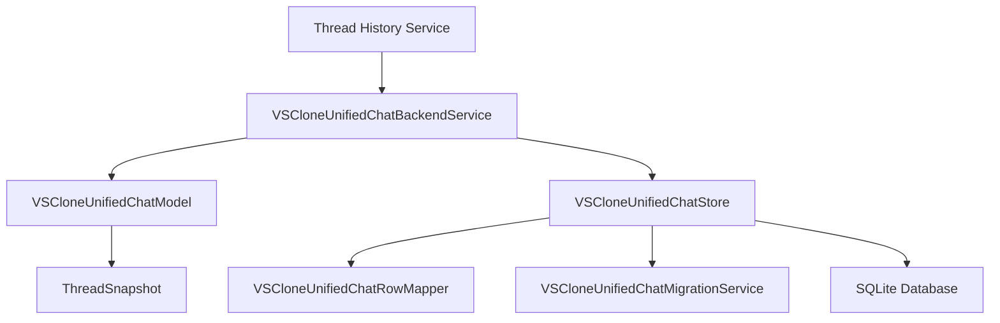
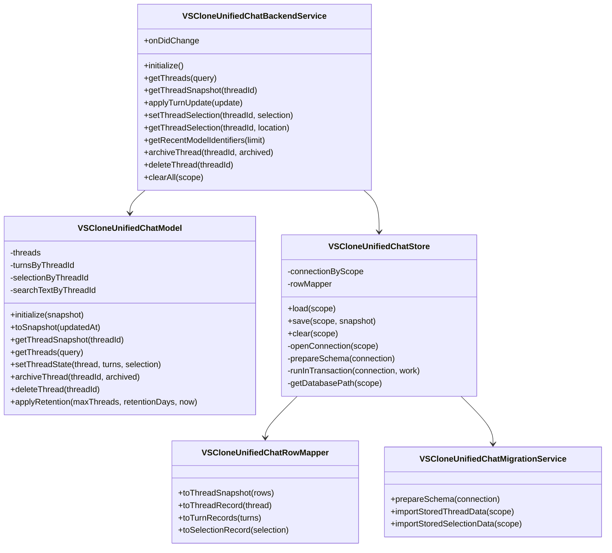

# Module 1: Thread History

Shared cross-module architecture, storage details, and top-level design rationale live in [the backend architecture document](../backend-unified-spec.md). This module document isolates the `Thread History` design so the durability and state-ownership details stay focused and easy to review.

## 1. Features

What it can do:

- own the canonical `ThreadSnapshot` abstraction
- create, update, archive, delete, and clear thread records
- reduce normalized turn updates into stable thread state
- restore a thread together with its turns and selected model
- expose thread-summary queries for the history rail
- persist thread, turn, and selection state transactionally
- run migration and retention logic

What it does not do:

- it does not render UI
- it does not discover models
- it does not talk directly to cloud providers
- it does not own provider secrets or authentication

## 2. Internal Architecture

Thread History should be structured as a thin public service over two internal layers:

- an in-memory domain model that applies deterministic state transitions
- a SQLite-backed repository that handles loading, saving, migration, and row mapping

This split is important because correctness and IO should be testable independently. The model should be easy to test with pure input/output cases, while the store should be tested with transaction, migration, and crash-recovery scenarios.

Why this design is defensible to a senior architect:

- the service layer owns lifecycle and change events, not business logic
- the model layer is the correctness boundary
- the store layer is the durability boundary
- migration and row mapping remain isolated from higher-level thread semantics

## 3. Data Abstraction

Primary abstraction: `ThreadSnapshot`

Abstraction function:

- the thread row represents summary-level conversation metadata
- the turn rows represent the ordered prompt/response history for that thread
- the optional selection row represents the active model bound to that thread
- together, these values represent one recoverable conversation state

Representation invariant:

- every turn belongs to an existing thread
- turns are ordered by sequence within a thread
- `turnCount` matches the number of stored turns for that thread
- `lastTurnPreview` is derived from the most recent turn
- if a thread has a selection, the selection refers to that same thread

Why this abstraction is useful:

- it matches how the user experiences the feature
- it gives restore, history display, and model restore the same correctness boundary
- it prevents the history rail from reconstructing state from partial or stale inputs

`TODO(student): If your instructor expects a formal abstraction function / representation invariant writeup, add it here using 6.005 terminology.`

## 4. Stable Storage Mechanism

Stable storage for this module is SQLite in workspace or profile scope, with transactional writes for thread updates.

Durability policy:

- initialize schema before first read or write
- commit thread summary, turn rows, and thread selection in one transaction
- retain a schema-version row in `meta`
- use retention pruning as an explicit backend policy, not implicit file deletion

## 5. Storage Schemas

This module owns or reads the following tables:

`threads`

- primary key: `thread_id`
- key fields: `session_resource`, `title`, `active_model_identifier`, `location`, `created_at`, `updated_at`, `status`, `archived`, `turn_count`, `last_turn_preview`
- purpose: one summary row per conversation

`turns`

- primary key: `turn_id`
- foreign key: `thread_id -> threads.thread_id`
- key fields: `sequence`, `model_identifier`, `provider_id`, `prompt_text`, `response_markdown`, `response_plain_text`, `started_at`, `completed_at`, `status`, `error_code`
- purpose: ordered turn history per thread

`thread_selection`

- primary key and foreign key: `thread_id -> threads.thread_id`
- key fields: `location`, `model_identifier`, `vendor`, `model_id`, `model_name`, `reasoning_effort`, `selected_at`
- purpose: per-thread selected model stored with the thread state

`meta`

- primary key: `key`
- key fields: `value`
- purpose: schema version and store metadata

## 6. External API

This project does not use a REST API here. The external API is an internal service contract exposed to other workbench services and UI surfaces.

Operations exposed by Thread History:

- `initialize()`
  - loads persisted state, runs migration if needed, and publishes readiness
- `getThreads(query)`
  - returns thread summaries filtered by text, archive status, or limit
- `getThreadSnapshot(threadId)`
  - returns one thread with turns and selection
- `applyTurnUpdate(update)`
  - reduces a normalized execution event into canonical state
- `setThreadSelection(threadId, selection)`
  - persists model selection as part of the thread snapshot
- `getThreadSelection(threadId, location)`
  - returns the selected model for that thread, if one exists
- `getRecentModelIdentifiers(limit)`
  - returns recent model identifiers needed by the switcher
- `archiveThread(threadId, archived)`
  - archives or unarchives a thread
- `deleteThread(threadId)`
  - permanently removes a thread and its turns
- `clearAll(scope)`
  - clears stored data for the selected persistence scope

## 7. Class, Method, and Field Declarations

Externally visible classes:

- `VSCloneUnifiedChatBackendService`
  - methods: `initialize`, `getThreads`, `getThreadSnapshot`, `applyTurnUpdate`, `setThreadSelection`, `getThreadSelection`, `getRecentModelIdentifiers`, `archiveThread`, `deleteThread`, `clearAll`
  - fields: `onDidChange`

Private-to-module classes:

- `VSCloneUnifiedChatModel`
  - methods: `initialize`, `toSnapshot`, `getThreadSnapshot`, `getThreads`, `setThreadState`, `archiveThread`, `deleteThread`, `applyRetention`
  - fields: `threads`, `turnsByThreadId`, `selectionByThreadId`, `searchTextByThreadId`

- `VSCloneUnifiedChatStore`
  - methods: `load`, `save`, `clear`, `openConnection`, `prepareSchema`, `runInTransaction`, `getDatabasePath`
  - fields: `connectionByScope`, `rowMapper`

- `VSCloneUnifiedChatRowMapper`
  - methods: `toThreadSnapshot`, `toThreadRecord`, `toTurnRecords`, `toSelectionRecord`
  - fields: none required beyond implementation-local helpers

- `VSCloneUnifiedChatMigrationService`
  - methods: `prepareSchema`, store-import helpers
  - fields: schema helpers and version constants

Externally visible fields:

- `onDidChange`

Private fields:

- `model`
- `store`
- `persistDelayer`
- `initialized`
- `initializing`
- `threads`
- `turnsByThreadId`
- `selectionByThreadId`
- `searchTextByThreadId`
- `connectionByScope`
- `rowMapper`

## 8. Mermaid Class Diagram

