# VSClone Backend Architecture

- **Author(s):** Brandon Howe
- **Role(s):** Developer
- **Version History:**
  - `v1.0` - Initial unified backend specification.
  - `v1.1` - Updated to match the implemented VSClone backend in `src/vs/workbench/contrib/vsclone`.

This document describes the backend that currently exists in the repository. In this project, "backend" means local workbench services plus Electron main-process IPC channels. VSClone does not expose a standalone REST service and does not manage a separate database schema.

## 1. Unified Architecture

### 1.1 Text Description

The implemented backend is composed of six cooperating subsystems:

1. `Thread History`
2. `Model Selection`
3. `Plan Mode`
4. `Chat Execution`
5. `Tab Completion`
6. `OAuth / Auth`

The main architectural decision is to keep one durable snapshot owner: `VSCloneUnifiedChatBackendService`. That service owns the persisted `IVSCloneChatHistorySnapshot`, which carries:

- thread summaries
- ordered turns per thread
- per-thread selected models
- per-location defaults
- recent model identifiers
- persisted thread plan mode

That design keeps restore-path and send-path behavior aligned. The history rail reads thread data from the same snapshot that `VSCloneThreadModelSelectionService` uses to restore model selection and that `VSClonePlanModeService` uses to restore thread mode. Execution never needs to reconstruct state from UI-only memory.

The renderer/workbench layer owns orchestration, prompt assembly, tool execution, completion debounce/cache, and storage coordination. The Electron main process owns the provider fetches, request cancellation, SSE parsing, and OAuth loopback listener. This split is the practical boundary for the codebase because it keeps secrets and CORS-sensitive network work out of the renderer while staying fully local.

### 1.2 Architecture Diagram

## 2. Shared Storage Contract

The shared durability contract is JSON-over-host-storage, not custom tables. On desktop builds the underlying host storage is SQLite-backed, but VSClone itself owns only these keys and payload shapes:

- `vsclone.chatHistory.v2.index`
  - thread summaries
  - `modeByThread`
  - `selectedByLocation`
  - `recentModelIdentifiers`
- `vsclone.chatHistory.v2.thread.<url-encoded-thread-id>`
  - ordered turns
  - optional per-thread selection
- `vsclone.providerPreferences.v1`
  - enabled flags for `openai`, `anthropic`, and `google`
- `secret://vsclone.oauth.tokens.<vendor>`
  - encrypted token sets through `ISecretStorageService`

Chat history keys are stored in workspace or profile scope depending on `vsclone.chatHistory.persistScope`. Provider preferences are profile-scoped. OAuth token sets are application-scoped secret-storage entries.

## 3. Module Documents

Detailed subsystem documents live in `backend-modules/`:

- [`Thread History`](backend-modules/thread-history.md)
- [`Model Selection`](backend-modules/model-selection.md)
- [`Plan Mode`](backend-modules/plan-mode.md)
- [`Chat Execution`](backend-modules/chat-execution.md)
- [`Tab Completion`](backend-modules/tab-completion.md)
- [`OAuth / Auth`](backend-modules/oauth-auth.md)

Plan Mode and OAuth / Auth each have their own module documents because both own cross-cutting runtime/state boundaries used by other subsystems. Chat Execution and Thread History still describe where plan-mode state is snapshotted into turns, while Model Selection, Chat Execution, and Tab Completion still describe where OAuth readiness and API headers are consumed.

## 4. Implemented Design Justifications

- One durable snapshot owner is the main correctness boundary. It prevents history, plan mode, and model selection from drifting apart.
- The code deliberately reuses VS Code host storage instead of introducing a VSClone-specific database file or schema migration layer.
- Renderer services own policy and orchestration; Electron main-process channels own provider fetches, abort wiring, and loopback OAuth because that is where the environment can safely perform them.
- OAuth uses secret storage plus a main-process loopback/token-exchange channel so browser launch, localhost callback capture, and token POSTs stay out of renderer fetch paths.
- Model catalog state is explicit source code, not a dynamic remote discovery step. `refreshCatalog()` recomputes readiness from provider preferences plus OAuth state so the picker behavior is deterministic and testable.
- Plan Mode is enforced twice: prompt assembly hides mutation tools from the model, and `VSCloneToolExecutionService` still blocks edit/create tools at runtime.
- Tab completion reuses the same selection policy as chat, but it keeps a dedicated transport and timeout path so editor latency requirements do not leak into the chat execution pipeline.

## 5. Concrete Constraints from the Code

- Streamed history deltas are persisted with a `300ms` delay; non-stream terminal states persist immediately.
- Retention limits are enforced by `vsclone.chatHistory.maxThreads` and `vsclone.chatHistory.retentionDays`.
- Inline completion requests time out after `1800ms`.
- The agent loop stops after `25` iterations and allows at most `2` corrective reprompts when the model fails to use tools for a tool-required task.
- The inline-completion fallback chain is policy-driven and currently prefers:
  - `openai/gpt-5.3-codex-spark`
  - `openai/gpt-5-nano`
  - `google/gemini-3.1-flash-lite-preview`
  - `anthropic/claude-haiku-4-5-20251001`
- The current composer send path always routes through the agent loop, even for ordinary chat turns.
