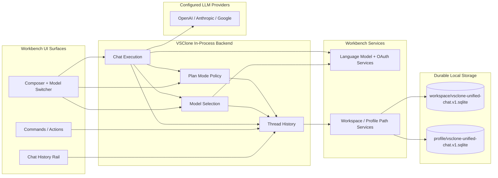

# VSClone Backend Architecture

- **Author(s):** Brandon Howe
- **Role(s):** Developer
- **Version History:**
  - `v1.0` - Initial unified backend specification for Stories 1 and 3.
  - `v1.1` - Split module-level specifications into dedicated files under `backend-modules/`.

This document defines one backend architecture for the related VSClone chat stories in this repo:

- Story 1: chat history rail
- Story 3: per-thread model switcher
- Plan Mode: read-only planning turns with hard runtime tool enforcement

Important constraint: VSClone does not have a traditional backend server and does not expose a REST API for these features. In this project, "backend" means the in-process workbench service layer that owns canonical state, durable storage, model-selection policy, and direct provider request execution.

This document now focuses on the shared architecture, storage contract, and top-level rationale. Detailed module specifications live in the linked files under `backend-modules/` so each subsystem has a dedicated document without duplicating the cross-module design context.

## 1. Unified Architecture

### 1.1 Text Description

The unified backend has three main modules plus one cross-cutting execution policy:

1. `Thread History`
2. `Chat Execution`
3. `Model Selection`
4. `Plan Mode`

The core architectural decision is to make `ThreadSnapshot` the canonical domain object for both user stories. A thread snapshot represents one recoverable conversation and contains:

- thread summary metadata
- ordered turn history
- the selected model for that thread
- supporting preferences such as defaults, recents, and provider enablement

This gives the feature set one source of truth. The history rail reads thread summaries and turns from the same backend snapshot that the model switcher uses to restore the selected model. The execution path also resolves the active model from that same snapshot before sending any request. Plan Mode uses the same thread snapshot so the UI, prompt assembly, tool gating, and post-response affordances all agree on whether a turn is read-only. That prevents split-brain behavior where the UI shows one mode while the execution path behaves like another.

Why this is the right design for a senior architect:

- State ownership is explicit. Only one module owns durable thread state.
- Execution and observation are grouped into one top-level module because the product has exactly one supported send path: direct provider execution.
- Provider discovery and provider execution are separated, which reduces the chance that catalog churn corrupts thread state.
- Plan Mode is a cross-cutting policy service rather than a UI-only toggle so read-only turns are enforced consistently across prompting, execution, and transcript rendering.
- SQLite gives us transactional durability, schema evolution, and indexed queries without inventing a network dependency that the product does not need.
- The design matches the current repo direction, which already has separate history, runtime, session, and model-selection services that can converge into this architecture cleanly.

`TODO(student): Add one paragraph in your own voice explaining why an in-process workbench backend is a better fit than a separate web service for this project.`

### 1.2 Mermaid Diagram

## 2. Shared Storage Contract

All modules and cross-cutting services rely on one SQLite durability contract rooted in VS Code storage locations:

- Workspace scope: `<workspaceStorage>/<workspaceId>/vsclone/vsclone-unified-chat.v1.sqlite`
- Profile scope: `<profileGlobalStorage>/vsclone/vsclone-unified-chat.v1.sqlite`

This is the preferred design because:

- thread, turn, and selection updates can commit atomically
- indexed lookups are a better fit than JSON-file scanning for thread lists and restore
- crash recovery and concurrent access are materially better than ad hoc file coordination
- schema migration remains straightforward through versioned DDL and metadata rows

The shared tables are:

- `meta`
- `threads`
- `turns`
- `thread_selection`
- `thread_modes`
- `location_defaults`
- `recent_models`
- `provider_preferences`

## 3. Module Documents

Each backend module now has its own focused document in `backend-modules/`. This keeps the architecture overview readable while preserving the deeper module-level specifications, APIs, data abstractions, and diagrams.

### 3.1 Thread History

[`Thread History Module`](backend-modules/thread-history.md)

Thread History owns the canonical `ThreadSnapshot`, thread lifecycle operations, retention policy, and transactional persistence that powers restore and history-rail queries.

### 3.2 Chat Execution

[`Chat Execution Module`](backend-modules/chat-execution.md)

Chat Execution owns prompt submission, provider execution, runtime observation, cancellation, and normalization of turn updates before those updates are reduced into durable thread state.

### 3.3 Model Selection

[`Model Selection Module`](backend-modules/model-selection.md)

Model Selection owns provider and model catalog discovery, per-thread model choice, location defaults, recent models, and provider enablement policy.

### 3.4 Plan Mode

[`Chat Execution Module`](backend-modules/chat-execution.md)

Plan Mode owns thread-scoped chat mode persistence, per-turn execution-mode snapshots, runtime tool-allowance checks, and the guarantee that read-only turns cannot mutate the workspace through tools or transcript actions.

## 4. Recommended Design Justifications

Use or adapt the following points when presenting to a senior architect:

- One canonical snapshot per thread is the main correctness boundary. It prevents history/model divergence and makes recovery deterministic.
- Chat Execution owns both send orchestration and stream normalization because the product only supports one direct provider path.
- Plan Mode must be enforced in runtime services, not just described in prompts, or the system still has mutation escape hatches.
- SQLite should remain local because the value of the feature is local recovery, not shared cloud history.
- Model selection is a policy layer over canonical thread state, not a UI-only preference.
- Execution state should stay transient except for the normalized updates reduced into Thread History, which keeps recovery simpler and avoids a second source of truth.

## 5. Open Blanks You Can Fill In

- `TODO(student): Add any latency or scale assumptions your professor expects.`
- `TODO(student): Add any privacy requirements, such as redaction or retention windows.`
- `TODO(student): Add any course-specific wording about abstraction functions or invariants if needed.`
