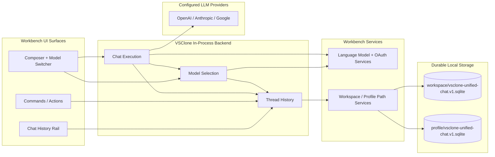
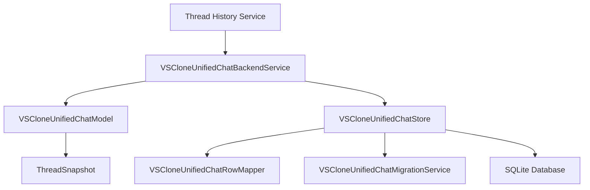
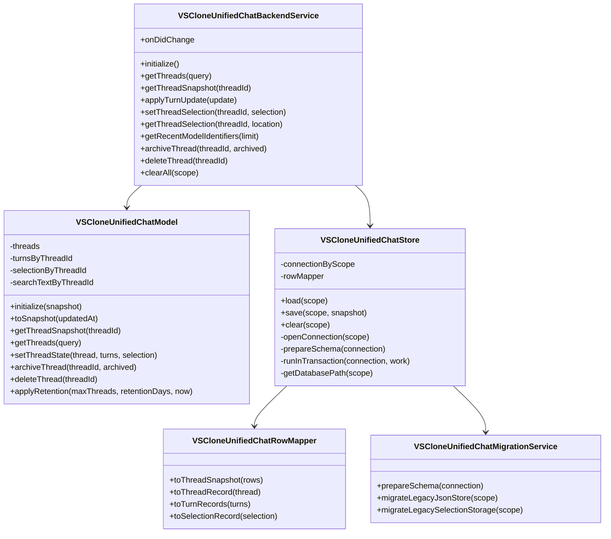
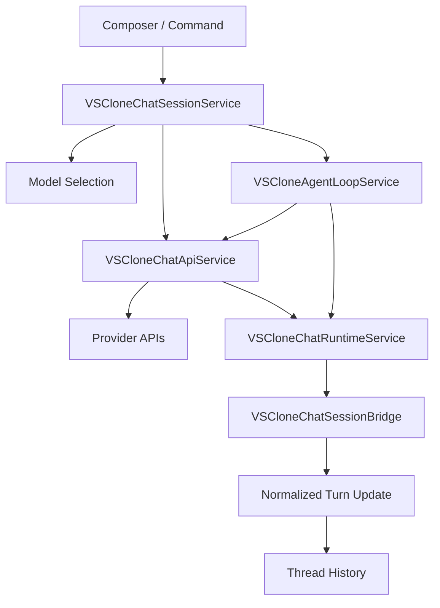
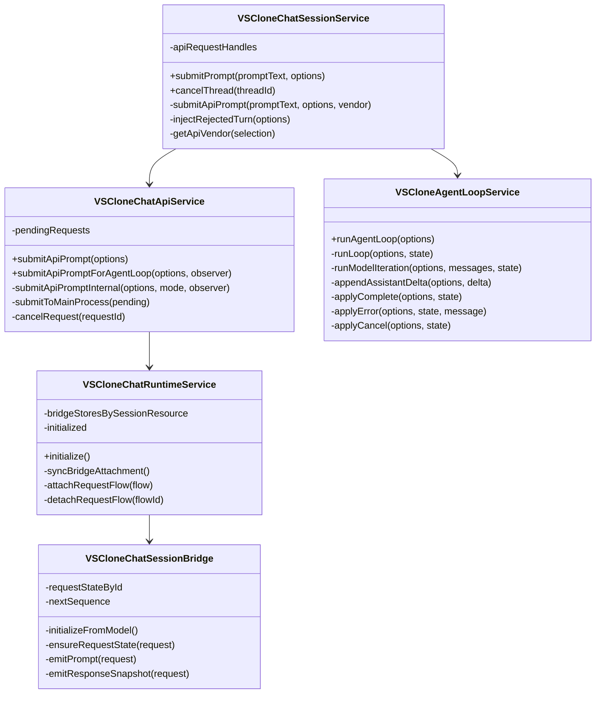
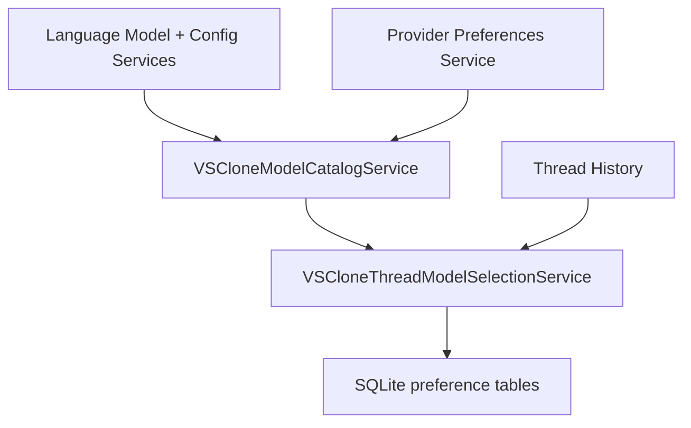
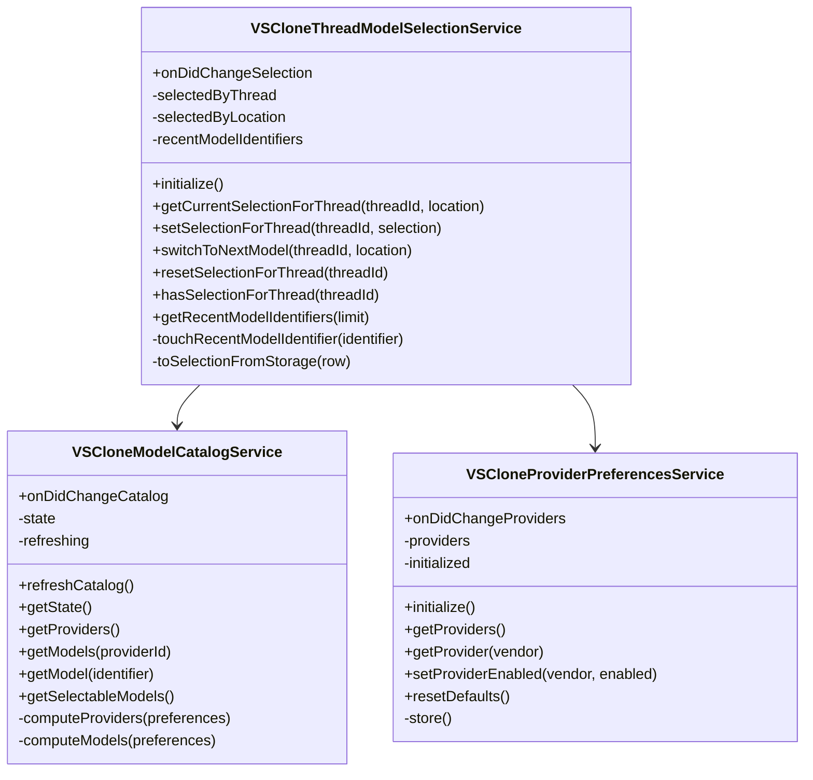

# VSClone Unified Backend Specification

- **Author(s):** Brandon Howe
- **Role(s):** Developer
- **Version History:**
  - `v1.0` - Initial unified backend specification for Stories 1 and 3.

This document defines one backend architecture for the two related CS485 user stories in this repo:

- Story 1: chat history rail
- Story 3: per-thread model switcher

Important constraint: VSClone does not have a traditional backend server and does not expose a REST API for these features. In this project, "backend" means the in-process workbench service layer that owns canonical state, durable storage, model-selection policy, and direct provider request execution.

## 1. Unified Architecture

### 1.1 Text Description

The unified backend has three modules:

1. `Thread History`
2. `Chat Execution`
3. `Model Selection`

The core architectural decision is to make `ThreadSnapshot` the canonical domain object for both user stories. A thread snapshot represents one recoverable conversation and contains:

- thread summary metadata
- ordered turn history
- the selected model for that thread
- supporting preferences such as defaults, recents, and provider enablement

This gives both stories one source of truth. The history rail reads thread summaries and turns from the same backend snapshot that the model switcher uses to restore the selected model. The execution path also resolves the active model from that same snapshot before sending any request. That prevents split-brain behavior where the UI shows one model while the outgoing request uses another.

Why this is the right design for a senior architect:

- State ownership is explicit. Only one module owns durable thread state.
- Execution and observation are grouped into one top-level module because the product has exactly one supported send path: direct provider execution.
- Provider discovery and provider execution are separated, which reduces the chance that catalog churn corrupts thread state.
- SQLite gives us transactional durability, schema evolution, and indexed queries without inventing a network dependency that the product does not need.
- The design matches the current repo direction, which already has separate history, runtime, session, and model-selection services that can converge into this architecture cleanly.

`TODO(student): Add one paragraph in your own voice explaining why an in-process workbench backend is a better fit than a separate web service for this project.`

### 1.2 Mermaid Diagram

## 2. Shared Storage Contract

All three modules rely on one SQLite durability contract rooted in VS Code storage locations:

- Workspace scope: `<workspaceStorage>/<workspaceId>/vsclone/vsclone-unified-chat.v1.sqlite`
- Profile scope: `<profileGlobalStorage>/vsclone/vsclone-unified-chat.v1.sqlite`

This is the preferred design because:

- thread, turn, and selection updates can commit atomically
- indexed lookups are a better fit than JSON-file scanning for thread lists and restore
- crash recovery and concurrent access are materially better than ad hoc file coordination
- schema migration remains straightforward through versioned DDL and metadata rows

The shared tables are:

- `meta`
- `threads`
- `turns`
- `thread_selection`
- `location_defaults`
- `recent_models`
- `provider_preferences`

## 3. Module 1: Thread History

### 3.1 Features

What it can do:

- own the canonical `ThreadSnapshot` abstraction
- create, update, archive, delete, and clear thread records
- reduce normalized turn updates into stable thread state
- restore a thread together with its turns and selected model
- expose thread-summary queries for the history rail
- persist thread, turn, and selection state transactionally
- run migration and retention logic

What it does not do:

- it does not render UI
- it does not discover models
- it does not talk directly to cloud providers
- it does not own provider secrets or authentication

### 3.2 Internal Architecture

Thread History should be structured as a thin public service over two internal layers:

- an in-memory domain model that applies deterministic state transitions
- a SQLite-backed repository that handles loading, saving, migration, and row mapping

This split is important because correctness and IO should be testable independently. The model should be easy to test with pure input/output cases, while the store should be tested with transaction, migration, and crash-recovery scenarios.

Why this design is defensible to a senior architect:

- the service layer owns lifecycle and change events, not business logic
- the model layer is the correctness boundary
- the store layer is the durability boundary
- migration and row mapping remain isolated from higher-level thread semantics

### 3.3 Data Abstraction

Primary abstraction: `ThreadSnapshot`

Abstraction function:

- the thread row represents summary-level conversation metadata
- the turn rows represent the ordered prompt/response history for that thread
- the optional selection row represents the active model bound to that thread
- together, these values represent one recoverable conversation state

Representation invariant:

- every turn belongs to an existing thread
- turns are ordered by sequence within a thread
- `turnCount` matches the number of stored turns for that thread
- `lastTurnPreview` is derived from the most recent turn
- if a thread has a selection, the selection refers to that same thread

Why this abstraction is useful:

- it matches how the user experiences the feature
- it gives restore, history display, and model restore the same correctness boundary
- it prevents the history rail from reconstructing state from partial or stale inputs

`TODO(student): If your instructor expects a formal abstraction function / representation invariant writeup, add it here using 6.005 terminology.`

### 3.4 Stable Storage Mechanism

Stable storage for this module is SQLite in workspace or profile scope, with transactional writes for thread updates.

Durability policy:

- initialize schema before first read or write
- commit thread summary, turn rows, and thread selection in one transaction
- retain a schema-version row in `meta`
- use retention pruning as an explicit backend policy, not implicit file deletion

### 3.5 Storage Schemas

This module owns or reads the following tables:

`threads`

- primary key: `thread_id`
- key fields: `session_resource`, `title`, `active_model_identifier`, `location`, `created_at`, `updated_at`, `status`, `archived`, `turn_count`, `last_turn_preview`
- purpose: one summary row per conversation

`turns`

- primary key: `turn_id`
- foreign key: `thread_id -> threads.thread_id`
- key fields: `sequence`, `model_identifier`, `provider_id`, `prompt_text`, `response_markdown`, `response_plain_text`, `started_at`, `completed_at`, `status`, `error_code`
- purpose: ordered turn history per thread

`thread_selection`

- primary key and foreign key: `thread_id -> threads.thread_id`
- key fields: `location`, `model_identifier`, `vendor`, `model_id`, `model_name`, `reasoning_effort`, `selected_at`
- purpose: per-thread selected model stored with the thread state

`meta`

- primary key: `key`
- key fields: `value`
- purpose: schema version and store metadata

### 3.6 External API

This project does not use a REST API here. The external API is an internal service contract exposed to other workbench services and UI surfaces.

Operations exposed by Thread History:

- `initialize()`
  - loads persisted state, runs migration if needed, and publishes readiness
- `getThreads(query)`
  - returns thread summaries filtered by text, archive status, or limit
- `getThreadSnapshot(threadId)`
  - returns one thread with turns and selection
- `applyTurnUpdate(update)`
  - reduces a normalized execution event into canonical state
- `setThreadSelection(threadId, selection)`
  - persists model selection as part of the thread snapshot
- `getThreadSelection(threadId, location)`
  - returns the selected model for that thread, if one exists
- `getRecentModelIdentifiers(limit)`
  - returns recent model identifiers needed by the switcher
- `archiveThread(threadId, archived)`
  - archives or unarchives a thread
- `deleteThread(threadId)`
  - permanently removes a thread and its turns
- `clearAll(scope)`
  - clears stored data for the selected persistence scope

### 3.7 Class, Method, and Field Declarations

Externally visible classes:

- `VSCloneUnifiedChatBackendService`
  - methods: `initialize`, `getThreads`, `getThreadSnapshot`, `applyTurnUpdate`, `setThreadSelection`, `getThreadSelection`, `getRecentModelIdentifiers`, `archiveThread`, `deleteThread`, `clearAll`
  - fields: `onDidChange`

Private-to-module classes:

- `VSCloneUnifiedChatModel`
  - methods: `initialize`, `toSnapshot`, `getThreadSnapshot`, `getThreads`, `setThreadState`, `archiveThread`, `deleteThread`, `applyRetention`
  - fields: `threads`, `turnsByThreadId`, `selectionByThreadId`, `searchTextByThreadId`

- `VSCloneUnifiedChatStore`
  - methods: `load`, `save`, `clear`, `openConnection`, `prepareSchema`, `runInTransaction`, `getDatabasePath`
  - fields: `connectionByScope`, `rowMapper`

- `VSCloneUnifiedChatRowMapper`
  - methods: `toThreadSnapshot`, `toThreadRecord`, `toTurnRecords`, `toSelectionRecord`
  - fields: none required beyond implementation-local helpers

- `VSCloneUnifiedChatMigrationService`
  - methods: `prepareSchema`, `migrateLegacyJsonStore`, `migrateLegacySelectionStorage`
  - fields: migration helpers and version constants

Externally visible fields:

- `onDidChange`

Private fields:

- `model`
- `store`
- `persistDelayer`
- `initialized`
- `initializing`
- `threads`
- `turnsByThreadId`
- `selectionByThreadId`
- `searchTextByThreadId`
- `connectionByScope`
- `rowMapper`

### 3.8 Mermaid Class Diagram

## 4. Module 2: Chat Execution

### 4.1 Features

What it can do:

- accept prompt submission from the composer or commands
- resolve the active thread and selected model before send
- call the configured provider through the direct provider path
- manage cancellation and in-flight request handles
- observe provider stream events
- normalize prompt, delta, completion, error, and cancel events into turn updates
- support agent-loop execution as an extension of the same request lifecycle

What it does not do:

- it does not own durable storage directly
- it does not define provider catalog policy
- it does not choose a model from UI state alone
- it does not render UI

### 4.2 Internal Architecture

Chat Execution merges what could have been called routing and runtime observation into one top-level module because the system has only one supported send path. Internally, however, it still benefits from a split into cooperating classes:

- a session service that accepts send requests and resolves the selected model
- an API service that performs transport-level provider execution
- an agent-loop service for multi-step execution
- a runtime service and session bridge that convert live provider events into normalized updates

This design is the right compromise because it keeps the public architecture simple without collapsing all execution behavior into one oversized class.

Why this is defensible to a senior architect:

- one module owns the full lifecycle from send to normalized update
- internal seams remain available for unit and integration testing
- request transport remains separate from thread-state ownership
- execution can evolve without destabilizing storage semantics

### 4.3 Data Abstraction

Primary abstractions:

- `ExecutionRequest`
- `ExecutionHandle`
- `RuntimeRequestState`
- `NormalizedTurnUpdate`

Abstraction function:

- an execution request represents one logical user send
- an execution handle represents control over the in-flight request
- runtime request state represents transient progress while the request is active
- a normalized turn update represents the durable semantic output that Thread History can safely persist

Representation invariant:

- every execution request is bound to exactly one thread
- every normalized turn update refers to one existing thread identifier and turn identifier
- stream events are reduced in sequence order for a given request
- terminal states are exclusive: completed, failed, or cancelled

The key architectural idea is that this module is allowed to be transient internally as long as it emits durable turn updates promptly into Thread History.

### 4.4 Stable Storage Mechanism

This module does not own an independent durable store. Its stable storage mechanism is indirect:

- request start, stream checkpoints, and terminal events are emitted into Thread History
- Thread History persists those updates in SQLite

Why this is acceptable:

- execution state is only valuable insofar as it changes the recoverable conversation
- a second execution-specific database would introduce another source of truth
- the system can recover to the last committed thread state even if the application crashes mid-stream

### 4.5 Storage Schemas

This module does not own tables of its own. It writes durable effects into Thread History through the following tables:

- `threads`
  - used to keep active model, timestamps, and summary state current
- `turns`
  - used to persist prompt text, streamed assistant output, status, and error information

Module-local transient state is not persisted separately.

### 4.6 External API

The external API is an internal execution service contract.

Operations exposed by Chat Execution:

- `submitPrompt(promptText, options)`
  - resolves thread and model, starts execution, and returns a submission result
- `cancelThread(threadId)`
  - cancels the active request for the given thread
- `submitApiPrompt(options)`
  - dispatches a direct provider request
- `submitApiPromptForAgentLoop(options, observer)`
  - dispatches a provider request for agent-mode execution
- `runAgentLoop(options)`
  - executes a multi-step agent loop while still producing normalized updates
- `initialize()`
  - starts runtime observation so active streams can be tracked even before the view opens

### 4.7 Class, Method, and Field Declarations

Externally visible classes:

- `VSCloneChatSessionService`
  - methods: `submitPrompt`, `cancelThread`
  - fields: none exposed publicly beyond service registration

- `VSCloneChatApiService`
  - methods: `submitApiPrompt`, `submitApiPromptForAgentLoop`
  - fields: none exposed publicly beyond service registration

- `VSCloneAgentLoopService`
  - methods: `runAgentLoop`
  - fields: none exposed publicly beyond service registration

- `VSCloneChatRuntimeService`
  - methods: `initialize`
  - fields: none exposed publicly beyond service registration

Private-to-module classes:

- `VSCloneChatSessionBridge`
  - methods: `initializeFromModel`, `ensureRequestState`, `emitPrompt`, `emitResponseSnapshot`
  - fields: `requestStateById`, `nextSequence`

Private methods across the module:

- `submitApiPromptInternal`
- `syncBridgeAttachment`
- `attachRequestFlow`
- `detachRequestFlow`
- `runLoop`
- `runModelIteration`
- `appendAssistantDelta`
- `applyComplete`
- `applyError`
- `applyCancel`
- `injectRejectedTurn`
- `getApiVendor`

Private fields across the module:

- `apiRequestHandles`
- `pendingRequests`
- `bridgeStoresBySessionResource`
- `requestStateById`
- `initialized`

### 4.8 Mermaid Class Diagram

## 5. Module 3: Model Selection

### 5.1 Features

What it can do:

- build the selectable provider/model catalog
- track per-thread selected models
- track per-location default models
- track recent models
- track provider enablement
- validate whether a model is selectable for the current context
- expose selection decisions to Chat Execution

What it does not do:

- it does not execute requests
- it does not store provider secrets
- it does not persist full conversation history
- it does not render the picker widget itself

### 5.2 Internal Architecture

Model Selection should remain internally split between two concerns:

- catalog discovery and validation
- thread-specific selection policy and preference persistence

That separation matters because provider availability can change frequently, while thread selection state should remain stable unless the user or a fallback rule changes it.

Why this is defensible to a senior architect:

- catalog refreshes do not need to mutate thread history
- selection policy can stay deterministic over canonical thread state
- provider enablement and recents remain policy data, not UI-local state
- fallback behavior stays centralized instead of spreading across picker code and send code

### 5.3 Data Abstraction

Primary abstractions:

- `ModelCatalogState`
- `ModelSelection`
- `SelectionPreferences`

Abstraction function:

- catalog state represents the currently available providers and models
- model selection represents the chosen model for one thread or location
- selection preferences represent persistent fallback and recent-choice policy

Representation invariant:

- a selected model identifier must refer to a model known to the catalog unless it is explicitly marked unavailable
- recent model identifiers are unique and ordered newest-first
- location defaults contain at most one default per location
- provider enablement contains at most one record per vendor

### 5.4 Stable Storage Mechanism

Stable storage for this module is the shared SQLite database used by Thread History.

Durability policy:

- per-thread selection persists in `thread_selection`
- per-location defaults persist in `location_defaults`
- recent models persist in `recent_models`
- provider enablement persists in `provider_preferences`

This is preferable to a separate preference file because restore behavior for history and model choice should read from the same durability contract.

### 5.5 Storage Schemas

This module owns or reads the following tables:

`thread_selection`

- primary key and foreign key: `thread_id -> threads.thread_id`
- key fields: `location`, `model_identifier`, `vendor`, `model_id`, `model_name`, `reasoning_effort`, `selected_at`
- purpose: selected model bound to a specific thread

`location_defaults`

- primary key: `location`
- key fields: `model_identifier`
- purpose: fallback defaults by surface or location

`recent_models`

- primary key: `position`
- key fields: `model_identifier`
- purpose: bounded recent-model list

`provider_preferences`

- primary key: `vendor`
- key fields: `enabled`
- purpose: persisted provider enablement policy

### 5.6 External API

The external API is an internal service contract used by the picker and Chat Execution.

Operations exposed by Model Selection:

- `initialize()`
  - loads provider preferences, defaults, recents, and any needed selection state
- `getCurrentSelectionForThread(threadId, location)`
  - returns the effective model for the thread
- `setSelectionForThread(threadId, selection)`
  - persists the selected model for a thread
- `switchToNextModel(threadId, location)`
  - rotates to the next valid model
- `resetSelectionForThread(threadId)`
  - clears explicit selection and falls back to defaults
- `hasSelectionForThread(threadId)`
  - reports whether the thread has an explicit saved selection
- `getRecentModelIdentifiers(limit)`
  - returns recent model identifiers
- `refreshCatalog()`
  - rebuilds provider/model catalog state
- `getProviders()`
  - returns provider descriptors
- `getModels(providerId)`
  - returns models for one provider or for the full catalog

### 5.7 Class, Method, and Field Declarations

Externally visible classes:

- `VSCloneThreadModelSelectionService`
  - methods: `initialize`, `getCurrentSelectionForThread`, `setSelectionForThread`, `switchToNextModel`, `resetSelectionForThread`, `hasSelectionForThread`, `getRecentModelIdentifiers`
  - fields: `onDidChangeSelection`

- `VSCloneModelCatalogService`
  - methods: `refreshCatalog`, `getState`, `getProviders`, `getModels`, `getModel`, `getSelectableModels`
  - fields: `onDidChangeCatalog`

- `VSCloneProviderPreferencesService`
  - methods: `initialize`, `getProviders`, `getProvider`, `setProviderEnabled`, `resetDefaults`
  - fields: `onDidChangeProviders`

Private-to-module classes and helpers:

- selection-policy helpers inside `VSCloneThreadModelSelectionService`
  - methods: `touchRecentModelIdentifier`, `toSelectionFromStorage`
  - fields: `selectedByThread`, `selectedByLocation`, `recentModelIdentifiers`

- catalog-computation helpers inside `VSCloneModelCatalogService`
  - methods: `computeProviders`, `computeModels`
  - fields: `state`, `refreshing`

- provider-preference persistence helpers inside `VSCloneProviderPreferencesService`
  - methods: `store`
  - fields: `providers`, `initialized`

Externally visible fields:

- `onDidChangeSelection`
- `onDidChangeCatalog`
- `onDidChangeProviders`

Private fields:

- `selectedByThread`
- `selectedByLocation`
- `recentModelIdentifiers`
- `state`
- `refreshing`
- `providers`
- `initialized`

### 5.8 Mermaid Class Diagram

## 6. Recommended Design Justifications

Use or adapt the following points when presenting to a senior architect:

- One canonical snapshot per thread is the main correctness boundary. It prevents history/model divergence and makes recovery deterministic.
- Chat Execution owns both send orchestration and stream normalization because the product only supports one direct provider path.
- SQLite should remain local because the value of the feature is local recovery, not shared cloud history.
- Model selection is a policy layer over canonical thread state, not a UI-only preference.
- Execution state should stay transient except for the normalized updates reduced into Thread History, which keeps recovery simpler and avoids a second source of truth.

## 7. Open Blanks You Can Fill In

- `TODO(student): Add any latency or scale assumptions your professor expects.`
- `TODO(student): Add any privacy requirements, such as redaction or retention windows.`
- `TODO(student): Add any course-specific wording about abstraction functions or invariants if needed.`
