# Header

Rationale: Because this is a fork of VSCode and not a standalone project, it's very important that LLMs adhere to the structure and contributing guidelines that VSCode has already established.

- **Spec ID:** `BC-CHAT-HISTORY-001`
- **Feature:** VSClone Unified Chat History Rail
- **User Story:** As a developer, I want to maintain a chat history with the LLM in a side panel so that I can reference previous prompts and responses while I work.
- **Scope:** Implement history as a left rail inside a single unified chat pane (history rail + conversation + composer/model toolbar), while keeping prompt/response capture, persistence, and search/reference behavior.
- **Non-goals:** Replacing VS Code’s core chat execution pipeline, multi-user sync, or introducing a new LLM provider protocol.
- **Target code area:** `src/vs/workbench/contrib/vsclone`
- **Proposed folders:**
  - `src/vs/workbench/contrib/vsclone/common`
  - `src/vs/workbench/contrib/vsclone/browser`
  - `src/vs/workbench/contrib/vsclone/electron-main` (reserved for future desktop-only enhancements; not required for MVP)
- **Required integration touchpoints:**
  - `src/vs/workbench/workbench.common.main.ts` (register contribution import)
  - unified chat host surface in `src/vs/workbench/contrib/vsclone/browser/vscloneUnifiedChatViewPane.ts`
  - external dependency from Story 3: `IVSCloneThreadModelSelectionService` (`src/vs/workbench/contrib/vsclone/common/vscloneThreadModelSelectionService.ts`)
  - Existing chat services/events from `src/vs/workbench/contrib/chat/common/*` and `src/vs/workbench/contrib/chat/browser/*`

# Architecture Diagram

Rationale: The architecture is designed to reflect the existing choices that VSCode made architecturally as much as possible. Chat generation is kept in existing services while confining history capture and rendering to the client/workbench layer. That split keeps responsibilities clean, avoids adding unnecessary backend behavior, and makes this easier to keep stable as upstream chat internals evolve.



- **Runtime placement:**
  - **Client:** unified chat pane UI (history rail + conversation + composer), bridge, in-memory model, persistence orchestration.
  - **Server process:** existing chat session execution and model event source.
  - **Cloud:** existing LLM backend (no new endpoint introduced).
  - **Local:** workspace/profile-scoped history files.

# Class Diagram

Rationale: The class diagram is based on the list of classes. The classes are decoupled as much as possible to prevent making code unmaintainable or difficult to edit. I wanted to avoid one oversized service and keep boundaries clear so testing and refactoring are easy.



# List of Classes

Rationale: Each class is designed to do a single thing. Migration and serialization classes are implemented up front to prepare for those cases rather than trying to handle those issues when they arise. There are a number of chat UI elements such as the view pane and history rail that make it easy to add more UI elements in the future.

- `VSCloneChatHistoryContribution` (`browser/vscloneChatHistory.contribution.ts`): registers unified chat integration, singleton services, and startup lifecycle hooks.
- `VSCloneChatSessionBridge` (`browser/vscloneChatSessionBridge.ts`): subscribes to `IChatService`/`IChatModel` events and converts them into normalized turn updates.
- `VSCloneUnifiedChatViewPane` (`browser/vscloneUnifiedChatViewPane.ts`): hosts one-pane chat layout regions (history rail, conversation surface, composer hooks).
- `VSCloneChatHistoryRail` (`browser/vscloneChatHistoryRail.ts`): renders the history rail and manages selection/search interactions.
- `VSCloneChatHistoryTreeDataSource` (`browser/vscloneChatHistoryRailTree.ts`): adapts history model into rail nodes (thread groups, threads, turns).
- `VSCloneChatHistoryCommandRegistrar` (`browser/vscloneChatHistoryActions.ts`): registers command handlers, context menu actions, and keybindings.
- `VSCloneChatHistoryService` (`common/vscloneChatHistoryService.ts`): central orchestration service for loading, querying, mutating, and persistence scheduling.
- `VSCloneChatHistoryModel` (`common/vscloneChatHistoryModel.ts`): in-memory store and query engine for thread/turn state.
- `VSCloneChatHistoryStore` (`common/vscloneChatHistoryStore.ts`): file-backed persistence, retention pruning, and recovery.
- `VSCloneChatHistorySerializer` (`common/vscloneChatHistorySerializer.ts`): JSON serialization/deserialization with deterministic ordering.
- `VSCloneChatHistoryMigrationService` (`common/vscloneChatHistoryMigrationService.ts`): schema upgrades and backward compatibility logic.

# State Diagrams

Rationale: A lot of things can go wrong with LLM code generation: streaming issues, wifi drops, cancelations, completions, interrupts, etc. As many of these cases are handled as possible in the state diagram. Making those transitions explicit now should reduce edge-case bugs where turns get stuck in a bad state.





# Flow Chart

Rationale: The flow chart keeps the ingestion path linear: capture event, normalize it, update in-memory state, then persist at safe checkpoints. I chose this ordering to make behavior easier to reason about and easier to debug when state looks wrong. It also keeps the UI responsive while still making history recoverable.



# Development Risks and Failures

Rationale: The risk table concentrates on the highest-probability integration failures: event ordering, storage integrity, scaling, and upstream API churn. I focused on mitigations that are local, testable, and practical for MVP instead of anything that requires a major rewrite. That gives us a better chance of shipping with predictable behavior.

| Risk | Failure Mode | Mitigation |
|---|---|---|
| Event ordering drift from chat internals | Turns attached to wrong thread or wrong status | Normalize by `sessionResource + requestId`; ignore stale sequence numbers |
| Unified pane density issues | History rail or conversation area becomes cramped | Provide resizable rail width and collapse/expand rail action |
| Streaming write pressure | UI jank and excessive disk writes | Keep streaming in memory; persist on terminal states + debounced checkpoints |
| Corrupt history files | Panel fails to load | Atomic write (`.tmp` then replace), schema validation, backup + recovery path |
| Large history volume | Slow startup/filtering | Lazy-load thread bodies, cap defaults (`maxThreads`, `maxTurnsPerThread`), prune old data |
| Multi-window same workspace | Last write wins and index inconsistency | Timestamp-based conflict resolution and periodic full re-read before write |
| API changes in upstream chat contrib | Bridge breaks after merge/rebase | Isolate bridge adapter, cover with unit tests against mocked `IChatModel` events |
| Markdown safety | XSS-like rendering concerns | Reuse existing sanitized markdown renderer pipeline and allowed tags list |

# Technology Stack

Rationale: A lot of the technology stack is already specified because this is building off of the VSCode repository. I tried not to include anything new framework wise to make sure the project is as maintainable as possible. Reusing existing services and UI patterns should also make development easier for LLMs as they can utilize existing docs.

- Language/runtime: TypeScript in VS Code workbench architecture.
- UI: unified chat view composition (`ViewPane` + embedded rail/list + conversation surface), existing markdown rendering infra.
- State/events: `Emitter`, `Event`, and existing observable patterns.
- Persistence: `IFileService`, `IStorageService`, workspace/profile storage paths.
- Integration: existing `IChatService`, `IChatModel`, `IChatWidgetService`, `IClipboardService`.
- Testing: workbench unit tests in `src/vs/workbench/contrib/vsclone/test/browser` and persistence tests in `.../test/common`.
- Telemetry/logging: existing workbench telemetry/log services with content-redacted events only.

# APIs

Rationale: I kept API usage tied to existing chat events and service surfaces as much as possible. The new command/config set is intentionally small so the feature is easy to use without expanding scope too much. This should keep integrations stable even if provider details change later.

- Existing consumed APIs:
  - `IChatService.onDidCreateModel`
  - `IChatService.getSession(...)`
  - `IChatModel.onDidChange` (`addRequest`, `changedRequest`, `completedRequest`, `removeRequest`)
  - `IChatWidgetService.revealWidget(...)`, `IChatWidget.setInput(...)`
- New commands:
  - `vsclone.chat.open`
  - `vsclone.chatHistory.focusRail`
  - `vsclone.chatHistory.toggleRail`
  - `vsclone.chatHistory.copyPrompt`
  - `vsclone.chatHistory.copyResponse`
  - `vsclone.chatHistory.reusePrompt`
  - `vsclone.chatHistory.openSession`
  - `vsclone.chatHistory.deleteThread`
  - `vsclone.chatHistory.clearAllWorkspace`
- New configuration keys:
  - `vsclone.chatHistory.enabled` (`boolean`, default `true`)
  - `vsclone.chatHistory.maxThreads` (`number`, default `200`)
  - `vsclone.chatHistory.maxTurnsPerThread` (`number`, default `100`)
  - `vsclone.chatHistory.retentionDays` (`number`, default `30`)
  - `vsclone.chatHistory.railWidth` (`number`, default `320`)
  - `vsclone.chatHistory.persistScope` (`"workspace" | "profile"`, default `"workspace"`)
  - `vsclone.chatHistory.redactSecrets` (`boolean`, default `true`)
- No new external cloud endpoint is introduced by this story; existing LLM transport remains unchanged.

# Public Interfaces

Rationale: The public interfaces are centered around predictable lifecycle actions, querying, and explicit mutations. I tried to keep each contract straightforward so callers can understand side effects and failure states without guessing. That makes the service easier to consume from UI code and safer to evolve over time.

```ts
export interface IVSCloneChatHistoryService {
	readonly _serviceBrand: undefined;
	readonly onDidChange: Event<IVSCloneChatHistoryChangeEvent>;
	initialize(): Promise<void>;
	getThreads(query?: IVSCloneChatHistoryQuery): readonly IVSCloneChatHistoryThread[];
	getTurns(threadId: string): readonly IVSCloneChatHistoryTurn[];
	applyTurnUpdate(update: IVSCloneChatTurnUpdate): Promise<void>;
	archiveThread(threadId: string, archived: boolean): Promise<void>;
	deleteThread(threadId: string): Promise<void>;
	clearAll(scope: 'workspace' | 'profile'): Promise<void>;
}

export interface IVSCloneChatHistoryQuery {
	text?: string;
	includeArchived?: boolean;
	fromTimestamp?: number;
	toTimestamp?: number;
	limit?: number;
}

export interface IVSCloneChatHistoryThread {
	threadId: string;
	sessionResource: string;
	title: string;
	activeModelIdentifier?: string;
	createdAt: number;
	updatedAt: number;
	status: 'active' | 'completed' | 'failed' | 'archived';
	archived: boolean;
	turnCount: number;
	lastTurnPreview: string;
}

export interface IVSCloneChatHistoryTurn {
	turnId: string;
	threadId: string;
	sequence: number;
	modelIdentifier?: string;
	providerId?: string;
	promptText: string;
	responseMarkdown: string;
	responsePlainText: string;
	startedAt: number;
	completedAt?: number;
	status: 'pending' | 'streaming' | 'completed' | 'failed' | 'cancelled';
	errorCode?: string;
}

export interface IVSCloneChatTurnUpdate {
	threadId: string;
	turnId: string;
	sequence: number;
	modelIdentifier?: string;
	providerId?: string;
	phase: 'prompt' | 'stream' | 'complete' | 'error' | 'cancel';
	promptText?: string;
	responseMarkdownDelta?: string;
	responsePlainTextDelta?: string;
	occurredAt: number;
	errorCode?: string;
}
```

# Data Schemas

Rationale: The chat data can be broadly broken down into two sections: info about the thread and info within each thread (like chat messages). This way, you don't have to load the info about every thread unless you open it, which saves performance if you have a lot of threads. It also helps with safer writes and clearer migrations because metadata and large payload data are separated.

- **Storage root:**
  - Workspace scope: `<workspaceStorage>/[workspaceId]/vsclone/chatHistory`
  - Empty window/profile scope: `<profileGlobalStorage>/vsclone/chatHistory`
- **Files:**
  - `history.index.v1.json` (thread metadata)
  - `threads/{threadId}.v1.json` (full turn data per thread)

```json
{
  "schemaVersion": 1,
  "workspaceId": "9f0a...c1",
  "updatedAt": 1765000000000,
  "threads": [
    {
      "threadId": "3f4e...8a",
      "sessionResource": "vscode-local-chat-session://session/abc",
      "title": "Refactor auth middleware",
      "activeModelIdentifier": "copilot/gpt-4.1",
      "createdAt": 1764999000000,
      "updatedAt": 1765000000000,
      "status": "completed",
      "archived": false,
      "turnCount": 4,
      "lastTurnPreview": "Try extracting JWT validation..."
    }
  ]
}
```

```json
{
  "schemaVersion": 1,
  "threadId": "3f4e...8a",
  "sessionResource": "vscode-local-chat-session://session/abc",
  "turns": [
    {
      "turnId": "t-001",
      "sequence": 1,
      "modelIdentifier": "copilot/gpt-4.1",
      "providerId": "copilot",
      "promptText": "Refactor this auth middleware for readability",
      "responseMarkdown": "Here is a cleaner structure...",
      "responsePlainText": "Here is a cleaner structure...",
      "startedAt": 1764999000123,
      "completedAt": 1764999002450,
      "status": "completed"
    }
  ]
}
```

- **Migration policy:**
  - Always read via `VSCloneChatHistoryMigrationService`.
  - Unsupported major version triggers safe fallback (history disabled for that workspace + non-blocking error notification).
  - Successful migration rewrites v1 files atomically.

# Security and Privacy

Rationale: User data is local as much as possible, very little information needs to be sent to telemetry and that data can be aggregates instead of raw data. Additionally, deletion options will be very clear to the user so they are in full control of their data.

- History content remains local to the machine/workspace storage; no prompt/response content is sent to telemetry.
- Telemetry, if any, contains only aggregate counters (history size, load time, migration success/failure).
- Markdown rendering reuses existing sanitized renderer (no raw HTML execution).
- `persistScope` defaults to `workspace` to reduce cross-project leakage.
- `redactSecrets` applies lightweight local redaction before persist for common token patterns.
- User controls:
  - disable feature globally
  - clear workspace history
  - delete single thread
- Residual risk: local filesystem access by other local users is out of scope for this story’s MVP.

# Risks to Completion

Rationale: A lot of the risks to completion are related to difficulties working with other services, specifically the VSCode codebase and LLM APIs.

- It may prove more difficult than expected to integrate with the existing VSCode codebase.
- High churn in upstream chat internals may require adapter updates during rebases.
- Accessibility polish (keyboard traversal, screen reader labels) may take longer than expected.
- Search UX expectations may expand from substring to semantic search, increasing scope.
