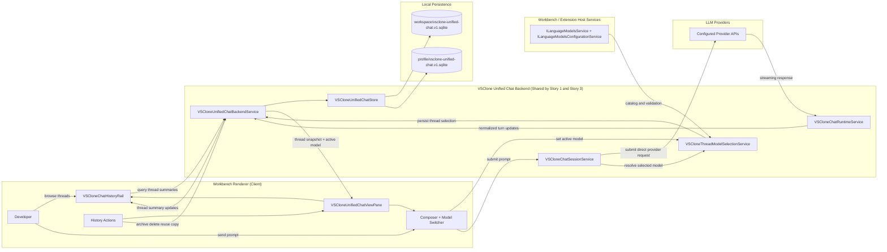
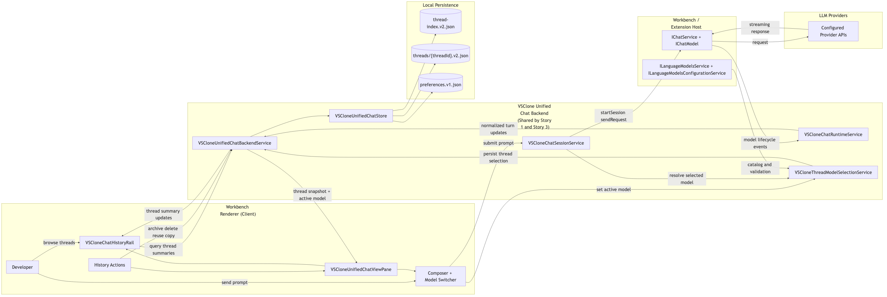
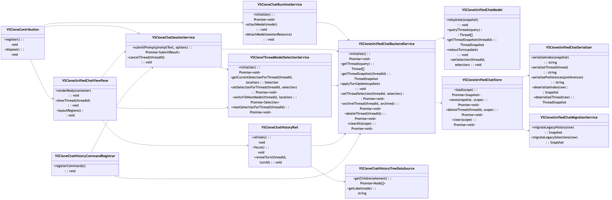
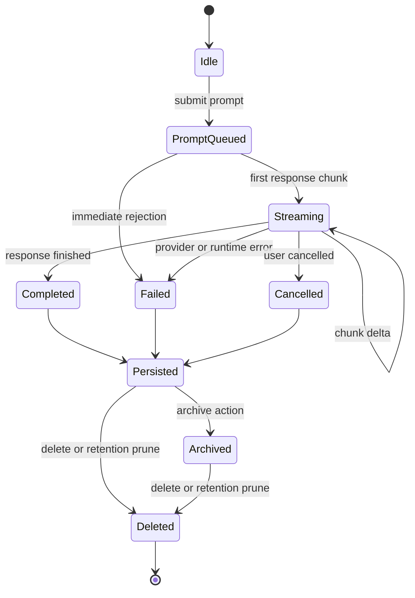
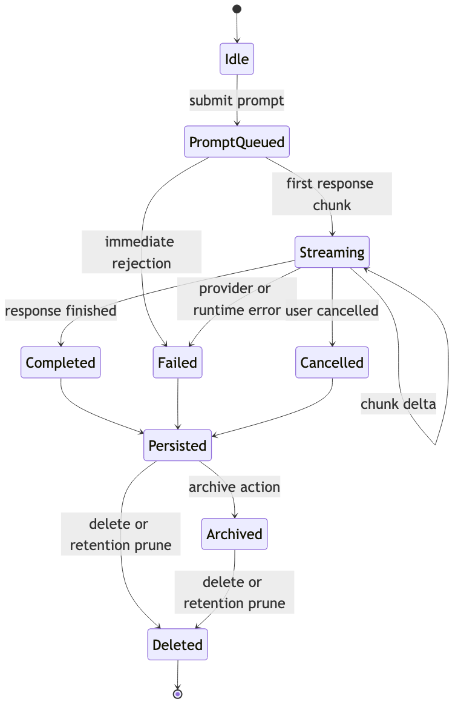
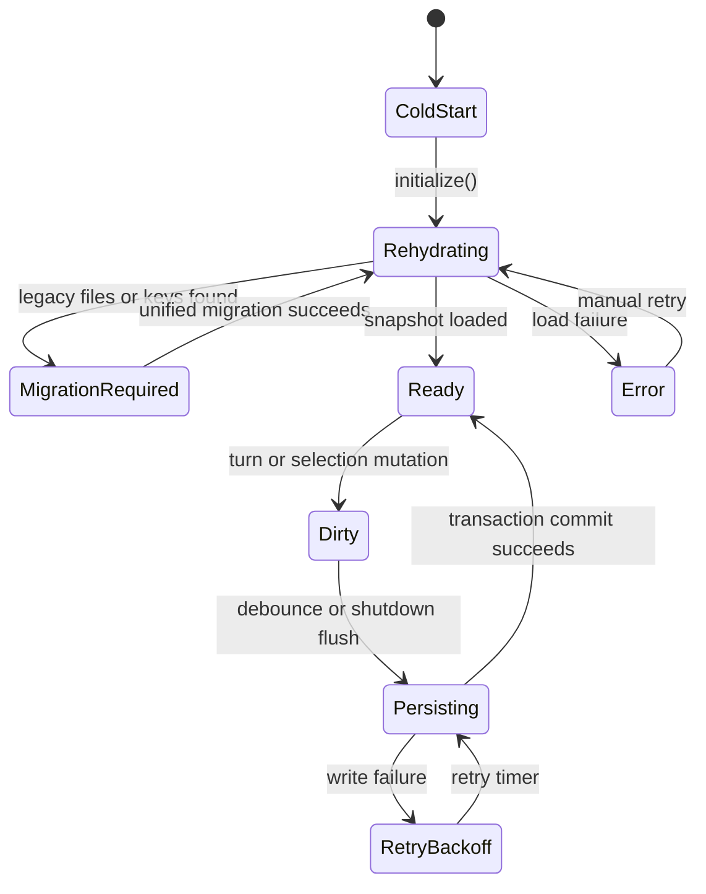
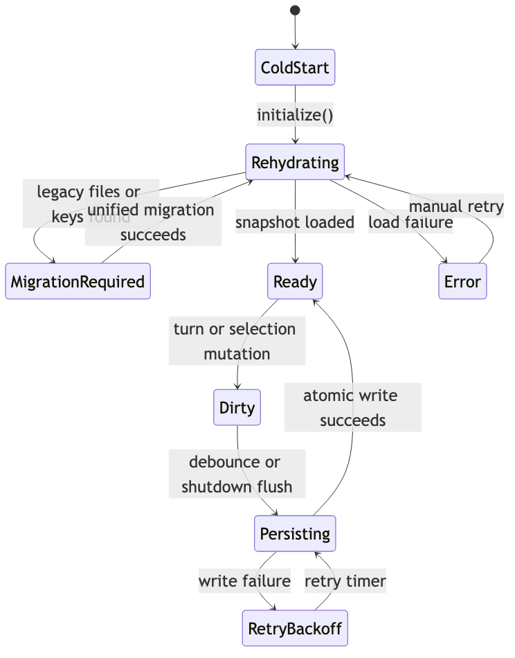
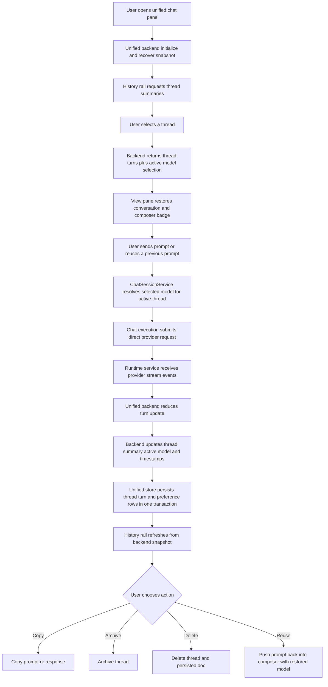
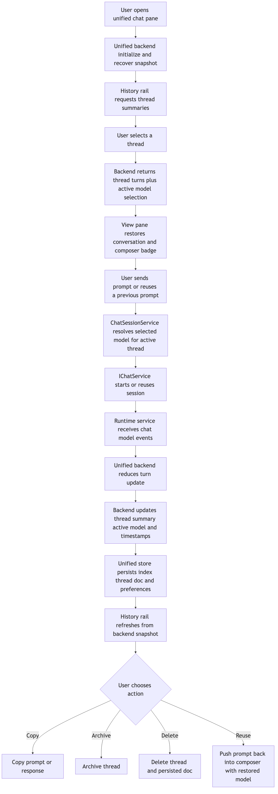

# Header

Rationale: This revision intentionally makes Story 1 and Story 3 share one backend specification. Because VSClone is implemented inside a VS Code fork, "backend" in this document means the shared workbench service layer and persistence adapters that own canonical chat state, not a separate web service.

- **Spec ID:** `BC-CHAT-HISTORY-001`
- **Revision:** `single-backend harmonized revision`
- **Author(s):** Brandon Howe
- **Role(s):** Developer
- **Version History:**
  - `v1.0` - Initial Story 1 development specification.
  - `v1.1` - Harmonized revision aligned with the shared SQLite-backed backend.
- **Feature:** VSClone Unified Chat History Rail
- **User Story:** As a developer, I want to maintain a chat history with the LLM in a side panel so that I can reference previous prompts and responses while I work.
- **Primary Outcome:** A responsive history rail inside the unified chat pane that is backed by the same thread state, model-selection state, and persistence backend used by the model switcher in Story 3.
- **Shared Backend Assumption:** Story 1 and Story 3 are both powered by a single `VSClone Unified Chat Backend` that owns thread metadata, turn history, per-thread model selection, recovery, and persistence.
- **Scope (MVP):**
  - Render a history rail inside the unified chat pane.
  - Show thread summaries, turn previews, and active-model metadata from the shared backend.
  - Reuse the backend thread snapshot to restore both conversation content and the selected model when a thread becomes active.
  - Persist history and model-selection metadata through one backend storage contract.
  - Support copy, reuse, archive, delete, and clear actions without introducing a separate history-only store.
- **Non-goals (MVP):**
  - Replacing VS Code's core chat execution pipeline.
  - Cross-device sync or team-shared conversation history.
  - Introducing a new provider protocol or custom cloud history service.
- **Target code area:** `src/vs/workbench/contrib/vsclone`
- **Proposed folders:**
  - `src/vs/workbench/contrib/vsclone/common`
  - `src/vs/workbench/contrib/vsclone/browser`
  - `src/vs/workbench/contrib/vsclone/electron-main` (reserved, not required for MVP)
- **Required integration touchpoints:**
  - `src/vs/workbench/workbench.common.main.ts` with exactly one VSClone import: `./contrib/vsclone/browser/vsclone.contribution.js`
  - Single VSClone registration entrypoint: `src/vs/workbench/contrib/vsclone/browser/vsclone.contribution.ts`
  - Chat execution services: `src/vs/workbench/contrib/vsclone/browser/vscloneChatRuntimeService.ts` for stream capture and `src/vs/workbench/contrib/vsclone/browser/vscloneChatSessionService.ts` for request dispatch
  - Shared backend owner: `src/vs/workbench/contrib/vsclone/common/vscloneUnifiedChatBackendService.ts`
  - Unified chat host surface: `src/vs/workbench/contrib/vsclone/browser/vscloneUnifiedChatViewPane.ts`
  - Existing chat services and rendering surfaces from `src/vs/workbench/contrib/chat/common/*` and `src/vs/workbench/contrib/chat/browser/*`
  - Model catalog and validation dependencies shared with Story 3: `ILanguageModelsService`, `ILanguageModelsConfigurationService`, and `IVSCloneThreadModelSelectionService`

# Architecture Diagram

Rationale: The architecture uses one shared backend so the history rail never has to guess which model belonged to which thread. The same backend snapshot drives the rail, the active conversation view, and the model switcher, which removes the split-brain risk that existed when history and model preferences were described separately.


```mermaid
flowchart LR
  subgraph Client["Workbench Renderer (Client)"]
    Dev["Developer"]
    View["VSCloneUnifiedChatViewPane"]
    Rail["VSCloneChatHistoryRail"]
    Composer["Composer + Model Switcher"]
    Actions["History Actions"]
  end

  subgraph Backend["VSClone Unified Chat Backend (Shared by Story 1 and Story 3)"]
    Runtime["VSCloneChatRuntimeService"]
    Session["VSCloneChatSessionService"]
    BackendSvc["VSCloneUnifiedChatBackendService"]
    Selection["VSCloneThreadModelSelectionService"]
    Store["VSCloneUnifiedChatStore"]
  end

  subgraph Workbench["Workbench / Extension Host Services"]
    LM["ILanguageModelsService + ILanguageModelsConfigurationService"]
  end

  subgraph Local["Local Persistence"]
    WorkspaceDb[("workspace/vsclone-unified-chat.v1.sqlite")]
    ProfileDb[("profile/vsclone-unified-chat.v1.sqlite")]
  end

  subgraph Cloud["LLM Providers"]
    Providers["Configured Provider APIs"]
  end

  Dev -->|browse threads| Rail
  Dev -->|send prompt| Composer
  View --> Rail
  View --> Composer
  Actions --> View

  Rail -->|query thread summaries| BackendSvc
  Actions -->|archive delete reuse copy| BackendSvc
  Composer -->|set active model| Selection
  Composer -->|submit prompt| Session

  Session -->|submit direct provider request| Providers
  Session -->|resolve selected model| Selection
  Providers -->|streaming response| Runtime
  Runtime -->|normalized turn updates| BackendSvc
  LM -->|catalog and validation| Selection
  Selection -->|persist thread selection| BackendSvc
  BackendSvc --> Store
  Store --> WorkspaceDb
  Store --> ProfileDb
  BackendSvc -->|thread snapshot + active model| View
  BackendSvc -->|thread summary updates| Rail
```



- **Runtime placement:**
  - **Client:** unified chat view, history rail, action handling, and conversation rendering.
  - **Shared backend:** chat execution, canonical thread state, model-selection persistence, and migration.
  - **Workbench services:** language-model registry/configuration and the VSClone in-process runtime.
  - **Cloud:** existing configured LLM provider APIs.
  - **Local:** one unified SQLite persistence contract for threads, turns, selections, and backend preferences.

# Class Diagram

Rationale: The class split keeps one canonical backend while still isolating the history UI into its own rail and action classes. The backend service owns the truth; the rail and view pane are projections over that state.


```mermaid
classDiagram
direction LR

class VSCloneContribution {
  +register(): void
  +dispose(): void
}

class VSCloneChatRuntimeService {
  +initialize(): Promise~void~
  +attachModel(model): void
  +detachModel(sessionResource): void
}

class VSCloneChatSessionService {
  +submitPrompt(promptText, options): Promise~SubmitResult~
  +cancelThread(threadId): void
}

class VSCloneUnifiedChatBackendService {
  +initialize(): Promise~void~
  +getThreads(query): Thread[]
  +getThreadSnapshot(threadId): ThreadSnapshot
  +applyTurnUpdate(update): void
  +setThreadSelection(threadId, selection): Promise~void~
  +archiveThread(threadId, archived): Promise~void~
  +deleteThread(threadId): Promise~void~
  +clearAll(scope): Promise~void~
}

class VSCloneUnifiedChatModel {
  +rehydrate(snapshot): void
  +queryThreads(query): Thread[]
  +getThreadSnapshot(threadId): ThreadSnapshot
  +reduceTurn(update): void
  +setSelection(threadId, selection): void
}

class VSCloneUnifiedChatStore {
  +load(scope): Promise~Snapshot~
  +save(snapshot, scope): Promise~void~
  +deleteThread(threadId, scope): Promise~void~
  +clear(scope): Promise~void~
}

class VSCloneUnifiedChatRowMapper {
  +toThreadSnapshot(rows): ThreadSnapshot
  +toThreadRecord(thread): ThreadRow
  +toTurnRecords(turns): TurnRow[]
  +toSelectionRecord(selection): SelectionRow
}

class VSCloneUnifiedChatMigrationService {
  +prepareSchema(connection): Promise~void~
  +migrateLegacyHistory(scope): Promise~void~
  +migrateLegacySelections(scope): Promise~void~
}

class VSCloneThreadModelSelectionService {
  +initialize(): Promise~void~
  +getCurrentSelectionForThread(threadId, location): Selection
  +setSelectionForThread(threadId, selection): Promise~void~
  +switchToNextModel(threadId, location): Promise~Selection~
  +resetSelectionForThread(threadId): Promise~void~
}

class VSCloneUnifiedChatViewPane {
  +renderBody(container): void
  +showThread(threadId): void
  +layoutRegions(): void
}

class VSCloneChatHistoryRail {
  +refresh(): void
  +focus(): void
  +revealTurn(threadId, turnId): void
}

class VSCloneChatHistoryTreeDataSource {
  +getChildren(element): Promise~Node[]~
  +getLabel(node): string
}

class VSCloneChatHistoryCommandRegistrar {
  +registerCommands(): void
}

VSCloneContribution --> VSCloneChatRuntimeService
VSCloneContribution --> VSCloneChatSessionService
VSCloneContribution --> VSCloneUnifiedChatViewPane
VSCloneChatRuntimeService --> VSCloneUnifiedChatBackendService
VSCloneChatSessionService --> VSCloneThreadModelSelectionService
VSCloneChatSessionService --> VSCloneUnifiedChatBackendService
VSCloneThreadModelSelectionService --> VSCloneUnifiedChatBackendService
VSCloneUnifiedChatBackendService --> VSCloneUnifiedChatModel
VSCloneUnifiedChatBackendService --> VSCloneUnifiedChatStore
VSCloneUnifiedChatStore --> VSCloneUnifiedChatRowMapper
VSCloneUnifiedChatStore --> VSCloneUnifiedChatMigrationService
VSCloneUnifiedChatViewPane --> VSCloneChatHistoryRail
VSCloneUnifiedChatViewPane --> VSCloneThreadModelSelectionService
VSCloneUnifiedChatViewPane --> VSCloneChatSessionService
VSCloneChatHistoryRail --> VSCloneChatHistoryTreeDataSource
VSCloneChatHistoryRail --> VSCloneUnifiedChatBackendService
VSCloneChatHistoryCommandRegistrar --> VSCloneUnifiedChatBackendService
VSCloneChatHistoryCommandRegistrar --> VSCloneChatSessionService
```



# List of Classes

Rationale: The shared backend classes are deliberately listed in this Story 1 spec so the history rail is no longer described as an isolated subsystem. That keeps the implementation plan honest: thread history and thread model selection are the same domain object viewed through different UI surfaces.

- **Shared backend classes:**
  - `VSCloneContribution` (`browser/vsclone.contribution.ts`): one registration entrypoint for the unified chat pane, backend services, and actions.
  - `VSCloneChatRuntimeService` (`browser/vscloneChatRuntimeService.ts`): startup-scoped execution-tracking service that listens to provider stream events even when the view is closed.
  - `VSCloneChatSessionService` (`browser/vscloneChatSessionService.ts`): request-dispatch service that sends prompts through the active thread and selected model, and supports history reuse flows.
  - `VSCloneUnifiedChatBackendService` (`common/vscloneUnifiedChatBackendService.ts`): canonical backend service for thread snapshots, turn reduction, model selection persistence, and storage orchestration.
  - `VSCloneUnifiedChatModel` (`common/vscloneUnifiedChatModel.ts`): in-memory source of truth for thread summaries, turn lists, and per-thread model-selection metadata.
  - `VSCloneUnifiedChatStore` (`common/vscloneUnifiedChatStore.ts`): SQLite-backed persistence layer for unified thread, turn, selection, and preference tables.
  - `VSCloneUnifiedChatRowMapper` (`common/vscloneUnifiedChatRowMapper.ts`): deterministic mapping between SQL rows and backend domain objects.
  - `VSCloneUnifiedChatMigrationService` (`common/vscloneUnifiedChatMigrationService.ts`): prepares schema and migrates legacy history files and legacy model-selection storage into the unified SQLite schema.
  - `VSCloneThreadModelSelectionService` (`common/vscloneThreadModelSelectionService.ts`): thin model-selection facade backed by the unified backend.
- **Story 1 UI classes:**
  - `VSCloneUnifiedChatViewPane` (`browser/vscloneUnifiedChatViewPane.ts`): host surface for the rail, conversation region, and composer.
  - `VSCloneChatHistoryRail` (`browser/vscloneChatHistoryRail.ts`): history tree/list UI that renders thread summaries from backend snapshots.
  - `VSCloneChatHistoryTreeDataSource` (`browser/vscloneChatHistoryRailTree.ts`): adapts backend thread and turn data into rail nodes.
  - `VSCloneChatHistoryCommandRegistrar` (`browser/vscloneChatHistoryActions.ts`): commands, menus, and keybindings for history actions.

# State Diagrams

Rationale: The state diagrams show both the visible thread lifecycle and the backend lifecycle that persists history. The second diagram matters because the single-backend design only helps if thread state and model-selection state are persisted together and recover together.

## State Diagram 1


```mermaid
stateDiagram-v2
  [*] --> Idle
  Idle --> PromptQueued: submit prompt
  PromptQueued --> Streaming: first response chunk
  PromptQueued --> Failed: immediate rejection
  Streaming --> Streaming: chunk delta
  Streaming --> Completed: response finished
  Streaming --> Failed: provider or runtime error
  Streaming --> Cancelled: user cancelled
  Completed --> Persisted
  Failed --> Persisted
  Cancelled --> Persisted
  Persisted --> Archived: archive action
  Persisted --> Deleted: delete or retention prune
  Archived --> Deleted: delete or retention prune
  Deleted --> [*]
```



## State Diagram 2


```mermaid
stateDiagram-v2
  [*] --> ColdStart
  ColdStart --> Rehydrating: initialize()
  Rehydrating --> MigrationRequired: legacy files or keys found
  MigrationRequired --> Rehydrating: unified migration succeeds
  Rehydrating --> Ready: snapshot loaded
  Rehydrating --> Error: load failure
  Ready --> Dirty: turn or selection mutation
  Dirty --> Persisting: debounce or shutdown flush
  Persisting --> Ready: transaction commit succeeds
  Persisting --> RetryBackoff: write failure
  RetryBackoff --> Persisting: retry timer
  Error --> Rehydrating: manual retry
```



# Flow Chart

Rationale: The flow chart stays linear on purpose. History rendering, prompt reuse, and model restoration all depend on the same thread snapshot, so the backend always reduces the event first and lets the UI refresh second.


```mermaid
flowchart TD
  A[User opens unified chat pane] --> B[Unified backend initialize and recover snapshot]
  B --> C[History rail requests thread summaries]
  C --> D[User selects a thread]
  D --> E[Backend returns thread turns plus active model selection]
  E --> F[View pane restores conversation and composer badge]
  F --> G[User sends prompt or reuses a previous prompt]
  G --> H[ChatSessionService resolves selected model for active thread]
  H --> I[Chat execution submits direct provider request]
  I --> J[Runtime service receives provider stream events]
  J --> K[Unified backend reduces turn update]
  K --> L[Backend updates thread summary active model and timestamps]
  L --> M[Unified store persists thread turn and preference rows in one transaction]
  M --> N[History rail refreshes from backend snapshot]
  N --> O{User chooses action}
  O -- Copy --> P[Copy prompt or response]
  O -- Archive --> Q[Archive thread]
  O -- Delete --> R[Delete thread and persisted doc]
  O -- Reuse --> S[Push prompt back into composer with restored model]
```



# Development Risks and Failures

Rationale: The largest risk addressed by this revision is state divergence. Some failures are still possible or even inevitable in edge cases, so I am describing recovery methods rather than pretending every risk can be fully prevented. The important question is not only whether a failure can happen, but also how likely it is, what part of the system it affects, and how the system recovers.

| Risk | Likelihood | Impact | Affected Scope | Failure Mode | Recovery Method |
|---|---|---|---|---|---|
| History and model selection stored separately | Low | High | VSClone chat history + restore path, not the full workbench | Selecting a thread restores the wrong model or stale badge | Use one canonical thread snapshot in `VSCloneUnifiedChatBackendService`; if divergence is detected, rebuild UI state from the persisted thread snapshot and rewrite the corrected selection row |
| Ingestion tied to view lifecycle | Medium | Medium | History freshness only | Turn history is missed when the view is hidden | Keep ingestion startup-scoped in `VSCloneChatRuntimeService`; on recovery, rescan active sessions and rehydrate missing turn state before the rail renders |
| Streaming write pressure | Medium | Medium | Persistence responsiveness and chat-panel smoothness | Long responses cause excessive write load or UI jank | Buffer streaming deltas in memory and commit at terminal states or controlled checkpoints; if pressure remains high, temporarily degrade to less frequent persistence |
| Legacy split-store migration | Medium | High | Migrated VSClone workspaces/profiles only | Old history loads but old model selections disappear or map incorrectly | Run import through one migration service, validate imported rows, and keep the legacy source readable until the first successful SQLite commit completes |
| Multi-window writes | Low | High | Unified chat backend database only | Concurrent windows race and one write overwrites partial thread state | Use SQLite transactions and locking semantics; if a transaction fails or retries exhaust, keep the current window read-only until the database is re-opened cleanly |
| Large thread volume | Medium | Medium | Rail performance and startup time | Slow filtering, delayed rail load, or high memory use | Query summaries first, lazy-load turns, prune by retention, and page large histories instead of loading every turn eagerly |
| Upstream chat-event drift | Medium | High | VSClone-to-chat integration path only | Turns attach to the wrong thread or the wrong terminal status | Centralize event normalization in one runtime adapter and recover by replaying normalized updates from current chat-model state |
| Sensitive content persisted unintentionally | Low | High | Privacy and compliance posture, not process liveness | Secret-like text lands in persisted history | Apply redaction before insert/update, support explicit clear operations, and purge affected rows if a false negative is detected |

# Technology Stack

Rationale: The stack stays inside existing VS Code workbench patterns because this is a VS Code fork, not a greenfield app. The only material architectural change is the shared backend contract that unifies history and model-selection persistence.

- **Language/runtime:** TypeScript in the VS Code workbench contribution architecture.
- **UI:** `ViewPane`, list/tree widgets, existing chat markdown/rendering infrastructure, and the unified chat pane.
- **Shared backend primitives:** `Emitter`, `Event`, `Disposable`, deterministic reducers, and workbench service injection.
- **Persistence:** SQLite via `@vscode/sqlite3`, using a VSClone-specific relational store under workspace/profile storage roots. `IStorageService` remains optional for lightweight feature flags only.
- **Execution integration:** `IVSCloneChatSessionService`, `IVSCloneChatApiService`, `IVSCloneAgentLoopService`, `ILanguageModelsService`, and `ILanguageModelsConfigurationService`.
- **Testing:** reducer, row-mapper, migration, SQL-store, and UI projection tests under `src/vs/workbench/contrib/vsclone/test/{common,browser}`.
- **Telemetry/logging:** existing log and telemetry services with redacted content and backend health events only.

# APIs

Rationale: Story 1 still uses the existing chat execution APIs, but now it also consumes the shared backend and thread-selection contract so restored threads and restored models stay consistent. The command set stays focused on history-specific user actions.

- **Existing APIs consumed:**
  - `IVSCloneChatSessionService.submitPrompt(...)`
  - `IVSCloneChatSessionService.cancelThread(...)`
  - `IVSCloneChatApiService.submitApiPrompt(...)`
  - `IVSCloneAgentLoopService.runAgentLoop(...)`
  - `ILanguageModelsService.getLanguageModelIds()`
  - `ILanguageModelsService.lookupLanguageModel(modelId)`
  - `ILanguageModelsConfigurationService.getLanguageModelsProviderGroups()`
  - `IClipboardService`
- **New commands (proposed):**
  - `vsclone.chat.open`
  - `vsclone.chatHistory.focusRail`
  - `vsclone.chatHistory.toggleRail`
  - `vsclone.chatHistory.copyPrompt`
  - `vsclone.chatHistory.copyResponse`
  - `vsclone.chatHistory.reusePrompt`
  - `vsclone.chatHistory.openSession`
  - `vsclone.chatHistory.archiveThread`
  - `vsclone.chatHistory.deleteThread`
  - `vsclone.chatHistory.clearAllWorkspace`
- **Shared backend settings (proposed):**
  - `vsclone.unifiedChat.enabled` (`boolean`, default `true`)
  - `vsclone.unifiedChat.persistScope` (`"workspace" | "profile"`, default `"workspace"`)
  - `vsclone.unifiedChat.maxThreads` (`number`, default `200`)
  - `vsclone.unifiedChat.maxTurnsPerThread` (`number`, default `100`)
  - `vsclone.unifiedChat.retentionDays` (`number`, default `30`)
  - `vsclone.unifiedChat.maxRecentModels` (`number`, default `8`)
  - `vsclone.unifiedChat.autoFallbackOnUnavailable` (`boolean`, default `true`)
  - `vsclone.unifiedChat.redactSecrets` (`boolean`, default `true`)
- **Story 1 UI settings (proposed):**
  - `vsclone.chatHistory.railWidth` (`number`, default `320`)
  - `vsclone.chatHistory.showArchived` (`boolean`, default `false`)
- **Cloud/backend note:** no new external cloud endpoint is introduced. Story 1 continues to rely on the existing configured provider path that is already used for chat execution.

# Public Interfaces

Rationale: The interfaces center on one canonical backend contract so every UI surface can ask for the same thread snapshot. Story 1 only needs projections of that snapshot, not a second domain model.

```ts
export type VSCloneUnifiedChatScope = 'workspace' | 'profile';
export type VSCloneChatLocation = 'chat' | 'editorInline' | 'notebook' | 'terminal';
export type VSCloneThreadStatus = 'active' | 'completed' | 'failed' | 'archived';
export type VSCloneTurnStatus = 'pending' | 'streaming' | 'completed' | 'failed' | 'cancelled';

export interface IVSCloneUnifiedChatBackendService {
	readonly _serviceBrand: undefined;
	readonly onDidChange: Event<IVSCloneUnifiedChatBackendChangeEvent>;
	initialize(): Promise<void>;
	getThreads(query?: IVSCloneUnifiedChatQuery): readonly IVSCloneUnifiedChatThread[];
	getThreadSnapshot(threadId: string): IVSCloneUnifiedChatThreadSnapshot | undefined;
	applyTurnUpdate(update: IVSCloneUnifiedChatTurnUpdate): void;
	setThreadSelection(threadId: string, selection: IVSCloneModelSelection): Promise<void>;
	getThreadSelection(threadId: string, location: VSCloneChatLocation): IVSCloneModelSelection | undefined;
	getRecentModelIdentifiers(limit?: number): readonly string[];
	archiveThread(threadId: string, archived: boolean): Promise<void>;
	deleteThread(threadId: string): Promise<void>;
	clearAll(scope: VSCloneUnifiedChatScope): Promise<void>;
}

export interface IVSCloneUnifiedChatQuery {
	text?: string;
	includeArchived?: boolean;
	fromTimestamp?: number;
	toTimestamp?: number;
	limit?: number;
}

export interface IVSCloneUnifiedChatThread {
	threadId: string;
	sessionResource: string;
	title: string;
	activeModelIdentifier?: string;
	location: VSCloneChatLocation;
	createdAt: number;
	updatedAt: number;
	status: VSCloneThreadStatus;
	archived: boolean;
	turnCount: number;
	lastTurnPreview: string;
}

export interface IVSCloneUnifiedChatThreadSnapshot {
	thread: IVSCloneUnifiedChatThread;
	selection?: IVSCloneModelSelection;
	turns: readonly IVSCloneUnifiedChatTurn[];
}

export interface IVSCloneUnifiedChatTurn {
	turnId: string;
	threadId: string;
	sequence: number;
	modelIdentifier?: string;
	providerId?: string;
	promptText: string;
	responseMarkdown: string;
	responsePlainText: string;
	startedAt: number;
	completedAt?: number;
	status: VSCloneTurnStatus;
	errorCode?: string;
}

export interface IVSCloneUnifiedChatTurnUpdate {
	threadId: string;
	turnId: string;
	sequence: number;
	sessionResource: string;
	location: VSCloneChatLocation;
	phase: 'prompt' | 'stream' | 'complete' | 'error' | 'cancel';
	occurredAt: number;
	promptText?: string;
	threadTitle?: string;
	modelIdentifier?: string;
	providerId?: string;
	responseMarkdownDelta?: string;
	responsePlainTextDelta?: string;
	responseMarkdownReplace?: string;
	responsePlainTextReplace?: string;
	errorCode?: string;
}

export interface IVSCloneModelSelection {
	threadId?: string;
	location: VSCloneChatLocation;
	modelIdentifier: string;
	vendor: string;
	modelId: string;
	modelName: string;
	selectedAt: number;
}

export interface IVSCloneUnifiedChatBackendChangeEvent {
	reason: 'initialize' | 'turnUpdate' | 'selection' | 'archive' | 'delete' | 'clear' | 'error';
	scope: VSCloneUnifiedChatScope;
	threadIds: readonly string[];
	error?: Error;
}
```

# Data Schemas

Rationale: The backend schema is intentionally identical here and in Story 3. The important design choice is that thread summary rows, turn rows, and per-thread model-selection rows live in one SQLite database, so reopening a thread is a transactional read instead of a history read plus a second preference lookup.

- **Storage roots:**
  - Workspace scope: `<workspaceStorage>/<workspaceId>/vsclone/vsclone-unified-chat.v1.sqlite`
  - Profile scope: `<profileGlobalStorage>/vsclone/vsclone-unified-chat.v1.sqlite`
- **Tables:**
  - `meta`
  - `threads`
  - `turns`
  - `thread_selection`
  - `location_defaults`
  - `recent_models`
  - `provider_preferences`

```sql
CREATE TABLE meta (
  key TEXT PRIMARY KEY,
  value TEXT NOT NULL
);

CREATE TABLE threads (
  thread_id TEXT PRIMARY KEY,
  session_resource TEXT NOT NULL,
  title TEXT NOT NULL,
  active_model_identifier TEXT,
  location TEXT NOT NULL CHECK(location IN ('chat', 'editorInline', 'notebook', 'terminal')),
  created_at INTEGER NOT NULL,
  updated_at INTEGER NOT NULL,
  status TEXT NOT NULL CHECK(status IN ('active', 'completed', 'failed', 'archived')),
  archived INTEGER NOT NULL CHECK(archived IN (0, 1)),
  turn_count INTEGER NOT NULL,
  last_turn_preview TEXT NOT NULL
);

CREATE TABLE turns (
  turn_id TEXT PRIMARY KEY,
  thread_id TEXT NOT NULL REFERENCES threads(thread_id) ON DELETE CASCADE,
  sequence INTEGER NOT NULL,
  model_identifier TEXT,
  provider_id TEXT,
  prompt_text TEXT NOT NULL,
  response_markdown TEXT NOT NULL,
  response_plain_text TEXT NOT NULL,
  started_at INTEGER NOT NULL,
  completed_at INTEGER,
  status TEXT NOT NULL CHECK(status IN ('pending', 'streaming', 'completed', 'failed', 'cancelled')),
  error_code TEXT
);

CREATE TABLE thread_selection (
  thread_id TEXT PRIMARY KEY REFERENCES threads(thread_id) ON DELETE CASCADE,
  location TEXT NOT NULL CHECK(location IN ('chat', 'editorInline', 'notebook', 'terminal')),
  model_identifier TEXT NOT NULL,
  vendor TEXT NOT NULL,
  model_id TEXT NOT NULL,
  model_name TEXT NOT NULL,
  selected_at INTEGER NOT NULL
);

CREATE TABLE location_defaults (
  location TEXT PRIMARY KEY CHECK(location IN ('chat', 'editorInline', 'notebook', 'terminal')),
  model_identifier TEXT NOT NULL
);

CREATE TABLE recent_models (
  position INTEGER PRIMARY KEY,
  model_identifier TEXT NOT NULL UNIQUE
);

CREATE TABLE provider_preferences (
  vendor TEXT PRIMARY KEY,
  enabled INTEGER NOT NULL CHECK(enabled IN (0, 1))
);
```

- **Migration policy:**
  - All reads pass through `VSCloneUnifiedChatMigrationService`.
  - The migration step reads legacy `history.index.v1.json`, legacy per-thread history files, and legacy `vsclone.modelSwitcher.selection.v1` storage data before importing them into SQLite.
  - Successful migration commits the imported rows transactionally.
  - Unsupported major versions trigger safe fallback with history disabled for that workspace and a non-blocking warning.

# Security and Privacy

Rationale: History necessarily stores prompts and responses locally, so the backend needs clear privacy boundaries. The single-backend design helps here too because secrets remain outside the unified store and model selection is just metadata, not credential material.

- Persist only thread content, summary metadata, and model-selection metadata required for restore behavior.
- Never persist provider API keys or secrets in `threads`, `turns`, `thread_selection`, or preference tables.
- Redaction should be applied before persistence when `vsclone.unifiedChat.redactSecrets` is enabled.
- Telemetry must exclude raw prompt text, response text, file contents, and any provider secret material.
- Clear actions must permanently remove backend rows or the scoped database for the selected scope.
- Provider credentials remain in existing configuration and secret-storage flows outside the backend store.

# Risks to Completion

Rationale: These are delivery risks rather than runtime failures. The goal is to make the response explicit: how likely the risk is, how badly it affects schedule or scope, what we can do now, and what the fallback plan is if it still occurs.

| Completion Risk | Likelihood | Impact on Delivery | What We Can Do Now | Contingency if It Happens |
|---|---|---|---|---|
| Unified migration exposes inconsistent legacy state | Medium | High | Build migration fixtures from real legacy samples, validate row counts, and add rollback-safe import checks | Ship migration behind a guard, disable legacy import for malformed workspaces, and preserve read-only access until a follow-up patch lands |
| Upstream chat-model event shapes change during implementation | Medium | High | Keep all event translation in one adapter and add reducer-level regression tests around normalized updates | Narrow the initial integration to the stable chat path and patch the adapter without changing the backend contract |
| Very large threads require pagination sooner than expected | Medium | Medium | Design queries and UI refresh paths to support lazy loading from the start | Reduce default retention/window size for MVP and defer full-history pagination to the next increment |
| Rail UX semantics change after product feedback | Medium | Medium | Keep history actions and query logic behind clear service boundaries so the UI can change without backend rewrites | Freeze the backend contract and iterate only on view composition, labels, and command wiring |
| Accessibility and keyboard support take longer than planned | Medium | Medium | Reuse existing workbench focus, keyboard, and ARIA patterns instead of inventing custom behavior | De-scope lower-value polish work and reserve time for accessibility fixes before declaring the feature complete |
