# Header

- **Spec ID:** `BC-USAGE-LOG-001`
- **Feature:** VSClone Provider-Verified Usage + Remaining Quota Side Panel
- **User Story:** As a developer, I want to see a running log of my LLM usage and remaining tokens so that I can manage my spending and avoid unexpected costs.
- **Primary Outcome:** A live, queryable usage ledger in a side panel with provider-authoritative token and cost totals, plus remaining quota and budget alerts.
- **Scope (MVP):**
  - Track per-request usage by querying provider usage APIs using provider correlation identifiers.
  - Show running totals (session/day/workspace) from provider-reported usage only.
  - Show remaining provider quota and optional user budget remaining.
  - Persist usage history locally with retention.
  - Provide export and clear actions.
- **Non-goals (MVP):**
  - Cross-device sync.
  - Estimating or inferring usage/cost when provider usage APIs do not return data.
  - Replacing existing Copilot entitlement/quota UI.
- **Target code area:** `src/vs/workbench/contrib/vsclone`
- **Proposed folders:**
  - `src/vs/workbench/contrib/vsclone/common`
  - `src/vs/workbench/contrib/vsclone/browser`
  - `src/vs/workbench/contrib/vsclone/electron-main` (not required for MVP)
- **Required integration touchpoints:**
  - `IChatService` / `IChatModel` for request lifecycle and provider correlation metadata.
  - Provider usage and quota APIs (OpenAI, Anthropic, and other configured providers).
  - Provider auth/session services (assumed already implemented).
  - `IChatEntitlementService` where Copilot quotas are surfaced through existing workbench services.

# Architecture Diagram



- **Where components run:**
  - **Client (renderer):** bridge, usage service, aggregation, budget policy, side-panel UI.
  - **Server process (extension host/chat runtime):** emits request lifecycle and provider correlation metadata.
  - **Cloud:** provider inference endpoints, provider usage endpoints, provider quota/billing endpoints.
  - **Local:** workspace/profile storage for usage ledger.
- **Information flows:**
  - prompt/response lifecycle -> normalized request references.
  - provider correlation references -> provider usage API queries -> authoritative usage rows.
  - provider quota snapshots + user budgets -> warnings and remaining budget indicators.
  - authoritative rows -> persisted ledger and rollups.

# Class Diagram



# List of Classes

- `VSCloneUsageContribution` (`browser/vscloneUsage.contribution.ts`): registers view container/view, singleton services, startup hooks.
- `VSCloneUsageSessionBridge` (`browser/vscloneUsageSessionBridge.ts`): listens to chat model lifecycle and emits normalized request references with provider correlation fields.
- `VSCloneUsageService` (`common/vscloneUsageService.ts`): orchestrates request reference ingestion, provider sync, querying, persistence, export, and alerts.
- `VSCloneUsageModel` (`common/vscloneUsageModel.ts`): in-memory usage ledger and summary state for provider-synced rows.
- `VSCloneUsageAggregationService` (`common/vscloneUsageAggregationService.ts`): computes per-session/day/workspace rollups from provider-reported values.
- `VSCloneUsageBudgetPolicy` (`common/vscloneUsageBudgetPolicy.ts`): applies configured token/cost budgets and threshold logic against provider-synced totals.
- `VSCloneUsageStore` (`common/vscloneUsageStore.ts`): local JSONL ledger + summary file IO, retention pruning.
- `VSCloneUsageSerializer` (`common/vscloneUsageSerializer.ts`): deterministic serialization/deserialization.
- `VSCloneUsageMigrationService` (`common/vscloneUsageMigrationService.ts`): schema evolution and compatibility.
- `VSCloneUsageLogViewPane` (`browser/vscloneUsageLogViewPane.ts`): side panel UI with live tail, grouping, filters, and details.
- `VSCloneUsageTreeDataSource` (`browser/vscloneUsageTree.ts`): maps usage model to tree/list nodes.
- `VSCloneUsageActionRegistrar` (`browser/vscloneUsageActions.ts`): commands, menus, and keybindings.

**Consistency check:** class diagram and class list both contain exactly these 12 classes.

# State Diagrams





# Flow Chart



# Development Risks and Failures

| Risk | Failure Mode | Mitigation |
|---|---|---|
| Provider usage API latency or eventual consistency | Recent requests stay unresolved for a short window | Mark entries `pending_sync`; retry on interval; show `lastSyncedAt` and manual refresh |
| Provider usage API rate limits | Sync gaps or delayed updates | Per-provider backoff/jitter and bounded concurrency |
| Missing provider correlation identifier | Authoritative usage cannot be retrieved | Mark `sync_failed` with reason; do not estimate values |
| Provider schema/version drift | Parse/normalization failures | Versioned provider adapters + contract tests |
| Provider lacks usage endpoint for selected account/model | No usage row available | Mark provider as unsupported and surface explicit UI state |
| Large ledger growth | Slow load and high memory | JSONL append + compacted summary + retention pruning + pagination |
| Multi-window writes | Corrupted or lost lines | File-level lock/atomic append strategy, periodic reload reconciliation |
| Quota API latency/staleness | Warning state flickers | Cache last quota snapshot with timestamp; UI shows `last updated` |

# Technology Stack

- **Language/runtime:** TypeScript in VS Code workbench architecture.
- **UI:** `ViewPane`/tree components in `browser/`, context menus/actions, optional details panel.
- **State/events:** `Emitter`, `Event`, observable patterns used by workbench services.
- **Data source integration:**
  - `IChatService`/`IChatModel` for request lifecycle and provider correlation metadata.
  - Provider-specific usage endpoints (OpenAI, Anthropic, and other enabled vendors).
  - Provider-specific quota/billing endpoints.
  - `IChatEntitlementService` for Copilot quota surfaces where applicable.
- **Persistence:** `IFileService` + `IStorageService` with workspace/profile storage roots.
- **Testing:** workbench unit tests under `src/vs/workbench/contrib/vsclone/test/{common,browser}`.
- **Logging/telemetry:** existing log + telemetry infra, content-redacted usage metrics only.

# APIs

- **Existing APIs consumed:**
  - `IChatService.onDidCreateModel`
  - `IChatModel.onDidChange`
  - Provider correlation metadata emitted by chat/provider adapters (for example provider request IDs)
  - Provider usage APIs (for example OpenAI usage/cost endpoints, Anthropic usage/billing endpoints)
  - Provider quota/billing APIs
  - `IChatEntitlementService.onDidChangeQuotaRemaining`
  - `IChatEntitlementService.quotas`

- **New commands (proposed):**
  - `vsclone.usageLog.openView`
  - `vsclone.usageLog.refresh`
  - `vsclone.usageLog.toggleLiveTail`
  - `vsclone.usageLog.copyEntry`
  - `vsclone.usageLog.exportCsv`
  - `vsclone.usageLog.exportJson`
  - `vsclone.usageLog.clearWorkspace`
  - `vsclone.usageLog.syncNow`

- **New settings (proposed):**
  - `vsclone.usageLog.enabled` (`boolean`, default `true`)
  - `vsclone.usageLog.retentionDays` (`number`, default `30`)
  - `vsclone.usageLog.maxEntries` (`number`, default `10000`)
  - `vsclone.usageLog.monthlyTokenBudget` (`number`, default `0` meaning disabled)
  - `vsclone.usageLog.monthlyCostBudgetUsd` (`number`, default `0` meaning disabled)
  - `vsclone.usageLog.alertThresholdPercent` (`number`, default `80`)
  - `vsclone.usageLog.persistScope` (`"workspace" | "profile"`, default `"workspace"`)
  - `vsclone.usageLog.syncIntervalSeconds` (`number`, default `30`)
  - `vsclone.usageLog.maxSyncWindowDays` (`number`, default `31`)
  - `vsclone.usageLog.failOnMissingProviderUsage` (`boolean`, default `true`)
  - `vsclone.usageLog.providerSyncEnabled` (`object`, providerId -> boolean, default `{}`)

- **Provider APIs are required for MVP:** providers without a supported usage API are marked unsupported and are excluded from this feature until integrated.

# Public Interfaces

```ts
export interface IVSCloneUsageService {
	readonly _serviceBrand: undefined;
	readonly onDidChange: Event<IVSCloneUsageChangeEvent>;
	initialize(): Promise<void>;
	recordRequest(event: IVSCloneUsageRequestEvent): Promise<void>;
	syncPendingUsage(options?: IVSCloneProviderSyncOptions): Promise<void>;
	getEntries(query?: IVSCloneUsageQuery): readonly IVSCloneUsageEntry[];
	getSummary(scope: 'session' | 'day' | 'workspace'): IVSCloneUsageSummary;
	export(format: 'csv' | 'json', query?: IVSCloneUsageQuery): Promise<URI>;
	clear(scope: 'workspace' | 'profile'): Promise<void>;
}

export interface IVSCloneUsageRequestEvent {
	entryId: string;
	sessionResource: string;
	requestId: string;
	providerId: string;
	providerRequestId?: string;
	modelId?: string;
	startedAt: number;
	completedAt?: number;
	status: 'in_progress' | 'completed' | 'failed' | 'cancelled';
}

export interface IVSCloneUsageEntry {
	entryId: string;
	sessionResource: string;
	requestId: string;
	providerId: string;
	providerRequestId?: string;
	modelId?: string;
	startedAt: number;
	completedAt?: number;
	billedInputTokens?: number;
	billedOutputTokens?: number;
	totalBilledTokens?: number;
	billedCostUsd?: number;
	remainingProviderTokens?: number;
	remainingProviderUsd?: number;
	source: 'provider_api';
	syncStatus: 'pending_sync' | 'synced' | 'sync_failed' | 'unsupported_provider';
	syncErrorCode?: string;
	syncedAt?: number;
	status: 'completed' | 'failed' | 'cancelled' | 'pending_sync' | 'sync_failed' | 'unsupported_provider';
	quotaSnapshot?: IVSCloneQuotaSnapshot;
}

export interface IVSCloneProviderSyncOptions {
	providerIds?: readonly string[];
	from?: number;
	to?: number;
	force?: boolean;
}

export interface IVSCloneQuotaSnapshot {
	providerId: string;
	remainingRequests?: number;
	remainingTokens?: number;
	remainingUsd?: number;
	resetDate?: number;
	capturedAt: number;
}

export interface IVSCloneUsageSummary {
	window: 'session' | 'day' | 'workspace';
	inputTokens: number;
	outputTokens: number;
	totalTokens: number;
	billedCostUsd?: number;
	budgetState: 'under' | 'warning' | 'exceeded';
	remainingBudgetTokens?: number;
	remainingBudgetUsd?: number;
	remainingProviderTokens?: number;
	remainingProviderUsd?: number;
	pendingSyncCount: number;
	failedSyncCount: number;
}

export interface IVSCloneUsageQuery {
	text?: string;
	from?: number;
	to?: number;
	providerIds?: readonly string[];
	modelIds?: readonly string[];
	status?: readonly Array<'completed' | 'failed' | 'cancelled' | 'pending_sync' | 'sync_failed' | 'unsupported_provider'>;
	limit?: number;
}
```

# Data Schemas

- **Storage roots:**
  - Workspace scope: `<workspaceStorage>/<workspaceId>/vsclone/usage`
  - Profile scope (empty window/global): `<profileGlobalStorage>/vsclone/usage`

- **Files:**
  - `usage-ledger.jsonl` (append-only event rows)
  - `usage-summary.json` (compacted rollups and budget state)

```json
{"entryId":"u_01","sessionResource":"vscode-local-chat-session://session/abc","requestId":"request_42","providerId":"openai","providerRequestId":"req_42","modelId":"gpt-4.1","startedAt":1765000010000,"completedAt":1765000014123,"billedInputTokens":1820,"billedOutputTokens":420,"totalBilledTokens":2240,"billedCostUsd":0.0114,"remainingProviderTokens":197760,"remainingProviderUsd":4.88,"source":"provider_api","syncStatus":"synced","syncedAt":1765000015200,"status":"completed","quotaSnapshot":{"providerId":"openai","remainingRequests":37,"remainingTokens":197760,"remainingUsd":4.88,"resetDate":1767225600000,"capturedAt":1765000015200}}
{"entryId":"u_02","sessionResource":"vscode-local-chat-session://session/abc","requestId":"request_43","providerId":"anthropic","providerRequestId":"msg_43","modelId":"claude-3.7-sonnet","startedAt":1765001010000,"completedAt":1765001015123,"source":"provider_api","syncStatus":"sync_failed","syncErrorCode":"rate_limited","status":"sync_failed"}
```

```json
{
  "updatedAt": 1765002000000,
  "totals": {
    "workspace": {
      "inputTokens": 244000,
      "outputTokens": 91000,
      "totalTokens": 335000,
      "billedCostUsd": 2.46
    },
    "today": {
      "inputTokens": 32000,
      "outputTokens": 10400,
      "totalTokens": 42400,
      "billedCostUsd": 0.32
    }
  },
  "budgetState": {
    "tokens": { "configured": 500000, "remaining": 165000, "state": "warning" },
    "usd": { "configured": 5.0, "remaining": 2.54, "state": "under" }
  },
  "syncState": {
    "pending": 3,
    "failed": 1,
    "lastSyncedAt": 1765002000000
  }
}
```

- **Migration policy:**
  - All reads pass through `VSCloneUsageMigrationService`.
  - Unknown additive fields are ignored safely.
  - Any future breaking schema change requires a one-time migration with atomic rewrite.

# Security and Privacy

- Do **not** persist prompt/response content in this feature by default; store usage metrics and technical identifiers only.
- Persist provider request identifiers only as needed for correlation and supportability.
- Telemetry excludes raw prompt text, response text, file contents, and provider secrets.
- Exports are explicit user actions; default export omits sensitive fields unless user opts in.
- Storage scope defaults to workspace to reduce accidental cross-project data mixing.
- Clear actions (`clearWorkspace`) must permanently remove ledger + summary files for that scope.
- Provider credentials are handled by existing auth/session services and are never persisted by this feature.

# Risks to Completion

- Provider usage API contracts may evolve, requiring adapter maintenance.
- Some providers may not support near-real-time usage retrieval, causing temporary pending states.
- Account/org/project scoping rules vary by provider and may require additional UX for source selection.
- Export requirements (CSV schema stability, compliance needs) may grow beyond MVP.
- Performance tuning may be needed if usage volume is high in large agent-heavy sessions.
