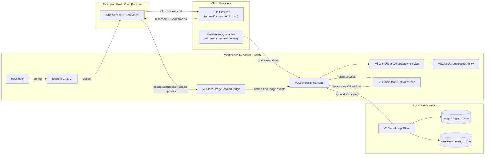
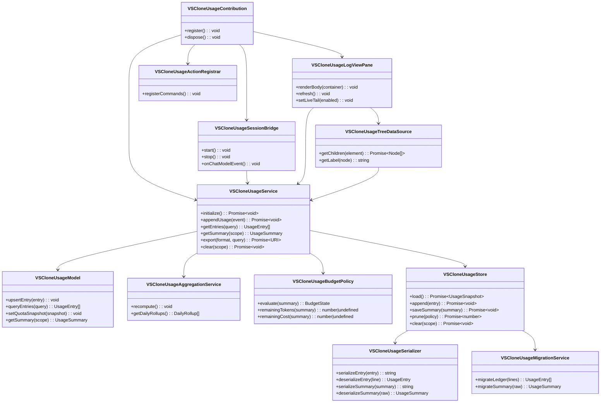
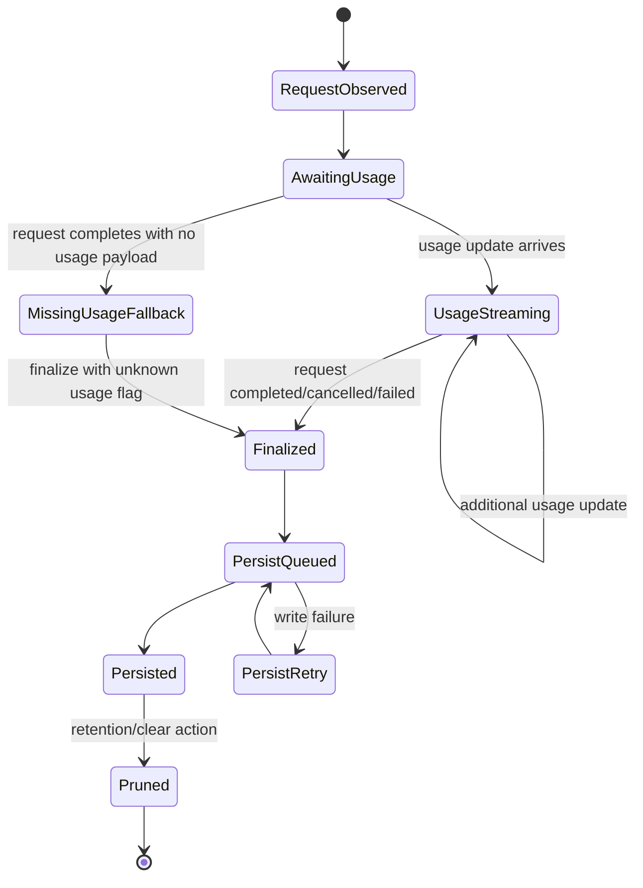
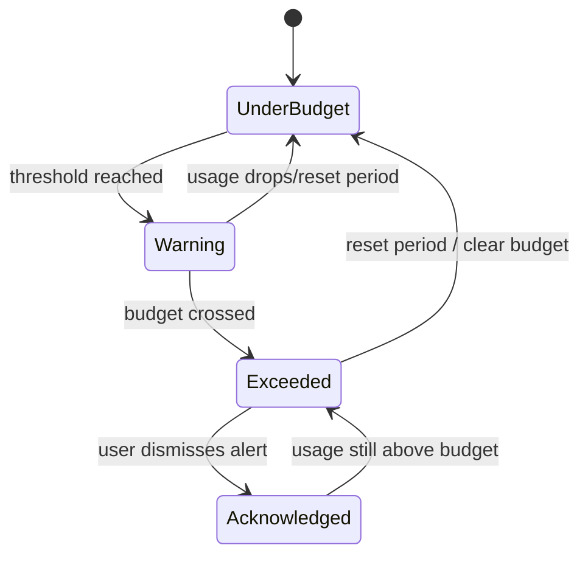
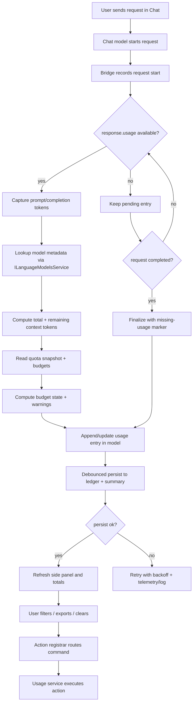

# Header

- **Spec ID:** `BC-USAGE-LOG-001`
- **Feature:** VSClone LLM Usage + Remaining Tokens Side Panel
- **User Story:** As a developer, I want to see a running log of my LLM usage and remaining tokens so that I can manage my spending and avoid unexpected costs.
- **Primary Outcome:** A live, queryable usage ledger in a side panel with token totals, remaining-token indicators, and budget alerts.
- **Scope (MVP):**
  - Track per-request token usage from chat responses.
  - Show running totals (session/day/workspace).
  - Show remaining tokens (context-window remaining and optional user budget remaining).
  - Persist usage history locally with retention.
  - Provide export and clear actions.
- **Non-goals (MVP):**
  - Cross-device sync.
  - Guaranteed billing-accurate currency values for every provider.
  - Replacing existing Copilot entitlement/quota UI.
- **Target code area:** `src/vs/workbench/contrib/vsclone`
- **Proposed folders:**
  - `src/vs/workbench/contrib/vsclone/common`
  - `src/vs/workbench/contrib/vsclone/browser`
  - `src/vs/workbench/contrib/vsclone/electron-main` (not required for MVP)
- **Required integration touchpoints:**
  - `src/vs/workbench/workbench.common.main.ts` (register contribution import)
  - Existing chat internals:
    - `IChatService` / `IChatModel` (`src/vs/workbench/contrib/chat/common/...`)
    - response usage updates (`response.usage`)
    - model metadata (`ILanguageModelsService`)
    - quota snapshots (`IChatEntitlementService`)

# Source-Code-Organization Alignment

- Implement as a **workbench contribution** in `vs/workbench/contrib`, not in `workbench/services`.
- Provide a single contribution entrypoint: `src/vs/workbench/contrib/vsclone/browser/vsclone.contribution.ts`.
- Expose VSClone public API from one common file: `src/vs/workbench/contrib/vsclone/common/vsclone.ts`.
- Keep environment boundaries:
  - `common/` runtime-agnostic model/store/contracts
  - `browser/` UI and workbench wiring
  - `electron-browser/` only if desktop-only IPC becomes required
  - `electron-main/` only for true main-process functionality
- Register in `workbench.common.main.ts` for shared behavior across desktop/web.

# Architecture Diagram




- **Where components run:**
  - **Client (renderer):** bridge, usage service, aggregation, budget policy, side-panel UI.
  - **Server process (extension host/chat runtime):** emits request/response lifecycle and token usage updates.
  - **Cloud:** LLM usage metadata and quota endpoints.
  - **Local:** workspace/profile storage for usage ledger.
- **Information flows:**
  - prompt/response lifecycle -> normalized usage events.
  - token usage + model metadata -> per-entry totals and remaining-context computation.
  - quota snapshots + user budgets -> warnings and remaining budget indicators.

# Class Diagram




# List of Classes

- `VSCloneUsageContribution` (`browser/vscloneUsage.contribution.ts`): registers view container/view, singleton services, startup hooks.
- `VSCloneUsageSessionBridge` (`browser/vscloneUsageSessionBridge.ts`): listens to chat model lifecycle and usage updates, normalizes events.
- `VSCloneUsageService` (`common/vscloneUsageService.ts`): orchestration service for ingestion, querying, persistence, export, and alerts.
- `VSCloneUsageModel` (`common/vscloneUsageModel.ts`): in-memory usage ledger and summary state.
- `VSCloneUsageAggregationService` (`common/vscloneUsageAggregationService.ts`): computes per-session/day/workspace rollups.
- `VSCloneUsageBudgetPolicy` (`common/vscloneUsageBudgetPolicy.ts`): applies configured token/cost budgets and threshold logic.
- `VSCloneUsageStore` (`common/vscloneUsageStore.ts`): local JSONL ledger + summary file IO, retention pruning.
- `VSCloneUsageSerializer` (`common/vscloneUsageSerializer.ts`): deterministic serialization/deserialization.
- `VSCloneUsageMigrationService` (`common/vscloneUsageMigrationService.ts`): schema evolution and compatibility.
- `VSCloneUsageLogViewPane` (`browser/vscloneUsageLogViewPane.ts`): side panel UI with live tail, grouping, filters, and details.
- `VSCloneUsageTreeDataSource` (`browser/vscloneUsageTree.ts`): maps usage model to tree/list nodes.
- `VSCloneUsageActionRegistrar` (`browser/vscloneUsageActions.ts`): commands, menus, and keybindings.

**Consistency check:** class diagram and class list both contain exactly these 12 classes.

# State Diagrams







# Flow Chart




# Development Risks and Failures

| Risk | Failure Mode | Mitigation |
|---|---|---|
| Providers may omit usage payloads | Gaps in log and incorrect totals | Persist `usageMissing=true` entries; label as partial data; exclude from cost estimate by default |
| Usage updates can be streamed multiple times | Double-counting tokens | Upsert by `sessionResource + requestId`; keep latest monotonic snapshot |
| Context remaining vs billing remaining mismatch | User confusion about “remaining tokens” | Show explicit labels: `remainingContextTokens` vs `budgetRemainingTokens` |
| Cost estimation drift | Unexpected estimate vs invoice | Use opt-in pricing table; mark estimate source and confidence |
| Large ledger growth | Slow load and high memory | JSONL append + compacted summary + retention pruning + pagination |
| Multi-window writes | Corrupted or lost lines | file-level lock/atomic append strategy, periodic reload reconciliation |
| Quota API latency/staleness | Warning state flickers | cache last quota snapshot with timestamp; UI shows “last updated” |

# Technology Stack

- **Language/runtime:** TypeScript in VS Code workbench architecture.
- **UI:** `ViewPane`/tree components in `browser/`, context menus/actions, optional details panel.
- **State/events:** `Emitter`, `Event`, observable patterns used by workbench services.
- **Data source integration:**
  - `IChatService`/`IChatModel` for request lifecycle and usage
  - `ILanguageModelsService` for model token limits/metadata
  - `IChatEntitlementService` for remaining quota snapshots
- **Persistence:** `IFileService` + `IStorageService` with workspace/profile storage roots.
- **Testing:** workbench unit tests under `src/vs/workbench/contrib/vsclone/test/{common,browser}`.
- **Logging/telemetry:** existing log + telemetry infra, content-redacted usage metrics only.

# APIs

- **Existing APIs consumed:**
  - `IChatService.onDidCreateModel`
  - `IChatModel.onDidChange`
  - `IChatResponseModel.usage`
  - `ILanguageModelsService.lookupLanguageModel(modelId)`
  - `IChatEntitlementService.onDidChangeQuotaRemaining`
  - `IChatEntitlementService.quotas`

- **New commands (proposed):**
  - `vsclone.usageLog.openView`
  - `vsclone.usageLog.refresh`
  - `vsclone.usageLog.toggleLiveTail`
  - `vsclone.usageLog.copyEntry`
  - `vsclone.usageLog.exportCsv`
  - `vsclone.usageLog.exportJson`
  - `vsclone.usageLog.clearWorkspace`

- **New settings (proposed):**
  - `vsclone.usageLog.enabled` (`boolean`, default `true`)
  - `vsclone.usageLog.retentionDays` (`number`, default `30`)
  - `vsclone.usageLog.maxEntries` (`number`, default `10000`)
  - `vsclone.usageLog.monthlyTokenBudget` (`number`, default `0` meaning disabled)
  - `vsclone.usageLog.monthlyCostBudgetUsd` (`number`, default `0` meaning disabled)
  - `vsclone.usageLog.alertThresholdPercent` (`number`, default `80`)
  - `vsclone.usageLog.pricingTable` (`object`, modelId -> input/output USD per 1M tokens)
  - `vsclone.usageLog.persistScope` (`"workspace" | "profile"`, default `"workspace"`)

- **No new cloud endpoint required for MVP:** leverages existing usage payload and quota snapshots when available.

# Public Interfaces

```ts
export interface IVSCloneUsageService {
	readonly _serviceBrand: undefined;
	readonly onDidChange: Event<IVSCloneUsageChangeEvent>;
	initialize(): Promise<void>;
	appendUsage(event: IVSCloneUsageEvent): Promise<void>;
	getEntries(query?: IVSCloneUsageQuery): readonly IVSCloneUsageEntry[];
	getSummary(scope: 'session' | 'day' | 'workspace'): IVSCloneUsageSummary;
	export(format: 'csv' | 'json', query?: IVSCloneUsageQuery): Promise<URI>;
	clear(scope: 'workspace' | 'profile'): Promise<void>;
}

export interface IVSCloneUsageEvent {
	entryId: string;
	sessionResource: string;
	requestId: string;
	modelId?: string;
	providerId?: string;
	startedAt: number;
	completedAt?: number;
	promptTokens?: number;
	completionTokens?: number;
	status: 'in_progress' | 'completed' | 'failed' | 'cancelled';
	usageMissing?: boolean;
}

export interface IVSCloneUsageEntry {
	entryId: string;
	sessionResource: string;
	requestId: string;
	modelId?: string;
	providerId?: string;
	startedAt: number;
	completedAt?: number;
	promptTokens: number;
	completionTokens: number;
	totalTokens: number;
	remainingContextTokens?: number;
	remainingBudgetTokens?: number;
	estimatedCostUsd?: number;
	estimatedCostSource: 'none' | 'pricingTable' | 'multiplierOnly';
	status: 'completed' | 'failed' | 'cancelled' | 'partial';
	quotaSnapshot?: IVSCloneQuotaSnapshot;
}

export interface IVSCloneQuotaSnapshot {
	chatRemaining?: number;
	completionsRemaining?: number;
	premiumRemaining?: number;
	resetDate?: number;
	capturedAt: number;
}

export interface IVSCloneUsageSummary {
	window: 'session' | 'day' | 'workspace';
	promptTokens: number;
	completionTokens: number;
	totalTokens: number;
	estimatedCostUsd?: number;
	budgetState: 'under' | 'warning' | 'exceeded';
	remainingBudgetTokens?: number;
	remainingBudgetUsd?: number;
}

export interface IVSCloneUsageQuery {
	text?: string;
	from?: number;
	to?: number;
	modelIds?: readonly string[];
	status?: readonly Array<'completed' | 'failed' | 'cancelled' | 'partial'>;
	limit?: number;
}
```

# Data Schemas

- **Storage roots:**
  - Workspace scope: `<workspaceStorage>/<workspaceId>/vsclone/usage`
  - Profile scope (empty window/global): `<profileGlobalStorage>/vsclone/usage`

- **Files:**
  - `usage-ledger.v1.jsonl` (append-only event rows)
  - `usage-summary.v1.json` (compacted rollups and budget state)

```json
{"schemaVersion":1,"entryId":"u_01","sessionResource":"vscode-local-chat-session://session/abc","requestId":"request_42","modelId":"gpt-4.1","providerId":"copilot","startedAt":1765000010000,"completedAt":1765000014123,"promptTokens":1820,"completionTokens":420,"totalTokens":2240,"remainingContextTokens":126180,"remainingBudgetTokens":197760,"estimatedCostUsd":0.0112,"estimatedCostSource":"pricingTable","status":"completed","quotaSnapshot":{"chatRemaining":37,"completionsRemaining":412,"premiumRemaining":6,"resetDate":1767225600000,"capturedAt":1765000014200}}
{"schemaVersion":1,"entryId":"u_02","sessionResource":"vscode-local-chat-session://session/abc","requestId":"request_43","modelId":"gpt-4.1","providerId":"copilot","startedAt":1765001010000,"completedAt":1765001015123,"promptTokens":0,"completionTokens":0,"totalTokens":0,"estimatedCostSource":"none","status":"partial"}
```

```json
{
  "schemaVersion": 1,
  "updatedAt": 1765002000000,
  "totals": {
    "workspace": {
      "promptTokens": 244000,
      "completionTokens": 91000,
      "totalTokens": 335000,
      "estimatedCostUsd": 2.43
    },
    "today": {
      "promptTokens": 32000,
      "completionTokens": 10400,
      "totalTokens": 42400,
      "estimatedCostUsd": 0.31
    }
  },
  "budgetState": {
    "tokens": { "configured": 500000, "remaining": 165000, "state": "warning" },
    "usd": { "configured": 5.0, "remaining": 2.57, "state": "under" }
  }
}
```

- **Migration policy:**
  - All reads pass through `VSCloneUsageMigrationService`.
  - Unsupported major versions trigger safe fallback (read-only mode + warning notification).
  - Successful migration rewrites to v1 atomically.

# Security and Privacy

- Do **not** persist prompt/response content in this feature by default; store usage metrics and technical identifiers only.
- Session/resource identifiers are persisted only as needed for correlation; optionally hash for export.
- Telemetry excludes raw prompt text, response text, and file contents.
- Exports are explicit user actions; default export omits sensitive fields unless user opts in.
- Storage scope defaults to workspace to reduce accidental cross-project data mixing.
- Clear actions (`clearWorkspace`) must permanently remove ledger + summary files for that scope.
- If pricing table contains proprietary internal rates, treat settings as user data and never upload.

# Risks to Completion

- Upstream chat event contracts may evolve (especially usage payload behavior), requiring adapter maintenance.
- Some providers may never emit usage, reducing perceived reliability of the log.
- Budget UX can expand scope quickly (per-team budgets, multi-currency, billing sync).
- Export requirements (CSV schema stability, compliance needs) may grow beyond MVP.
- Performance tuning may be needed if usage volume is high in large agent-heavy sessions.
