# Header

Rationale: Given that the user is logged into multiple models, they should be able to switch between them seamlessly and with ease. Changes should be focused on quick selection, ensuring you can use the model, and persistence so request routing stays reliable.

- **Spec ID:** `BC-MODEL-SWITCHER-001`
- **Feature:** VSClone Unified Chat Model Switcher Dropdown
- **User Story:** As a developer, I want to switch between different LLM providers and models from a dropdown so that I can use the best model for each task.
- **Primary Outcome:** A reliable model dropdown in the unified chat pane that lets users choose provider/model quickly, tied to the active history thread for correct routing.
- **Scope (MVP):**
  - Add a provider/model dropdown in the unified chat composer toolbar.
  - Support switching models before sending a request.
  - Persist selected model per active thread (with location fallback) and restore it on thread switch.
  - Validate model compatibility with chat mode/capabilities.
  - Handle unavailable/unconfigured providers gracefully.
- **Non-goals (MVP):**
  - Building every provider integration from scratch.
  - Billing dashboards or usage accounting.
  - Cross-device sync of model preferences.
- **Target code area:** `src/vs/workbench/contrib/vsclone`
- **Proposed folders:**
  - `src/vs/workbench/contrib/vsclone/common`
  - `src/vs/workbench/contrib/vsclone/browser`
  - `src/vs/workbench/contrib/vsclone/electron-main` (reserved for future desktop-only needs)
- **Integration touchpoints in existing code:**
  - unified chat host surface in `src/vs/workbench/contrib/vsclone/browser/vscloneUnifiedChatViewPane.ts`
  - chat input toolbar/model picker surface in `src/vs/workbench/contrib/chat/browser/widget/input/chatInputPart.ts`
  - model picker action shape in `src/vs/workbench/contrib/chat/browser/widget/input/modelPickerActionItem.ts`
  - request routing via `IChatSendRequestOptions.userSelectedModelId`
  - model catalog and provider groups via `ILanguageModelsService` and `ILanguageModelsConfigurationService`
  - active-thread context from VSClone history rail service (`IVSCloneChatHistoryService`)

# Architecture Diagram

Rationale: I kept this architecture aligned with existing VSCode services as much as possible. The client handles picker state and UI while workbench services handle model registration and request routing. This avoids duplicating provider logic and keeps model availability changes visible where users are already interacting.



- **Where components run:**
  - **Client:** unified chat pane UI (history rail + conversation + composer), dropdown UI, catalog/filter logic, thread-scoped model selection state, commands.
  - **Server/workbench services:** language model provider registration and request routing.
  - **Local storage:** profile-scoped model preferences, provider group config, encrypted secrets.
  - **Cloud:** selected provider/model inference endpoints.
- **Information flow:**
  - active history thread -> current model selection context.
  - model metadata -> dropdown options.
  - thread selection -> persisted thread preference + next request routing.
  - provider configuration/secrets -> provider availability.

# Class Diagram

Rationale: The class diagram is based on the class list and split into catalog, availability, compatibility, selection, and rendering concerns. This separation makes changes easier when upstream picker or provider behavior shifts. It also keeps testing more focused, since each piece has a smaller and clearer responsibility.



# List of Classes

Rationale: Each class maps to a concrete behavior users will notice, like switching, fallback, provider setup, or persistence. Dedicated action and migration classes are included early so those parts do not become patchwork later. There's also a UI element for the switcher that is included that works with the classes in user story 1.

- `VSCloneModelSwitcherContribution` (`browser/vscloneModelSwitcher.contribution.ts`): registers picker integration, services, and startup hooks.
- `VSCloneModelCatalogService` (`common/vscloneModelCatalogService.ts`): builds provider/model catalog from `ILanguageModelsService`.
- `VSCloneModelAvailabilityService` (`common/vscloneModelAvailabilityService.ts`): computes provider/model availability and readiness state.
- `VSCloneModelCompatibilityService` (`common/vscloneModelCompatibilityService.ts`): filters models by mode/capabilities and active thread context.
- `VSCloneThreadModelSelectionService` (`common/vscloneThreadModelSelectionService.ts`): source of truth for per-thread selection, fallback, and next-model switching.
- `VSCloneModelPreferenceStore` (`common/vscloneModelPreferenceStore.ts`): persists selected/default/recent models.
- `VSCloneProviderConfigurationBridge` (`browser/vscloneProviderConfigurationBridge.ts`): launches provider config flows and validates provider-group setup.
- `VSCloneModelPickerController` (`browser/vscloneModelPickerController.ts`): orchestrates dropdown data, sections, and selection application.
- `VSCloneUnifiedChatModelSwitcherActionItem` (`browser/vscloneUnifiedChatModelSwitcherActionItem.ts`): composer toolbar renderer for provider/model dropdown inside unified chat view.
- `VSCloneModelSwitcherActionRegistrar` (`browser/vscloneModelSwitcherActions.ts`): command IDs, menus, keyboard shortcuts.
- `VSCloneModelSelectionMigrationService` (`common/vscloneModelSelectionMigrationService.ts`): migrates legacy model selection records to v1.

**Consistency check:** class diagram and class list contain the same 11 classes.

# State Diagrams

Rationale: Model selection can fail for several runtime reasons, like provider changes, auth issues, or capability mismatches, so those transitions are explicit here. This helps prevent broken routing when users actually send a request. I wanted failure behavior to be predictable so fallback handling does not feel random.




# Flow Chart

Rationale: The flow chart follows the same path users take: refresh catalog, validate selection, apply it, persist it, then route the next request. Keeping that path linear makes behavior easier to reason about. It also makes debugging simpler when a selected model does not match what was expected at send time.



# Development Risks and Failures

Rationale: Most of the risk here is integration risk, especially issues with implementation or poor vendor authentication. The mitigations focus on visible errors and graceful fallback instead of silently letting bad selections through. This keeps user trust higher because invalid selections fail clearly instead of failing deep in request execution logic.

| Risk | Failure Mode | Mitigation |
|---|---|---|
| Provider/model catalog churn | Dropdown options stale or flicker | Debounced catalog refresh + stable sorting + diffed updates |
| Incompatible model selected for mode | Request failure after send | Pre-send compatibility checks in selection service and picker UI badges |
| Provider deconfigured mid-session | Selected model becomes invalid | Runtime availability checks + fallback/default model policy |
| Thread/model mismatch | Wrong model used after switching threads | Restore selection on thread change and show active-model badge in composer |
| Duplicate identifiers across vendors | Wrong model routed | Always persist internal model identifier; include vendor in display and telemetry context |
| Secret/config errors | Provider appears selectable but unusable | Validate provider-group config before apply; actionable error in picker |
| Accessibility regressions | Keyboard and screen-reader users blocked | ARIA labels, keyboard navigation parity, announced state changes |
| Extensibility conflicts with existing chat picker | UI duplication or command collisions | Integrate via one action path and feature flag (`vsclone.modelSwitcher.enabled`) |

# Technology Stack

Rationale: Since this is a VSCode fork, I reused the existing chat toolbar, model services, and storage patterns. There's no need to add new frameworks or libraries, everything can be done with the existing stack. This code does depend on some of the code we came up with in user story 1 though.

- **Language/runtime:** TypeScript inside VS Code workbench contribution architecture.
- **UI components:** Chat toolbar action item, dropdown widget, quick input, context keys.
- **Core dependencies:**
  - `ILanguageModelsService` for provider/model metadata and selection lookup.
  - `IChatService` request routing via `userSelectedModelId`.
  - `ILanguageModelsConfigurationService` for provider group config.
  - `IStorageService` for selection persistence and recents.
  - `IVSCloneChatHistoryService` for active thread context in unified chat.
- **Security dependencies:** `ISecretStorageService` through language model configuration flow.
- **Testing:** browser/common unit tests under `src/vs/workbench/contrib/vsclone/test`.

# APIs

Rationale: I stayed on existing model catalog and send-request APIs and only added a small command/settings layer. This keeps the implementation focused on orchestration rather than building new provider abstractions. A narrow API surface should be easier to stabilize across provider and product changes.

- **Existing APIs consumed:**
  - `ILanguageModelsService.getLanguageModelIds()`
  - `ILanguageModelsService.lookupLanguageModel(modelId)`
  - `ILanguageModelsService.selectLanguageModels(selector)`
  - `ILanguageModelsService.onDidChangeLanguageModels`
  - `ILanguageModelsConfigurationService.getLanguageModelsProviderGroups()`
  - `IChatService.sendRequest(..., { userSelectedModelId })`
  - `IVSCloneChatHistoryService.onDidChange`

- **New commands (proposed):**
  - `vsclone.modelSwitcher.openPicker`
  - `vsclone.modelSwitcher.setModelForActiveThread`
  - `vsclone.modelSwitcher.switchToNextModel`
  - `vsclone.modelSwitcher.setDefaultModelForLocation`
  - `vsclone.modelSwitcher.manageProviders`
  - `vsclone.modelSwitcher.refreshCatalog`
  - `vsclone.modelSwitcher.resetSelection`

- **New settings (proposed):**
  - `vsclone.modelSwitcher.enabled` (`boolean`, default `true`)
  - `vsclone.modelSwitcher.autoFallbackOnUnavailable` (`boolean`, default `true`)
  - `vsclone.modelSwitcher.defaultModelFallbackByLocation` (`object`, default `{}`)
  - `vsclone.modelSwitcher.rememberPerThread` (`boolean`, default `true`)
  - `vsclone.modelSwitcher.maxRecentModels` (`number`, default `8`)
  - `vsclone.modelSwitcher.strictCapabilityFiltering` (`boolean`, default `true`)
  - `vsclone.modelSwitcher.showProviderSections` (`boolean`, default `true`)

# Public Interfaces

Rationale: The interfaces define a small, stable selection lifecycle that UI code can consume and test easily. Explicit change reasons make fallback and restore behavior easier to handle correctly. This helps keep selection state transitions easy to deal with instead of being inferred implicitly by UI components.

```ts
export interface IVSCloneThreadModelSelectionService {
	readonly _serviceBrand: undefined;
	readonly onDidChangeSelection: Event<IVSCloneModelSelectionChangeEvent>;
	initialize(): Promise<void>;
	getCurrentSelectionForThread(threadId: string, location: IVSCloneChatLocation): IVSCloneModelSelection | undefined;
	setSelectionForThread(threadId: string, selection: IVSCloneModelSelection): Promise<void>;
	switchToNextModel(threadId: string, location: IVSCloneChatLocation): Promise<IVSCloneModelSelection | undefined>;
	resetSelectionForThread(threadId: string): Promise<void>;
}

export interface IVSCloneModelCatalogService {
	readonly _serviceBrand: undefined;
	readonly onDidChangeCatalog: Event<void>;
	refreshCatalog(): Promise<void>;
	getProviders(): readonly IVSCloneProviderDescriptor[];
	getModels(providerId?: string): readonly IVSCloneModelDescriptor[];
}

export interface IVSCloneModelSelection {
	threadId?: string;
	location: IVSCloneChatLocation;
	modelIdentifier: string;
	vendor: string;
	modelId: string;
	modelName: string;
	selectedAt: number;
}

export interface IVSCloneModelDescriptor {
	identifier: string;
	vendor: string;
	modelId: string;
	name: string;
	family: string;
	isUserSelectable: boolean;
	capabilities?: {
		toolCalling?: boolean;
		vision?: boolean;
		agentMode?: boolean;
	};
	maxInputTokens?: number;
	maxOutputTokens?: number;
}

export interface IVSCloneProviderDescriptor {
	vendor: string;
	displayName: string;
	managementCommand?: string;
	isConfigured: boolean;
	status: 'available' | 'requires_config' | 'disabled';
}

export interface IVSCloneModelSelectionChangeEvent {
	threadId?: string;
	previous: IVSCloneModelSelection | undefined;
	current: IVSCloneModelSelection | undefined;
	reason: 'user' | 'restore' | 'fallback' | 'reset';
}

export type IVSCloneChatLocation = 'chat' | 'editorInline' | 'notebook' | 'terminal';
```

# Data Schemas

Rationale: Selection and recents are stored separately so restore stays fast and recents can stay bounded. Versioned keys and idempotent migration reduce the chance of breaking users during future catalog changes. Available models may change over time (newly supported providers, new model releases), so persistence should be simple but still resilient to this kind of thing.

- **Persistence scope:** profile-level by default (mirrors existing model preference behavior).
- **Storage keys (proposed):**
  - `vsclone.modelSwitcher.selection.v1`
  - `vsclone.modelSwitcher.recents.v1`

```json
{
  "version": 1,
  "selectedByThread": {
    "thread_3f4e8a": {
      "modelIdentifier": "copilot/gpt-4.1",
      "vendor": "copilot",
      "modelId": "gpt-4.1",
      "modelName": "GPT-4.1",
      "selectedAt": 1765003000000
    },
    "thread_61bd0d": {
      "modelIdentifier": "anthropic/claude-3.7-sonnet",
      "vendor": "anthropic",
      "modelId": "claude-3.7-sonnet",
      "modelName": "Claude 3.7 Sonnet",
      "selectedAt": 1765003010000
    }
  },
  "defaultFallbackByLocation": {
    "chat": "copilot/gpt-4.1",
    "editorInline": "copilot/gpt-4.1"
  }
}
```

```json
{
  "version": 1,
  "recentModelIdentifiers": [
    "copilot/gpt-4.1",
    "anthropic/claude-3.7-sonnet",
    "openai/gpt-4o"
  ],
  "updatedAt": 1765003020000
}
```

- **Provider group config source (existing integration):** `chatLanguageModels.json` in profile storage.

```json
[
  {
    "vendor": "openai",
    "name": "OpenAI Personal",
    "baseUrl": "https://api.openai.com/v1",
    "apiKey": "${input:chat.lm.secret.a1b2c3d4}"
  },
  {
    "vendor": "anthropic",
    "name": "Anthropic Work",
    "apiKey": "${input:chat.lm.secret.e5f6g7h8}"
  }
]
```

- **Migration policy:**
  - Migrate legacy location-only keys (if present) into `selection.v1` once.
  - Unknown/invalid models are dropped and replaced by fallback-per-location defaults.
  - Migration is non-blocking and idempotent.

# Security and Privacy

Rationale: Secrets stay in secret storage and never in model-switcher preference data. That keeps this feature focused on selection metadata instead of turning it into a credential surface. Keeping that boundary strict also makes audits and future security reviews much easier.

- Provider secrets are never stored in plain text model-switcher preferences.
- Provider credentials remain in secret storage; config stores secret placeholders only.
- Telemetry should avoid raw secrets and should treat model identifiers as system metadata only.
- Respect extension auth access controls for language model providers.
- If workspace trust disables chat/provider capabilities, picker must show disabled state and block selection.
- Exporting model preferences (if added later) must exclude secret-bearing provider configuration.

# Risks to Completion

Rationale: The biggest completion risks are changes in the chat window and other product UX decisions. Planning for those early should reduce last-minute issues.

- Upstream model picker internals in `chatInputPart` may change, requiring repeated merge adjustments.
- Provider configuration UX may expand scope if users expect full onboarding for each vendor.
- Capability mapping can become complex as providers add non-uniform feature flags.
- Product decisions on default model policy and fallback behavior may change late.
- Accessibility and localization pass can add significant stabilization time.
