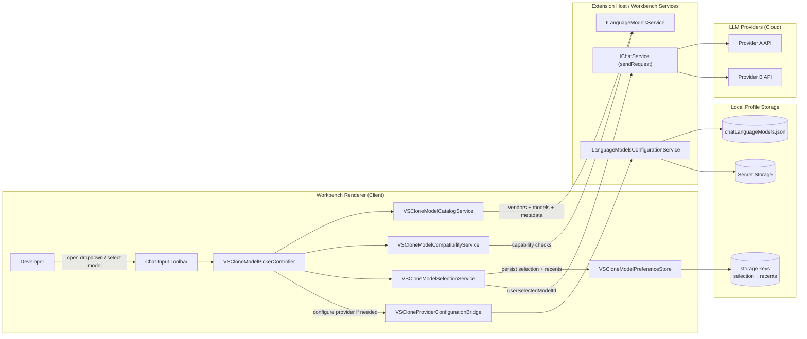
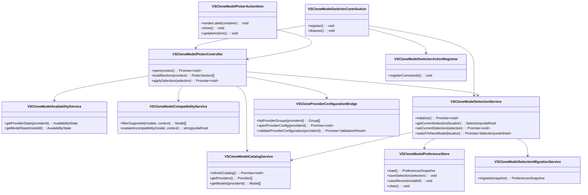
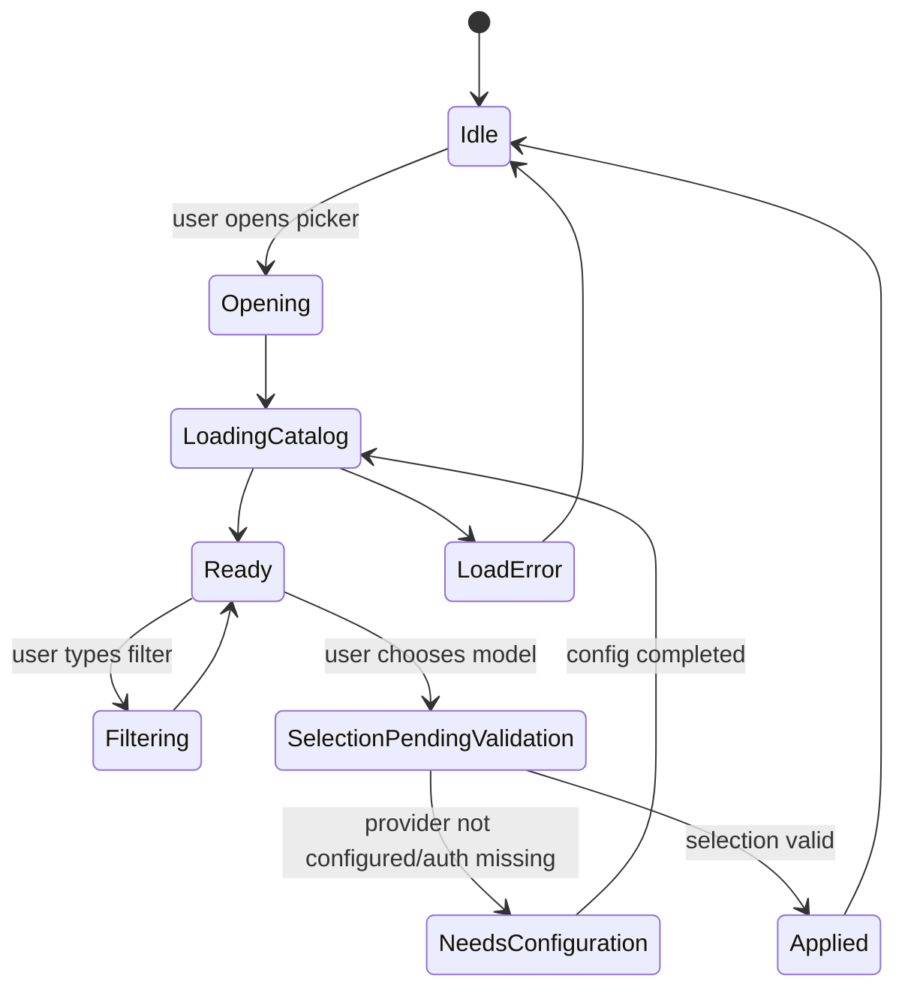
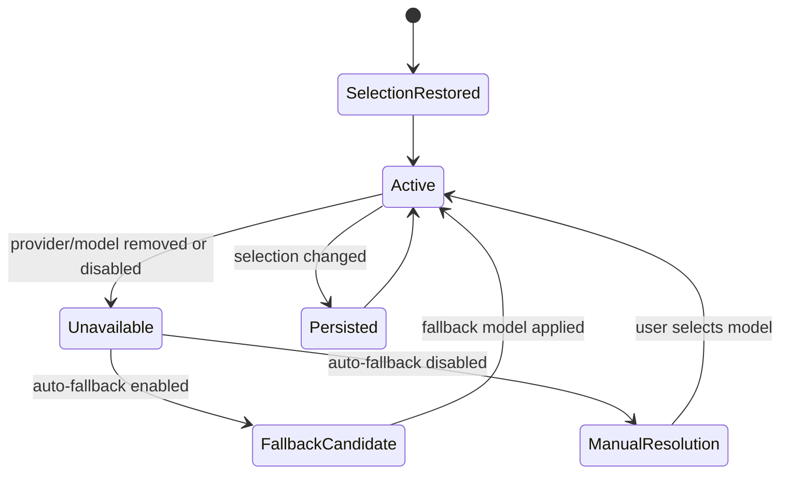
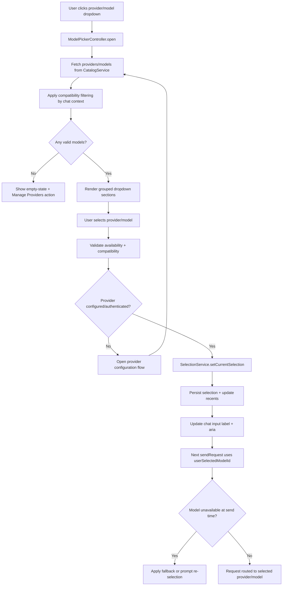

# Header

- **Spec ID:** `BC-MODEL-SWITCHER-001`
- **Feature:** VSClone Provider/Model Switcher Dropdown
- **User Story:** As a developer, I want to switch between different LLM providers and models from a dropdown so that I can use the best model for each task.
- **Primary Outcome:** A reliable chat-pane dropdown that lets users choose provider/model quickly, with validation, persistence, and request routing.
- **Scope (MVP):**
  - Add a provider/model dropdown in the chat input toolbar.
  - Support switching models before sending a request.
  - Persist selected model by chat location and restore it.
  - Validate model compatibility with chat mode/capabilities.
  - Handle unavailable/unconfigured providers gracefully.
- **Non-goals (MVP):**
  - Building every provider integration from scratch.
  - Billing dashboards or usage accounting.
  - Cross-device sync of model preferences.
- **Target code area:** `src/vs/workbench/contrib/vsclone`
- **Proposed folders:**
  - `src/vs/workbench/contrib/vsclone/common`
  - `src/vs/workbench/contrib/vsclone/browser`
  - `src/vs/workbench/contrib/vsclone/electron-main` (reserved for future desktop-only needs)
- **Integration touchpoints in existing code:**
  - chat input toolbar/model picker surface in `src/vs/workbench/contrib/chat/browser/widget/input/chatInputPart.ts`
  - model picker action shape in `src/vs/workbench/contrib/chat/browser/widget/input/modelPickerActionItem.ts`
  - request routing via `IChatSendRequestOptions.userSelectedModelId`
  - model catalog and provider groups via `ILanguageModelsService` and `ILanguageModelsConfigurationService`

# Source-Code-Organization Alignment

- Implement this as a **workbench contribution** under `vs/workbench/contrib/vsclone`.
- Provide one contribution entrypoint: `src/vs/workbench/contrib/vsclone/browser/vsclone.contribution.ts`.
- Expose public VSClone contracts from one common API surface: `src/vs/workbench/contrib/vsclone/common/vsclone.ts`.
- Keep runtime separation aligned with VS Code guidance:
  - `common/` for contracts, state, persistence, filtering logic.
  - `browser/` for UI, commands, toolbar integration.
  - `electron-*` only if required later.

# Architecture Diagram




- **Where components run:**
  - **Client:** dropdown UI, catalog/filter logic, model selection state, commands.
  - **Server/workbench services:** language model provider registration and request routing.
  - **Local storage:** profile-scoped model preferences, provider group config, encrypted secrets.
  - **Cloud:** selected provider/model inference endpoints.
- **Information flow:**
  - model metadata -> dropdown options.
  - selection -> persisted preferences + next request routing.
  - provider configuration/secrets -> provider availability.

# Class Diagram




# List of Classes

- `VSCloneModelSwitcherContribution` (`browser/vscloneModelSwitcher.contribution.ts`): registers picker integration, services, and startup hooks.
- `VSCloneModelCatalogService` (`common/vscloneModelCatalogService.ts`): builds provider/model catalog from `ILanguageModelsService`.
- `VSCloneModelAvailabilityService` (`common/vscloneModelAvailabilityService.ts`): computes provider/model availability and readiness state.
- `VSCloneModelCompatibilityService` (`common/vscloneModelCompatibilityService.ts`): filters models by mode/capabilities/location.
- `VSCloneModelSelectionService` (`common/vscloneModelSelectionService.ts`): source of truth for active selection and next-model switching.
- `VSCloneModelPreferenceStore` (`common/vscloneModelPreferenceStore.ts`): persists selected/default/recent models.
- `VSCloneProviderConfigurationBridge` (`browser/vscloneProviderConfigurationBridge.ts`): launches provider config flows and validates provider-group setup.
- `VSCloneModelPickerController` (`browser/vscloneModelPickerController.ts`): orchestrates dropdown data, sections, and selection application.
- `VSCloneModelPickerActionItem` (`browser/vscloneModelPickerActionItem.ts`): toolbar action-view-item renderer for provider/model dropdown.
- `VSCloneModelSwitcherActionRegistrar` (`browser/vscloneModelSwitcherActions.ts`): command IDs, menus, keyboard shortcuts.
- `VSCloneModelSelectionMigrationService` (`common/vscloneModelSelectionMigrationService.ts`): migrates legacy model selection records to v1.

**Consistency check:** class diagram and class list contain the same 11 classes.

# State Diagrams







# Flow Chart




# Development Risks and Failures

| Risk | Failure Mode | Mitigation |
|---|---|---|
| Provider/model catalog churn | Dropdown options stale or flicker | Debounced catalog refresh + stable sorting + diffed updates |
| Incompatible model selected for mode | Request failure after send | Pre-send compatibility checks in selection service and picker UI badges |
| Provider deconfigured mid-session | Selected model becomes invalid | Runtime availability checks + fallback/default model policy |
| Duplicate identifiers across vendors | Wrong model routed | Always persist internal model identifier; include vendor in display and telemetry context |
| Secret/config errors | Provider appears selectable but unusable | Validate provider-group config before apply; actionable error in picker |
| Accessibility regressions | Keyboard and screen-reader users blocked | ARIA labels, keyboard navigation parity, announced state changes |
| Extensibility conflicts with existing chat picker | UI duplication or command collisions | Integrate via one action path and feature flag (`vsclone.modelSwitcher.enabled`) |

# Technology Stack

- **Language/runtime:** TypeScript inside VS Code workbench contribution architecture.
- **UI components:** Chat toolbar action item, dropdown widget, quick input, context keys.
- **Core dependencies:**
  - `ILanguageModelsService` for provider/model metadata and selection lookup.
  - `IChatService` request routing via `userSelectedModelId`.
  - `ILanguageModelsConfigurationService` for provider group config.
  - `IStorageService` for selection persistence and recents.
- **Security dependencies:** `ISecretStorageService` through language model configuration flow.
- **Testing:** browser/common unit tests under `src/vs/workbench/contrib/vsclone/test`.

# APIs

- **Existing APIs consumed:**
  - `ILanguageModelsService.getLanguageModelIds()`
  - `ILanguageModelsService.lookupLanguageModel(modelId)`
  - `ILanguageModelsService.selectLanguageModels(selector)`
  - `ILanguageModelsService.onDidChangeLanguageModels`
  - `ILanguageModelsConfigurationService.getLanguageModelsProviderGroups()`
  - `IChatService.sendRequest(..., { userSelectedModelId })`

- **New commands (proposed):**
  - `vsclone.modelSwitcher.openPicker`
  - `vsclone.modelSwitcher.switchToNextModel`
  - `vsclone.modelSwitcher.setDefaultModelForLocation`
  - `vsclone.modelSwitcher.manageProviders`
  - `vsclone.modelSwitcher.refreshCatalog`
  - `vsclone.modelSwitcher.resetSelection`

- **New settings (proposed):**
  - `vsclone.modelSwitcher.enabled` (`boolean`, default `true`)
  - `vsclone.modelSwitcher.autoFallbackOnUnavailable` (`boolean`, default `true`)
  - `vsclone.modelSwitcher.defaultModelByLocation` (`object`, default `{}`)
  - `vsclone.modelSwitcher.maxRecentModels` (`number`, default `8`)
  - `vsclone.modelSwitcher.strictCapabilityFiltering` (`boolean`, default `true`)
  - `vsclone.modelSwitcher.showProviderSections` (`boolean`, default `true`)

# Public Interfaces

```ts
export interface IVSCloneModelSelectionService {
	readonly _serviceBrand: undefined;
	readonly onDidChangeSelection: Event<IVSCloneModelSelectionChangeEvent>;
	initialize(): Promise<void>;
	getCurrentSelection(location: IVSCloneChatLocation): IVSCloneModelSelection | undefined;
	setCurrentSelection(selection: IVSCloneModelSelection): Promise<void>;
	switchToNextModel(location: IVSCloneChatLocation): Promise<IVSCloneModelSelection | undefined>;
	resetSelection(location: IVSCloneChatLocation): Promise<void>;
}

export interface IVSCloneModelCatalogService {
	readonly _serviceBrand: undefined;
	readonly onDidChangeCatalog: Event<void>;
	refreshCatalog(): Promise<void>;
	getProviders(): readonly IVSCloneProviderDescriptor[];
	getModels(providerId?: string): readonly IVSCloneModelDescriptor[];
}

export interface IVSCloneModelSelection {
	location: IVSCloneChatLocation;
	modelIdentifier: string;
	vendor: string;
	modelId: string;
	modelName: string;
	selectedAt: number;
}

export interface IVSCloneModelDescriptor {
	identifier: string;
	vendor: string;
	modelId: string;
	name: string;
	family: string;
	isUserSelectable: boolean;
	capabilities?: {
		toolCalling?: boolean;
		vision?: boolean;
		agentMode?: boolean;
	};
	maxInputTokens?: number;
	maxOutputTokens?: number;
}

export interface IVSCloneProviderDescriptor {
	vendor: string;
	displayName: string;
	managementCommand?: string;
	isConfigured: boolean;
	status: 'available' | 'requires_config' | 'disabled';
}

export interface IVSCloneModelSelectionChangeEvent {
	previous: IVSCloneModelSelection | undefined;
	current: IVSCloneModelSelection | undefined;
	reason: 'user' | 'restore' | 'fallback' | 'reset';
}

export type IVSCloneChatLocation = 'chat' | 'editorInline' | 'notebook' | 'terminal';
```

# Data Schemas

- **Persistence scope:** profile-level by default (mirrors existing model preference behavior).
- **Storage keys (proposed):**
  - `vsclone.modelSwitcher.selection.v1`
  - `vsclone.modelSwitcher.recents.v1`

```json
{
  "version": 1,
  "selectedByLocation": {
    "chat": {
      "modelIdentifier": "copilot/gpt-4.1",
      "vendor": "copilot",
      "modelId": "gpt-4.1",
      "modelName": "GPT-4.1",
      "selectedAt": 1765003000000
    },
    "editorInline": {
      "modelIdentifier": "anthropic/claude-3.7-sonnet",
      "vendor": "anthropic",
      "modelId": "claude-3.7-sonnet",
      "modelName": "Claude 3.7 Sonnet",
      "selectedAt": 1765003010000
    }
  }
}
```

```json
{
  "version": 1,
  "recentModelIdentifiers": [
    "copilot/gpt-4.1",
    "anthropic/claude-3.7-sonnet",
    "openai/gpt-4o"
  ],
  "updatedAt": 1765003020000
}
```

- **Provider group config source (existing integration):** `chatLanguageModels.json` in profile storage.

```json
[
  {
    "vendor": "openai",
    "name": "OpenAI Personal",
    "baseUrl": "https://api.openai.com/v1",
    "apiKey": "${input:chat.lm.secret.a1b2c3d4}"
  },
  {
    "vendor": "anthropic",
    "name": "Anthropic Work",
    "apiKey": "${input:chat.lm.secret.e5f6g7h8}"
  }
]
```

- **Migration policy:**
  - Migrate legacy selection keys (if present) into `selection.v1` once.
  - Unknown/invalid models are dropped and replaced by default-per-location fallback.
  - Migration is non-blocking and idempotent.

# Security and Privacy

- Provider secrets are never stored in plain text model-switcher preferences.
- Provider credentials remain in secret storage; config stores secret placeholders only.
- Telemetry should avoid raw secrets and should treat model identifiers as system metadata only.
- Respect extension auth access controls for language model providers.
- If workspace trust disables chat/provider capabilities, picker must show disabled state and block selection.
- Exporting model preferences (if added later) must exclude secret-bearing provider configuration.

# Risks to Completion

- Upstream model picker internals in `chatInputPart` may change, requiring repeated merge adjustments.
- Provider configuration UX may expand scope if users expect full onboarding for each vendor.
- Capability mapping can become complex as providers add non-uniform feature flags.
- Product decisions on default model policy and fallback behavior may change late.
- Accessibility and localization pass can add significant stabilization time.
