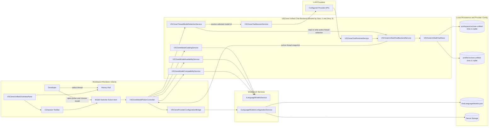
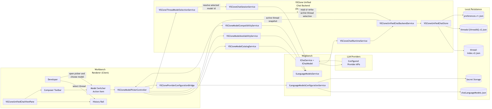
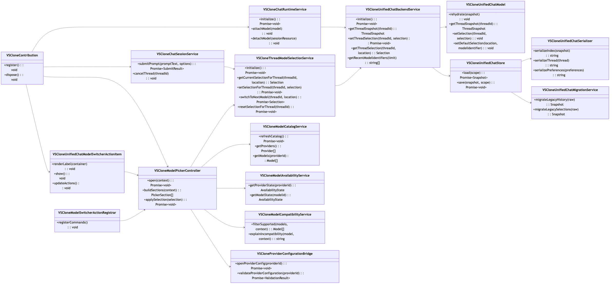
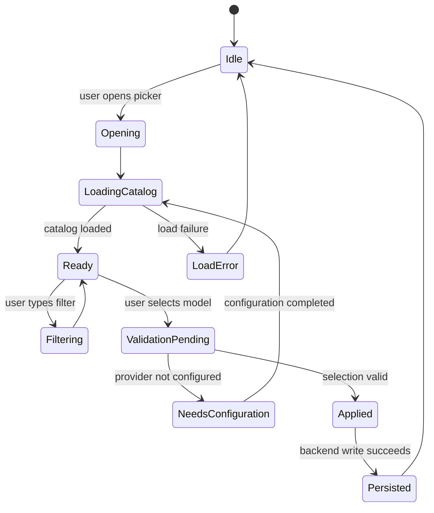
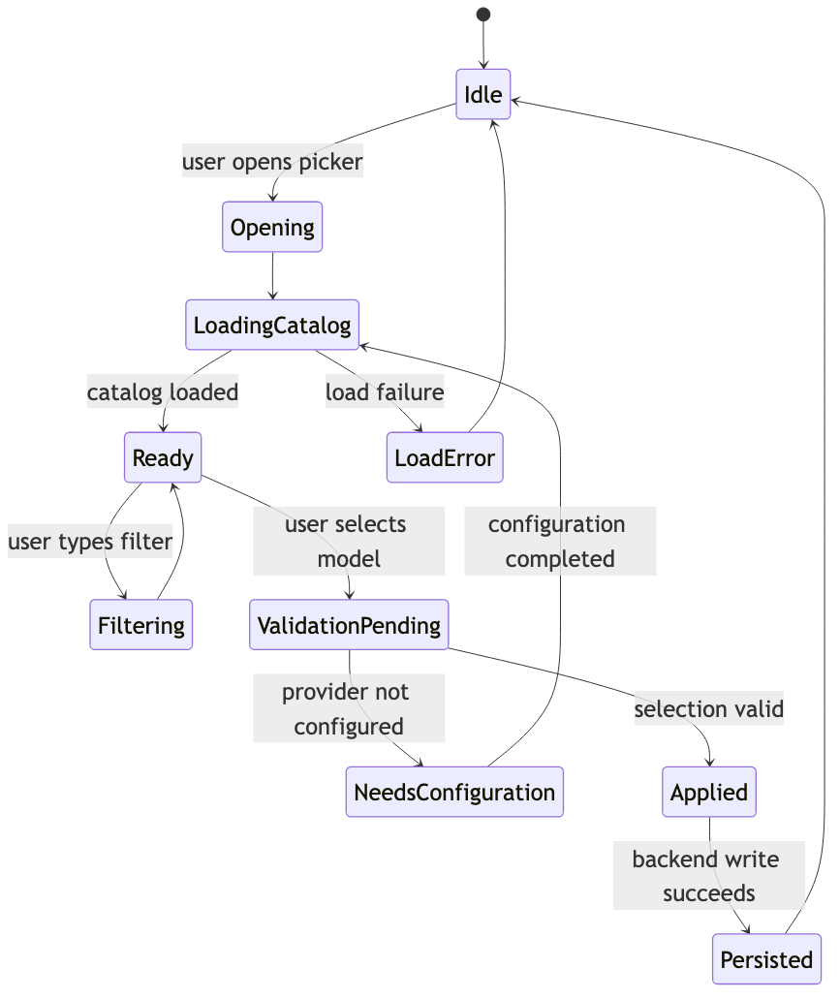
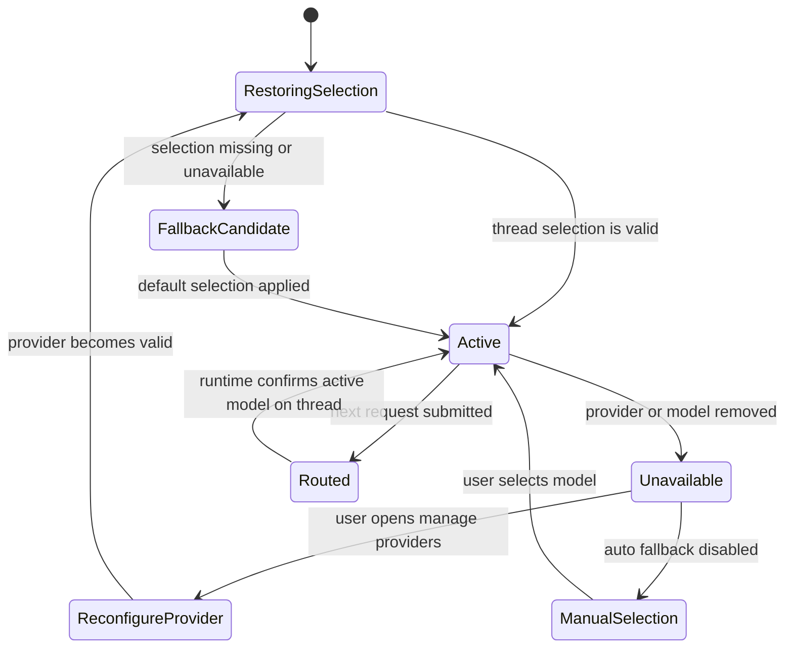
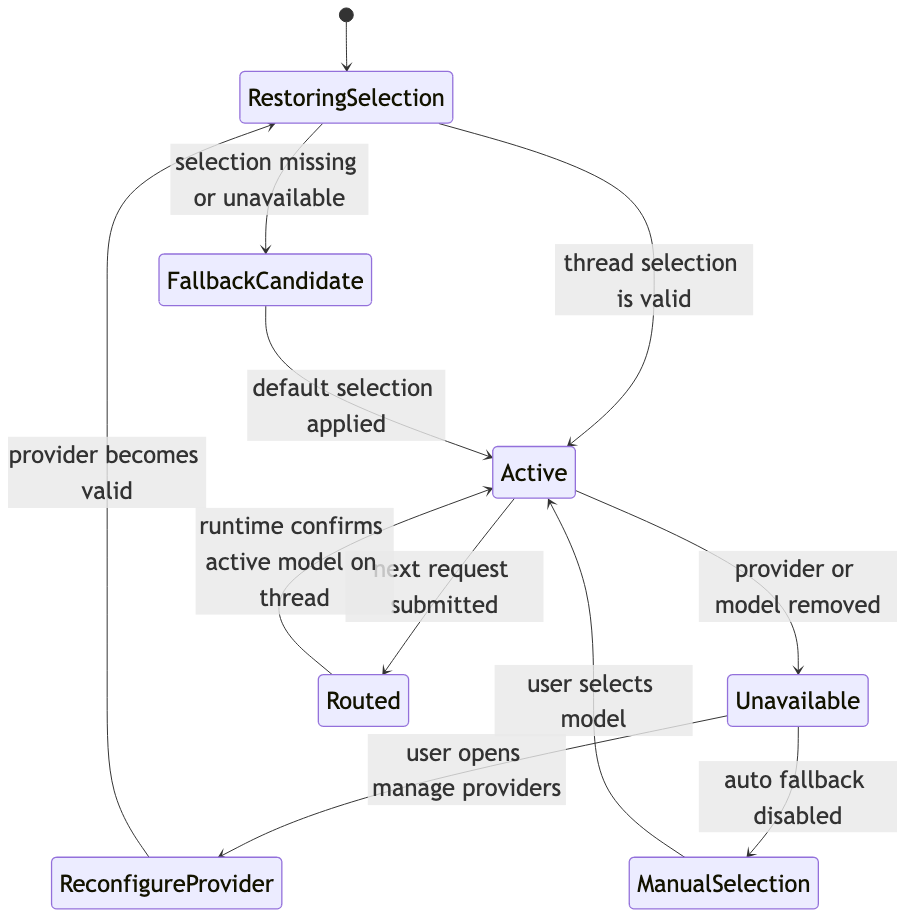
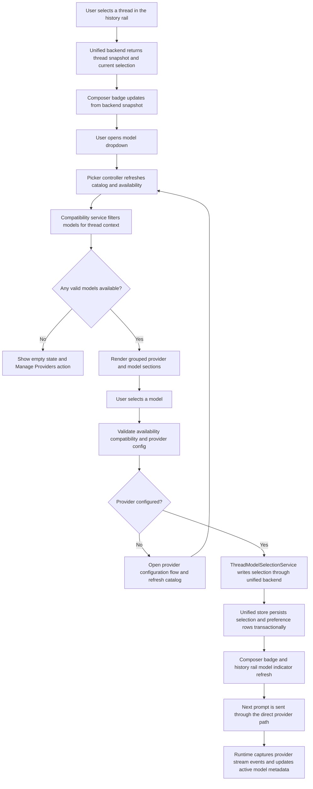
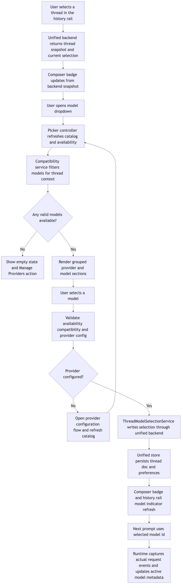

# Header

Rationale: This revision updates Story 3 so it uses the exact same backend contract as Story 1. The model switcher is no longer specified as a separate preference subsystem; it is a UI over the same canonical thread snapshots that also power the history rail.

- **Spec ID:** `BC-MODEL-SWITCHER-001`
- **Revision:** `single-backend harmonized revision`
- **Author(s):** Brandon Howe
- **Role(s):** Developer
- **Version History:**
  - `v1.0` - Initial Story 3 development specification.
  - `v1.1` - Harmonized revision aligned with the shared SQLite-backed backend.
- **Feature:** VSClone Unified Chat Model Switcher Dropdown
- **User Story:** As a developer, I want to switch between different LLM providers and models from a dropdown so that I can use the best model for each task.
- **Primary Outcome:** A reliable model dropdown in the unified chat composer that reads and writes the same per-thread backend snapshot used by the history rail in Story 1.
- **Shared Backend Assumption:** Story 3 and Story 1 both rely on a single `VSClone Unified Chat Backend` that owns thread metadata, turn history, selected model state, recent model state, recovery, and persistence.
- **Scope (MVP):**
  - Add a provider/model dropdown in the unified chat composer toolbar.
  - Restore the selected model from the active thread snapshot supplied by the shared backend.
  - Persist per-thread model choice through the same unified backend database that stores history.
  - Support fallback defaults by location and recent-model rotation through backend preferences.
  - Validate availability and compatibility before the next request is sent.
- **Non-goals (MVP):**
  - Building every provider integration from scratch.
  - Creating a separate billing or usage backend.
  - Cross-device sync of model preferences.
- **Target code area:** `src/vs/workbench/contrib/vsclone`
- **Proposed folders:**
  - `src/vs/workbench/contrib/vsclone/common`
  - `src/vs/workbench/contrib/vsclone/browser`
  - `src/vs/workbench/contrib/vsclone/electron-main` (reserved, not required for MVP)
- **Required integration touchpoints:**
  - `src/vs/workbench/workbench.common.main.ts` with exactly one VSClone import: `./contrib/vsclone/browser/vsclone.contribution.js`
  - Single VSClone registration entrypoint: `src/vs/workbench/contrib/vsclone/browser/vsclone.contribution.ts`
  - Unified chat host surface: `src/vs/workbench/contrib/vsclone/browser/vscloneUnifiedChatViewPane.ts`
  - Chat execution services: `src/vs/workbench/contrib/vsclone/browser/vscloneChatRuntimeService.ts` for stream capture and `src/vs/workbench/contrib/vsclone/browser/vscloneChatSessionService.ts` for request dispatch
  - Shared backend owner: `src/vs/workbench/contrib/vsclone/common/vscloneUnifiedChatBackendService.ts`
  - Chat toolbar/model picker surface in `src/vs/workbench/contrib/chat/browser/widget/input/chatInputPart.ts`
  - Existing chat execution via `IVSCloneChatSessionService` and `IVSCloneChatApiService`
  - Model catalog and provider groups via `ILanguageModelsService` and `ILanguageModelsConfigurationService`

# Architecture Diagram

Rationale: The architecture keeps one canonical backend and treats the model switcher as a projection plus validation layer on top of it. That means selecting a thread, restoring a conversation, showing the active model badge, and sending the next request all read from the same state.


```mermaid
flowchart LR
  subgraph Client["Workbench Renderer (Client)"]
    Dev["Developer"]
    View["VSCloneUnifiedChatViewPane"]
    Rail["History Rail"]
    Toolbar["Composer Toolbar"]
    Switcher["Model Switcher Action Item"]
    Picker["VSCloneModelPickerController"]
    ConfigBridge["VSCloneProviderConfigurationBridge"]
  end

  subgraph Backend["VSClone Unified Chat Backend (Shared by Story 1 and Story 3)"]
    Runtime["VSCloneChatRuntimeService"]
    Session["VSCloneChatSessionService"]
    BackendSvc["VSCloneUnifiedChatBackendService"]
    Selection["VSCloneThreadModelSelectionService"]
    Catalog["VSCloneModelCatalogService"]
    Availability["VSCloneModelAvailabilityService"]
    Compatibility["VSCloneModelCompatibilityService"]
    Store["VSCloneUnifiedChatStore"]
  end

  subgraph Workbench["Workbench Services"]
    LM["ILanguageModelsService"]
    LMConfig["ILanguageModelsConfigurationService"]
  end

  subgraph Local["Local Persistence and Provider Config"]
    WorkspaceDb[("workspace/vsclone-unified-chat.v1.sqlite")]
    ProfileDb[("profile/vsclone-unified-chat.v1.sqlite")]
    ProviderConfig[("chatLanguageModels.json")]
    Secrets[("Secret Storage")]
  end

  subgraph Cloud["LLM Providers"]
    Providers["Configured Provider APIs"]
  end

  Dev -->|select thread| Rail
  Dev -->|open picker and choose model| Switcher
  View --> Rail
  View --> Toolbar
  Toolbar --> Switcher
  Switcher --> Picker
  Picker --> Catalog
  Picker --> Availability
  Picker --> Compatibility
  Picker --> Selection
  Picker --> ConfigBridge

  Selection -->|read or write active thread selection| BackendSvc
  Catalog --> LM
  Availability --> LM
  Compatibility --> LM
  ConfigBridge --> LMConfig
  LMConfig --> ProviderConfig
  LMConfig --> Secrets

  Selection -->|resolve selected model id| Session
  Session --> Providers
  Providers --> Runtime
  Runtime --> BackendSvc
  BackendSvc --> Store
  Store --> WorkspaceDb
  Store --> ProfileDb
  BackendSvc -->|active thread snapshot| Picker
```



- **Runtime placement:**
  - **Client:** unified chat pane, history rail, composer toolbar, picker UI, and provider configuration actions.
  - **Shared backend:** canonical thread state, selection persistence, chat execution context, recent-model preferences, and recovery.
  - **Workbench services:** language-model registry/configuration and the VSClone in-process runtime.
  - **Cloud:** selected provider/model inference endpoints.
  - **Local:** one unified SQLite persistence contract for thread state, plus existing provider config and secret storage.

# Class Diagram

Rationale: The class diagram shows the same backend core as Story 1, then adds model-specific validation and picker classes on top of it. This avoids a second persistence path and keeps selection logic coupled to the thread snapshot it belongs to.


```mermaid
classDiagram
direction LR

class VSCloneContribution {
  +register(): void
  +dispose(): void
}

class VSCloneChatRuntimeService {
  +initialize(): Promise~void~
  +attachModel(model): void
  +detachModel(sessionResource): void
}

class VSCloneChatSessionService {
  +submitPrompt(promptText, options): Promise~SubmitResult~
  +cancelThread(threadId): void
}

class VSCloneUnifiedChatBackendService {
  +initialize(): Promise~void~
  +getThreadSnapshot(threadId): ThreadSnapshot
  +setThreadSelection(threadId, selection): Promise~void~
  +getThreadSelection(threadId, location): Selection
  +getRecentModelIdentifiers(limit): string[]
}

class VSCloneUnifiedChatModel {
  +rehydrate(snapshot): void
  +getThreadSnapshot(threadId): ThreadSnapshot
  +setSelection(threadId, selection): void
  +setDefaultSelection(location, modelIdentifier): void
}

class VSCloneUnifiedChatStore {
  +load(scope): Promise~Snapshot~
  +save(snapshot, scope): Promise~void~
}

class VSCloneUnifiedChatRowMapper {
  +toThreadSnapshot(rows): ThreadSnapshot
  +toThreadRecord(thread): ThreadRow
  +toTurnRecords(turns): TurnRow[]
  +toSelectionRecord(selection): SelectionRow
}

class VSCloneUnifiedChatMigrationService {
  +prepareSchema(connection): Promise~void~
  +migrateLegacyHistory(scope): Promise~void~
  +migrateLegacySelections(scope): Promise~void~
}

class VSCloneThreadModelSelectionService {
  +initialize(): Promise~void~
  +getCurrentSelectionForThread(threadId, location): Selection
  +setSelectionForThread(threadId, selection): Promise~void~
  +switchToNextModel(threadId, location): Promise~Selection~
  +resetSelectionForThread(threadId): Promise~void~
}

class VSCloneModelCatalogService {
  +refreshCatalog(): Promise~void~
  +getProviders(): Provider[]
  +getModels(providerId): Model[]
}

class VSCloneModelAvailabilityService {
  +getProviderState(providerId): AvailabilityState
  +getModelState(modelId): AvailabilityState
}

class VSCloneModelCompatibilityService {
  +filterSupported(models, context): Model[]
  +explainIncompatibility(model, context): string
}

class VSCloneProviderConfigurationBridge {
  +openProviderConfig(providerId): Promise~void~
  +validateProviderConfiguration(providerId): Promise~ValidationResult~
}

class VSCloneModelPickerController {
  +open(context): Promise~void~
  +buildSections(context): PickerSection[]
  +applySelection(selection): Promise~void~
}

class VSCloneUnifiedChatModelSwitcherActionItem {
  +renderLabel(container): void
  +show(): void
  +updateActions(): void
}

class VSCloneModelSwitcherActionRegistrar {
  +registerCommands(): void
}

VSCloneContribution --> VSCloneChatRuntimeService
VSCloneContribution --> VSCloneChatSessionService
VSCloneContribution --> VSCloneModelPickerController
VSCloneContribution --> VSCloneUnifiedChatModelSwitcherActionItem
VSCloneChatRuntimeService --> VSCloneUnifiedChatBackendService
VSCloneChatSessionService --> VSCloneThreadModelSelectionService
VSCloneThreadModelSelectionService --> VSCloneUnifiedChatBackendService
VSCloneUnifiedChatBackendService --> VSCloneUnifiedChatModel
VSCloneUnifiedChatBackendService --> VSCloneUnifiedChatStore
VSCloneUnifiedChatStore --> VSCloneUnifiedChatRowMapper
VSCloneUnifiedChatStore --> VSCloneUnifiedChatMigrationService
VSCloneModelPickerController --> VSCloneModelCatalogService
VSCloneModelPickerController --> VSCloneModelAvailabilityService
VSCloneModelPickerController --> VSCloneModelCompatibilityService
VSCloneModelPickerController --> VSCloneThreadModelSelectionService
VSCloneModelPickerController --> VSCloneProviderConfigurationBridge
VSCloneUnifiedChatModelSwitcherActionItem --> VSCloneModelPickerController
VSCloneModelSwitcherActionRegistrar --> VSCloneModelPickerController
```



# List of Classes

Rationale: The list makes the backend overlap explicit. The model switcher adds catalog, availability, compatibility, configuration, and picker concerns, but it does not add a second source of truth.

- **Shared backend classes:**
  - `VSCloneContribution` (`browser/vsclone.contribution.ts`): one registration entrypoint for the unified chat pane, backend services, and picker actions.
  - `VSCloneChatRuntimeService` (`browser/vscloneChatRuntimeService.ts`): startup-scoped execution-tracking service so active thread state is correct even before the picker opens.
  - `VSCloneChatSessionService` (`browser/vscloneChatSessionService.ts`): request-dispatch service that sends the next prompt using the selected model from the unified backend.
  - `VSCloneUnifiedChatBackendService` (`common/vscloneUnifiedChatBackendService.ts`): canonical backend service for thread snapshots, turn history, per-thread selection, recent-model state, and persistence orchestration.
  - `VSCloneUnifiedChatModel` (`common/vscloneUnifiedChatModel.ts`): in-memory model for thread state and backend preferences.
  - `VSCloneUnifiedChatStore` (`common/vscloneUnifiedChatStore.ts`): unified SQLite-backed store for thread, turn, selection, and preference tables.
  - `VSCloneUnifiedChatRowMapper` (`common/vscloneUnifiedChatRowMapper.ts`): deterministic mapping between SQL rows and backend domain objects.
  - `VSCloneUnifiedChatMigrationService` (`common/vscloneUnifiedChatMigrationService.ts`): prepares schema and migrates the old history store and the old selection store into the unified SQLite schema.
  - `VSCloneThreadModelSelectionService` (`common/vscloneThreadModelSelectionService.ts`): model-selection facade over the shared backend.
- **Story 3 model-switcher classes:**
  - `VSCloneModelCatalogService` (`common/vscloneModelCatalogService.ts`): builds the selectable provider/model catalog from workbench language-model services.
  - `VSCloneModelAvailabilityService` (`common/vscloneModelAvailabilityService.ts`): computes configured, disabled, and unavailable states.
  - `VSCloneModelCompatibilityService` (`common/vscloneModelCompatibilityService.ts`): filters models based on active-thread context and supported capabilities.
  - `VSCloneProviderConfigurationBridge` (`browser/vscloneProviderConfigurationBridge.ts`): opens provider configuration flows and validates setup.
  - `VSCloneModelPickerController` (`browser/vscloneModelPickerController.ts`): orchestrates picker sections, validation, and selection writes.
  - `VSCloneUnifiedChatModelSwitcherActionItem` (`browser/vscloneUnifiedChatModelSwitcherActionItem.ts`): renders the composer toolbar dropdown and active-model badge.
  - `VSCloneModelSwitcherActionRegistrar` (`browser/vscloneModelSwitcherActions.ts`): commands, menus, and keybindings for model selection.

# State Diagrams

Rationale: The first diagram covers the picker's own lifecycle, and the second covers the persisted selection lifecycle once providers or thread context change. Both are important because the picker can look healthy while still sending with the wrong model if restore and fallback logic are underspecified.

## State Diagram 1


```mermaid
stateDiagram-v2
  [*] --> Idle
  Idle --> Opening: user opens picker
  Opening --> LoadingCatalog
  LoadingCatalog --> Ready: catalog loaded
  LoadingCatalog --> LoadError: load failure
  Ready --> Filtering: user types filter
  Filtering --> Ready
  Ready --> ValidationPending: user selects model
  ValidationPending --> NeedsConfiguration: provider not configured
  NeedsConfiguration --> LoadingCatalog: configuration completed
  ValidationPending --> Applied: selection valid
  Applied --> Persisted: backend write succeeds
  Persisted --> Idle
  LoadError --> Idle
```



## State Diagram 2


```mermaid
stateDiagram-v2
  [*] --> RestoringSelection
  RestoringSelection --> Active: thread selection is valid
  RestoringSelection --> FallbackCandidate: selection missing or unavailable
  FallbackCandidate --> Active: default selection applied
  Active --> Unavailable: provider or model removed
  Unavailable --> ReconfigureProvider: user opens manage providers
  ReconfigureProvider --> RestoringSelection: provider becomes valid
  Unavailable --> ManualSelection: auto fallback disabled
  ManualSelection --> Active: user selects model
  Active --> Routed: next request submitted
  Routed --> Active: runtime confirms active model on thread
```



# Flow Chart

Rationale: The flow chart mirrors the user path and keeps one critical rule: every selection change is written through the same backend that the history rail reads. That makes thread switching, badge rendering, and send behavior deterministic.


```mermaid
flowchart TD
  A[User selects a thread in the history rail] --> B[Unified backend returns thread snapshot and current selection]
  B --> C[Composer badge updates from backend snapshot]
  C --> D[User opens model dropdown]
  D --> E[Picker controller refreshes catalog and availability]
  E --> F[Compatibility service filters models for thread context]
  F --> G{Any valid models available?}
  G -- No --> H[Show empty state and Manage Providers action]
  G -- Yes --> I[Render grouped provider and model sections]
  I --> J[User selects a model]
  J --> K[Validate availability compatibility and provider config]
  K --> L{Provider configured?}
  L -- No --> M[Open provider configuration flow and refresh catalog]
  M --> E
  L -- Yes --> N[ThreadModelSelectionService writes selection through unified backend]
  N --> O[Unified store persists selection and preference rows transactionally]
  O --> P[Composer badge and history rail model indicator refresh]
  P --> Q[Next prompt is sent through the direct provider path]
  Q --> R[Runtime captures provider stream events and updates active model metadata]
```



# Development Risks and Failures

Rationale: The biggest risk for Story 3 is not the dropdown widget itself; it is stale or inconsistent state. Some failures are still possible even with a good design, so the table uses recovery methods and explicit likelihood/impact assessment instead of assuming all risk can be mitigated away.

| Risk | Likelihood | Impact | Affected Scope | Failure Mode | Recovery Method |
|---|---|---|---|---|---|
| Model selection stored outside thread state | Low | High | VSClone picker, restore path, and send path; not the full workbench | Thread switch restores the wrong model or badge | Store per-thread selection inside the unified backend snapshot; if mismatch is observed, rebuild badge state from the backend and rewrite the corrected row |
| Provider or model catalog churn | Medium | Medium | Picker options and validation only | Picker shows stale or invalid options | Refresh catalog on open, reconcile persisted selections on catalog-change events, and downgrade to explicit unavailable states instead of silently keeping stale data |
| Invalid model allowed through UI | Low | High | Chat execution path for the affected thread | Request fails after send because the chosen model is not actually selectable | Validate availability and compatibility before `setSelectionForThread(...)`; if a bad selection still slips through, reset to a fallback/default selection and prompt the user to reselect |
| Provider deconfigured mid-session | Medium | Medium | Affected provider section and threads using that provider | Saved selection becomes unusable | Mark selection unavailable, surface manage-provider flow, and recover by applying fallback-by-location only when policy allows it |
| Legacy selection migration | Medium | Medium | Migrated profiles/workspaces only | Old per-location or storage-key selections are lost or imported incorrectly | Import legacy selection state into SQLite preference/selection tables in one migration pass and keep the old source readable until import validation succeeds |
| Chat execution drift | Low | High | Active thread send path only | Picker shows one model but the dispatched provider request uses another | Resolve model id from the unified backend immediately before send; if drift is detected, block the request and refresh selection state from the backend |
| Accessibility regressions | Medium | Medium | Keyboard and screen-reader users of the picker | Users cannot reliably open or change models | Reuse workbench focus/ARIA patterns and recover by falling back to command-based selection paths until the inline control is fixed |
| UI duplication | Low | Medium | VSClone chat composer area only | Competing pickers or conflicting commands appear | Keep one contribution entrypoint and one command family; if duplication appears, disable the extra surface and route all actions through the canonical picker |

# Technology Stack

Rationale: The implementation still relies on existing VS Code services for model discovery and chat execution. The new part is the requirement that those services integrate through one backend state contract instead of two unrelated stores.

- **Language/runtime:** TypeScript in the VS Code workbench contribution architecture.
- **UI components:** chat toolbar action item, picker widgets, context keys, and unified chat pane host surface.
- **Shared backend primitives:** `Emitter`, `Event`, `Disposable`, deterministic reducers, and service injection.
- **Catalog/config dependencies:** `ILanguageModelsService`, `ILanguageModelsConfigurationService`, and existing provider auth/config flows.
- **Chat execution:** `IVSCloneChatSessionService`, `IVSCloneChatApiService`, `IVSCloneAgentLoopService`, and direct provider adapters.
- **Persistence:** SQLite via `@vscode/sqlite3`, with provider secrets remaining in existing secret-storage flows and `chatLanguageModels.json`.
- **Testing:** backend reducer, migration, selection, picker, and integration tests under `src/vs/workbench/contrib/vsclone/test/{common,browser}`.

# APIs

Rationale: The API surface is narrow on purpose. The picker reads the active thread snapshot, validates a candidate selection, persists it through the backend, and lets the existing chat execution path send the next request.

- **Existing APIs consumed:**
  - `ILanguageModelsService.getLanguageModelIds()`
  - `ILanguageModelsService.lookupLanguageModel(modelId)`
  - `ILanguageModelsService.selectLanguageModels(selector)`
  - `ILanguageModelsService.onDidChangeLanguageModels`
  - `ILanguageModelsConfigurationService.getLanguageModelsProviderGroups()`
  - `IVSCloneChatSessionService.submitPrompt(...)`
  - `IVSCloneChatApiService.submitApiPrompt(...)`
  - `IVSCloneAgentLoopService.runAgentLoop(...)`
- **New commands (proposed):**
  - `vsclone.modelSwitcher.openPicker`
  - `vsclone.modelSwitcher.setModelForActiveThread`
  - `vsclone.modelSwitcher.switchToNextModel`
  - `vsclone.modelSwitcher.setDefaultModelForLocation`
  - `vsclone.modelSwitcher.manageProviders`
  - `vsclone.modelSwitcher.refreshCatalog`
  - `vsclone.modelSwitcher.resetSelection`
- **Shared backend settings (proposed):**
  - `vsclone.unifiedChat.enabled` (`boolean`, default `true`)
  - `vsclone.unifiedChat.persistScope` (`"workspace" | "profile"`, default `"workspace"`)
  - `vsclone.unifiedChat.maxThreads` (`number`, default `200`)
  - `vsclone.unifiedChat.maxTurnsPerThread` (`number`, default `100`)
  - `vsclone.unifiedChat.retentionDays` (`number`, default `30`)
  - `vsclone.unifiedChat.maxRecentModels` (`number`, default `8`)
  - `vsclone.unifiedChat.autoFallbackOnUnavailable` (`boolean`, default `true`)
  - `vsclone.unifiedChat.redactSecrets` (`boolean`, default `true`)
- **Story 3 UI settings (proposed):**
  - `vsclone.modelSwitcher.enabled` (`boolean`, default `true`)
  - `vsclone.modelSwitcher.strictCapabilityFiltering` (`boolean`, default `true`)
  - `vsclone.modelSwitcher.showProviderSections` (`boolean`, default `true`)
  - `vsclone.modelSwitcher.showActiveModelBadge` (`boolean`, default `true`)

# Public Interfaces

Rationale: Story 3 includes the same backend interface as Story 1 because that is now the canonical state contract. On top of that it exposes the model catalog and selection services that drive the picker.

```ts
export type VSCloneUnifiedChatScope = 'workspace' | 'profile';
export type VSCloneChatLocation = 'chat' | 'editorInline' | 'notebook' | 'terminal';

export interface IVSCloneUnifiedChatBackendService {
	readonly _serviceBrand: undefined;
	readonly onDidChange: Event<IVSCloneUnifiedChatBackendChangeEvent>;
	initialize(): Promise<void>;
	getThreadSnapshot(threadId: string): IVSCloneUnifiedChatThreadSnapshot | undefined;
	setThreadSelection(threadId: string, selection: IVSCloneModelSelection): Promise<void>;
	getThreadSelection(threadId: string, location: VSCloneChatLocation): IVSCloneModelSelection | undefined;
	getRecentModelIdentifiers(limit?: number): readonly string[];
}

export interface IVSCloneThreadModelSelectionService {
	readonly _serviceBrand: undefined;
	readonly onDidChangeSelection: Event<IVSCloneModelSelectionChangeEvent>;
	initialize(): Promise<void>;
	getCurrentSelectionForThread(threadId: string, location: VSCloneChatLocation): IVSCloneModelSelection | undefined;
	setSelectionForThread(threadId: string, selection: IVSCloneModelSelection): Promise<void>;
	switchToNextModel(threadId: string, location: VSCloneChatLocation): Promise<IVSCloneModelSelection | undefined>;
	resetSelectionForThread(threadId: string): Promise<void>;
	getRecentModelIdentifiers(limit?: number): readonly string[];
}

export interface IVSCloneModelCatalogService {
	readonly _serviceBrand: undefined;
	readonly onDidChangeCatalog: Event<void>;
	refreshCatalog(): Promise<void>;
	getProviders(): readonly IVSCloneProviderDescriptor[];
	getModels(providerId?: string): readonly IVSCloneModelDescriptor[];
}

export interface IVSCloneModelCompatibilityService {
	readonly _serviceBrand: undefined;
	filterSupported(
		models: readonly IVSCloneModelDescriptor[],
		context: IVSCloneModelSelectionContext
	): readonly IVSCloneModelDescriptor[];
	explainIncompatibility(
		model: IVSCloneModelDescriptor,
		context: IVSCloneModelSelectionContext
	): string | undefined;
}

export interface IVSCloneModelSelection {
	threadId?: string;
	location: VSCloneChatLocation;
	modelIdentifier: string;
	vendor: string;
	modelId: string;
	modelName: string;
	selectedAt: number;
}

export interface IVSCloneModelDescriptor {
	identifier: string;
	vendor: string;
	modelId: string;
	name: string;
	family: string;
	isUserSelectable: boolean;
	capabilities?: {
		toolCalling?: boolean;
		vision?: boolean;
		agentMode?: boolean;
	};
}

export interface IVSCloneProviderDescriptor {
	vendor: string;
	displayName: string;
	managementCommand?: string;
	isConfigured: boolean;
	status: 'available' | 'requires_config' | 'disabled';
}

export interface IVSCloneModelSelectionContext {
	threadId: string;
	location: VSCloneChatLocation;
	activeMode: 'chat' | 'agent';
	requiresToolCalling?: boolean;
}

export interface IVSCloneModelSelectionChangeEvent {
	threadId?: string;
	previous: IVSCloneModelSelection | undefined;
	current: IVSCloneModelSelection | undefined;
	reason: 'user' | 'restore' | 'fallback' | 'reset';
}

export interface IVSCloneUnifiedChatThreadSnapshot {
	thread: {
		threadId: string;
		sessionResource: string;
		title: string;
		activeModelIdentifier?: string;
		location: VSCloneChatLocation;
		createdAt: number;
		updatedAt: number;
		status: 'active' | 'completed' | 'failed' | 'archived';
		archived: boolean;
		turnCount: number;
		lastTurnPreview: string;
	};
	selection?: IVSCloneModelSelection;
	turns: readonly Array<{
		turnId: string;
		threadId: string;
		sequence: number;
		modelIdentifier?: string;
		providerId?: string;
		promptText: string;
		responseMarkdown: string;
		responsePlainText: string;
		startedAt: number;
		completedAt?: number;
		status: 'pending' | 'streaming' | 'completed' | 'failed' | 'cancelled';
		errorCode?: string;
	}>;
}

export interface IVSCloneUnifiedChatBackendChangeEvent {
	reason: 'initialize' | 'turnUpdate' | 'selection' | 'archive' | 'delete' | 'clear' | 'error';
	scope: VSCloneUnifiedChatScope;
	threadIds: readonly string[];
	error?: Error;
}
```

# Data Schemas

Rationale: This data schema is intentionally identical to Story 1. That is the core of the harmonization work: model selection is stored as part of the same SQLite backend contract as thread history, and defaults/recents live in relational preference tables instead of a separate preference file.

- **Storage roots:**
  - Workspace scope: `<workspaceStorage>/<workspaceId>/vsclone/vsclone-unified-chat.v1.sqlite`
  - Profile scope: `<profileGlobalStorage>/vsclone/vsclone-unified-chat.v1.sqlite`
- **Tables:**
  - `meta`
  - `threads`
  - `turns`
  - `thread_selection`
  - `location_defaults`
  - `recent_models`
  - `provider_preferences`

```sql
CREATE TABLE threads (
  thread_id TEXT PRIMARY KEY,
  session_resource TEXT NOT NULL,
  title TEXT NOT NULL,
  active_model_identifier TEXT,
  location TEXT NOT NULL CHECK(location IN ('chat', 'editorInline', 'notebook', 'terminal')),
  created_at INTEGER NOT NULL,
  updated_at INTEGER NOT NULL,
  status TEXT NOT NULL CHECK(status IN ('active', 'completed', 'failed', 'archived')),
  archived INTEGER NOT NULL CHECK(archived IN (0, 1)),
  turn_count INTEGER NOT NULL,
  last_turn_preview TEXT NOT NULL
);

CREATE TABLE turns (
  turn_id TEXT PRIMARY KEY,
  thread_id TEXT NOT NULL REFERENCES threads(thread_id) ON DELETE CASCADE,
  sequence INTEGER NOT NULL,
  model_identifier TEXT,
  provider_id TEXT,
  prompt_text TEXT NOT NULL,
  response_markdown TEXT NOT NULL,
  response_plain_text TEXT NOT NULL,
  started_at INTEGER NOT NULL,
  completed_at INTEGER,
  status TEXT NOT NULL CHECK(status IN ('pending', 'streaming', 'completed', 'failed', 'cancelled')),
  error_code TEXT
);

CREATE TABLE thread_selection (
  thread_id TEXT PRIMARY KEY REFERENCES threads(thread_id) ON DELETE CASCADE,
  location TEXT NOT NULL CHECK(location IN ('chat', 'editorInline', 'notebook', 'terminal')),
  model_identifier TEXT NOT NULL,
  vendor TEXT NOT NULL,
  model_id TEXT NOT NULL,
  model_name TEXT NOT NULL,
  reasoning_effort TEXT,
  selected_at INTEGER NOT NULL
);

CREATE TABLE location_defaults (
  location TEXT PRIMARY KEY CHECK(location IN ('chat', 'editorInline', 'notebook', 'terminal')),
  model_identifier TEXT NOT NULL
);

CREATE TABLE recent_models (
  position INTEGER PRIMARY KEY,
  model_identifier TEXT NOT NULL UNIQUE
);

CREATE TABLE provider_preferences (
  vendor TEXT PRIMARY KEY,
  enabled INTEGER NOT NULL CHECK(enabled IN (0, 1))
);
```

- **Provider group config source (existing integration):** `chatLanguageModels.json` in profile storage, with provider secrets referenced through secret-storage placeholders.
- **Migration policy:**
  - All reads pass through `VSCloneUnifiedChatMigrationService`.
  - The migration step reads legacy history files and legacy model-switcher storage before importing them into SQLite.
  - Unknown additive fields are ignored safely.
  - Successful migration commits the imported rows transactionally.

# Security and Privacy

Rationale: The switcher only needs model metadata, not secrets. The single-backend design preserves that boundary by storing selected model identifiers in the unified backend while leaving actual provider credentials in existing configuration and secret-storage flows.

- Provider secrets are never stored in the unified backend database or tables.
- Provider secrets are never stored in SQLite backend tables.
- Provider credentials remain in `chatLanguageModels.json` plus secret storage placeholders only.
- Telemetry should treat model identifiers as system metadata and exclude secret-bearing configuration values.
- If workspace trust or provider policy disables model usage, the picker must show disabled state and block selection persistence.
- Future export features must exclude provider secrets and raw credential placeholders by default.

# Risks to Completion

Rationale: The biggest completion risk is integration churn where language-model availability, provider configuration flows, and chat execution all evolve independently. The table below makes the response concrete by pairing each risk with near-term actions and fallback plans.

| Completion Risk | Likelihood | Impact on Delivery | What We Can Do Now | Contingency if It Happens |
|---|---|---|---|---|
| Provider capability metadata stays inconsistent across vendors | Medium | High | Define one internal normalized capability shape and add adapter tests for every vendor/model family | Restrict the initial picker to well-understood vendors/models and mark ambiguous models unavailable until metadata catches up |
| Upstream picker or chat-toolbar internals change during implementation | Medium | Medium | Minimize direct coupling to toolbar internals and isolate VSClone UI glue in one controller/action layer | Keep backend and selection services stable, then patch only the UI integration surface after rebases/merges |
| Migration reveals invalid or stale stored model identifiers | Medium | Medium | Validate imported identifiers against the catalog and log recoverable mismatches as fallback events | Clear only bad selection rows, preserve thread history, and let the picker rehydrate from defaults/recents |
| Accessibility, keyboarding, and localization work takes longer than planned | Medium | Medium | Reuse workbench conventions early and include accessibility review before polish work | De-scope lower-priority visual refinements and reserve schedule for correctness/accessibility fixes |
| Product decisions around fallback defaults and provider grouping change late | Medium | Medium | Keep grouping/default logic in configurable services instead of hard-coding it into the picker UI | Freeze the persistence contract and revise only grouping/default policy classes in a follow-up iteration |
